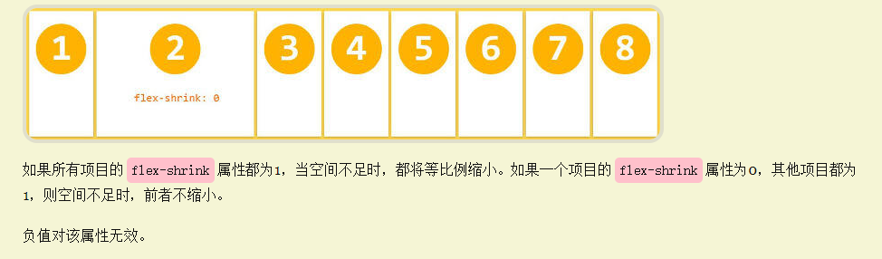

- 1.calc属性  是css3的一个计算属性 设置动态值 calculate
  （1）calc是英文单词calculate(计算)的缩写，是css3的一个新增的功能，你可以使用calc()给元素的border、margin、padding、font-size和width等属性设置动态值。
  （3）calc()函数支持 “+”, “-“, “*”, “/” 运算；
  （4）calc()函数使用标准的数学运算优先级规则；
  （5）但需要注意的是 + - 必须用空格隔开;
  [原文链接](https://blog.csdn.net/m0_38099607/article/details/73012637) 
  
- 2 盒模型的组成：外边距（margin）+ border（边框） + 内边距（padding）+ content（内容），可以把每一个容器，比如div，都看做是一个盒子模型
   分为  标准盒模型 box-sizing:content-box  设置的width是content的宽度  div的宽高是 content加padding加border
        怪异盒模型 box-sizing:border-box   设置的width是content+padding+border的宽度  div的宽高是 设置的宽高
  标准盒模型大小等于width+padding+border，例如设置width为100，padding为10，border为10，那么这个盒模型的大小为140，
  IE盒模型设置width为100，那么这个盒模型的大小就为100，且content等于100-40=60。

- 3.BFC相关原理及特性？ [什么是BFC，他有什么用？](https://blog.csdn.net/sqLeiQ/article/details/125261564)
>BFC(Block Formatting Context)：块级格式化上下文，BFC是一块块独立的渲染区域，它有一套渲染规则，决定了其子元素将如何定位，以及和其他元素的关系和相互作用。
> BFC的布局规则：
1 内部的Box会在垂直方向，一个接一个地放置。
2 Box垂直方向的距离由margin决定。属于同一个BFC的两个相邻Box的margin会发生重叠。
3 每个盒子（块盒与行盒）的margin box的左边，与包含块border box的左边相接触(对于从左往右的格式化，否则相反)。即使存在浮动也是如此。
4 BFC的区域不会与float box重叠。
5 BFC就是页面上的一个隔离的独立容器，容器里面的子元素不会影响到外面的元素。反之也如此。
6 计算BFC的高度时，浮动元素也参与计算。

>创建BFC的情况。

>1.根元素，即HTML标签。

>2.position设置为absolute和fixed。

>3.float元素设置为非none即left right。

>4.display的inline-block和flex、table-cell、table、grid等。

>5.overflow设置为非visible（默认值。内容不会被修剪，会呈现在元素框之外）。

>应用：1.解决margin会导致的外边距塌陷问题。2.清除浮动。3.阻止元素被浮动元素覆盖。

-margin外边距的塌陷问题
margin塌陷现象：在垂直方向如果有两个元素的外边距有相遇，两个元素的外边距不是两个间距的加和，而是两个边距中值比较大的，边距小的塌陷到了边距值大的值内部。
兄弟关系：1. 同级元素塌陷：上面的元素有下边距，下面的元素有上边距，两个边距相遇，真正盒子间距离是较大的那个值。
父子关系：2. 父子元素塌陷：父子元素之间也会出现margin塌陷，（1）父元素和子元素都设置了同方向的margin-top值，两个属性之间没有其他内容进行隔离，导致两个属性相遇，发生margin塌陷。
（2）本身父元素与上一个元素的距离是0，子元素如果设置了垂直方向的上边距，会带着父级元素一起掉下来（父元素的上边距0塌陷到了子元素的上边距50里面）。
解决方法： （1）同级元素：如果两个元素垂直方向有间距，只需要设置给一个元素，不要进行拆分。
（2）父子元素：1 让两个边距不要相遇，中间可以使用父元素border或padding将边距分隔开；2 更加常用的方法，父子盒模型之间的距离就不要用子元素的margin去设置，
而是用父元素的padding挤出来。3利用伪元素给父元素的前面添加一个空元素(伪元素是行内元素)  .father::before {content:'';display:table}  4 最常用的方法：给父元素添加overflow：hidden（注意是给父级元素添加）
注：水平方向没有margin塌陷 除非设置writing-mode(书写模式，比如实现古代诗词竖向效果) 。 

-清除浮动主要是为了解决，父元素因为子级元素浮动引起的内部高度为0的问题（高度塌陷） [清除浮动的4种方式](https://blog.csdn.net/weixin_43638968/article/details/107617275)
方法：1.父级添加overflow:hidden方法： 可以通过触发BFC的方式，实现清除浮动效果。
优点： 简单、代码少、浏览器支持好 缺点： 内容增多时候容易造成不会自动换行导致内容被隐藏掉，无法显示需要溢出的元素。不能和position配合使用，因为超出的尺寸的会被隐藏。
2. 在浮动元素后使用一个空元素如

，并在CSS中赋予.clear{clear:both;}属性即可清理浮动。亦可使用 或
来进行清理。
3.使用after伪元素清除浮动：.father::after{content:"";display:block;clear:both} （clear：none/left/right/both 左侧/右侧/两边不能出现浮动元素 ）
:after方式为空元素的升级版，好处是不用单独加标签了。IE8以上和非IE浏览器才支持:after，
zoom(IE专有属性)可解决ie6,ie7浮动问题（较常用推荐）
优点： 符合闭合浮动思想，结构语义化正确，不容易出现怪问题（目前：大型网站都有使用，如：腾迅，网易，新浪等等） 
缺点： 由于IE6-7不支持：after，使用zoom：1   zoom在ie、chorm支持，在火狐Firefox中不支持

-伪元素 伪类   伪类本质上是为了弥补常规CSS选择器的不足，以便获取到更多信息；  伪元素本质上是创建了一个有内容的虚拟容器
一 伪元素：::before  ::after
    1 ::first-letter
    伪元素 ::first-letter 用来设置指定元素中内容第一个字符的样式，通常用来配合 font-size 和 float 属性制作首字下沉效果。需要注意的是，伪元素 ::first-letter 仅可以用于块级元素，行内元素想要使用该伪元素，则需要先将其转换为块级元素。
    2 ::first-line
    伪元素 ::first-line 用来设置指定元素中内容第一行的样式，与 ::first-letter 类似，伪元素 ::first-line 也仅可以用于块级元素，行内元素想要使用该伪元素，则需要先将其转换为块级元素。
    3 ::selection
    伪元素 ::selection 用来设置对象被选中时的样式，需要注意的是，伪元素 ::selection 中只能定义元素被选中时的 color、background、cursor、outline 以及 text-shadow（IE11 尚不支持定义该属性）等属性。
    4::placeholder
二 伪元素 ::placeholder 用来设置表单元素（、 元素）的占位文本（通过 HTML 的 placeholder 属性设置的文本）比如： input.text::placeholder{ color: red; background-color: #CCC; }
    

- 4.通过修改文字方式如何控制div大小？
    使用em rem单位

- 7 水平垂直居中 
1、父元素设置 display: flex; justify-content 项目在主轴上的对齐方式: center; align-items 项目在交叉轴上如何对齐: center; ，唯一的子元素就能水平垂直居中
2、父级元素设置 flex，子元素设置 margin: auto;   
3、子元素 position: relative; left: 50%; top: 50%; transform: translate(-50%, -50%); 
4、margin:auto+absolute + 四个方向的值相等 一般用于弹出层，需要设置弹出层的宽高 :.son:width:100px;height:100px; margin: auto; position: absolute; top: 0; left: 0; right: 0; bottom: 0;
5、父元素 display: table-cell; text-align: center; vertical-align: middle;
6、网格布局 父元素display: grid; 子元素 justify-self: center;水平方向    align-self: center;垂直方向
  [CSS 不定宽高的垂直水平居中](https://juejin.cn/post/6844903933350150158#heading-4)

-   8 position属性
static（静态定位）
对象遵循标准文档流中，top, right, bottom, left 等属性失效。
relative（相对定位）
对象遵循标准文档流中，依赖top, right, bottom, left 等属性相对于该对象在标准文档流中的位置进行偏移，同时可通过z-index定义层叠关系。
absolute（绝对定位）
对象脱离标准文档流，使用top, right, bottom, left 等属性进行绝对定位（相对于static定位以外的第一个父元素进行绝对定位） 同时可通过z-index定义层叠关系。
fixed（固定定位）
对象脱离标准文档流，使用top, right, bottom, left 等属性进行绝对定位（相对于浏览器窗口进行绝对定位）同时可通过z-index定义层叠关系。
-   9 margin 和 padding 的区别 
    作用对象不同，padding是施加于自身的，margin是施加于外部的
- 10 px、%、em、vw、vh、vmax、vmin、rem区别
  % 相对于自己的父级。
em 相对于自己的字体大小。具体就是，如果自己设置了字体大小，那么你设置width:1em;就会相对于自己，如果自己没有设置，它就会逐级向上找或者说它自己继承于谁的字体大小，
如果谁都没设置字体大小，那就是浏览器默认的字体大小，就是16px，此时就是1em=16px了。
所以一定不要以为em是相对于父级了，是相对于自己或者继承过来的字体大小，没有就是浏览器默认的16px。
vw 相对于浏览器可视区的宽度，单位是1vw=1%，可视区的宽度不是屏幕宽度哈，这里需要注意，不是指你的屏幕可视区，而是相对于浏览器的可视区大小。
vmax指浏览器可视区的宽、高，以最大的进行百分计算。
vmin指浏览器可视区的宽、高，以最小的进行百分比的计算。
rem 是相对于根字体的大小。1rem等于根字体大小px
  
-11 块级元素跟行内元素区别
块元素可以设置宽高，宽度默认继承父元素的宽度
行内元素不能设置宽高，他的大小由内容撑起来的
-12如何让浏览器支持小字体 
谷歌最小是12px   transform:scale(0.8)
-13 移动端1px解决方案
1px问题产生的原因
从移动端的角度说个具体的场景，以iphone6为例。
iphone6的屏幕宽度为375px，设计师做的视觉稿一般是750px，也就是2x，这个时候设计师在视觉稿上画了1px的边框，于是你就写了“border-width:1px”，so...1px边框问题产生了。
对设计师来说它的1px是相对于750px的（物理像素），对你来说你的1px是相对于375px的（css像素）“实际上你应该是border-width:0.5px”。
媒体查询 + 伪元素 + transfrom
@media screen and (-webkit-min-device-pixel-ratio: 2) {
.border-top::after {
content: "";
position: absolute;
top: 0;
left: 0;
right: 0;
border-top: 1px solid #000;
transform-origin: left top;

transform: scaleY(.5);
}
}

@media screen and (-webkit-min-device-pixel-ratio: 3) {
.border-top::after {
/* 省略无关代码 */
transform: scaleY(1 / 3);
}
}

- flex属性 [Flex 布局教程：语法篇](http://www.ruanyifeng.com/blog/2015/07/flex-grammar.html)
 一 定义
Flex是Flexible Box的缩写，意为”弹性布局”，用来为盒状模型提供最大的灵活性。
 任何一个容器都可以指定为Flex布局。 .box{display:flex;} 
 行内元素也可以使用Flex布局。 .box{display:inline-flex;}
 Webkit内核的浏览器，必须加上-webkit前缀。 .box{display:-webkit-flex;/* Safari */display:flex;}
 注意，设为Flex布局以后，子元素的float、clear和vertical-align属性将失效。
 二 基本概念
 基本概念 
 三 容器属性 
  3.1 flex-direction(方向) 属性 属性决定主轴的方向（即项目的排列方向
      .box { flex-direction: row | row-reverse | column | column-reverse; }
      row（默认值）：主轴为水平方向，起点在左端。
      row-reverse：主轴为水平方向，起点在右端。
      column (列 美[ˈkɑːləm])：主轴为垂直方向，起点在上沿。
      column-reverse：主轴为垂直方向，起点在下沿。
    
  3.2 flex-wrap（包 （使文字）换行 美[ræp]）属性定义，如果一条轴线排不下，如何换行 
      .box{ flex-wrap: nowrap | wrap | wrap-reverse; }
      nowrap（默认）：不换行。
      wrap：换行，第一行在上方
      wrap-reverse：换行，第一行在下方。
  3.3 flex-flow  是flex-direction属性和flex-wrap属性的简写形式，默认值为row nowrap
     .box { flex-flow: <flex-direction> || <flex-wrap>; }
  3.4 justify(使每行排齐)-content 定义了项目在主轴上的对齐方式。
      .box { justify-content: flex-start | flex-end | center | space（ 空间; (可利用的)空地; 空隙; 空子 美[speɪs]）-between | space-around; } 
      flex-start（默认值）：左对齐
      flex-end：右对齐
      center： 居中
      space-between：两端对齐，项目之间的间隔都相等。
      space-around：每个项目两侧的间隔相等。所以，项目之间的间隔比项目与边框的间隔大一倍。
  3.5 align(排列)-items(项目) 属性 项目在交叉轴上如何对齐。
    .box { align-items: flex-start | flex-end | center | baseline | stretch; }
  3.6 align-content属性定义了多根轴线的对齐方式。如果项目只有一根轴线，该属性不起作用。
    .box { align-content: flex-start | flex-end | center | space(空隙)-between | space-around | stretch[伸展 美 [stretʃ]; }
  四、项目的属性
  4.1 order(顺序 美[ˈɔːrdər])属性 定义项目的排列顺序。数值越小，排列越靠前，默认为0。.item { order: <integer>; } 
  4.2 flex-grow(扩大，增加 美[ɡroʊ])属性定义项目的放大比例，默认为0，即如果存在剩余空间，也不放大。 .item { flex-grow: <number>; /* default 0 */ }
    如果所有项目的flex-grow属性都为1，则它们将等分剩余空间（如果有的话）。如果一个项目的flex-grow属性为2，其他项目都为1，则前者占据的剩余空间将比其他项多一倍。
  4.3 flex-shrink (收缩 美[ʃrɪŋk]) 定义了项目的缩小比例，默认为1，即如果空间不足!!!，该项目将缩小
     .item { flex-shrink: <number>; /* default 1 */ } 
  4.4 flex-basis（基准; 准则 美[ˈbeɪsɪs]） 属性定义了在分配多余空间之前，项目占据的主轴空间（main size）。浏览器根据这个属性，计算主轴是否有多余空间。它的默认值为auto，即项目的本来大小。 
    .item { flex-basis: <length> | auto; /* default auto */ } 它可以设为跟width或height属性一样的值（比如350px），则项目将占据固定空间
    [flex弹性布局教程-03-项目属性flex-basis](https://blog.csdn.net/chenjiebin/article/details/120378207)
      flex-basis 属性设置在项目上的。
      flex-basis 是设置项目 占据主轴空间的大小、不全等于width。
      flex-basis 优先级比 width 更高。
  4.5 flex属性 flex属性是flex-grow, flex-shrink 和 flex-basis的简写，默认值为0 1 auto。后两个属性可选。
    .item {flex: none | [ <'flex-grow'> <'flex-shrink'>? || <'flex-basis'> ]} 该属性有两个快捷值：auto (1 1 auto) 和 none (0 0 auto)。
    建议优先使用这个属性，而不是单独写三个分离的属性，因为浏览器会推算相关值。
  4.6 align-self属性 align-self属性允许单个项目有与其他项目不一样的对齐方式，可覆盖align-items属性。默认值为auto，表示继承父元素的align-items属性，如果没有父元素，则等同于stretch。
    .item { align-self: auto | flex-start | flex-end | center | baseline | stretch; } 