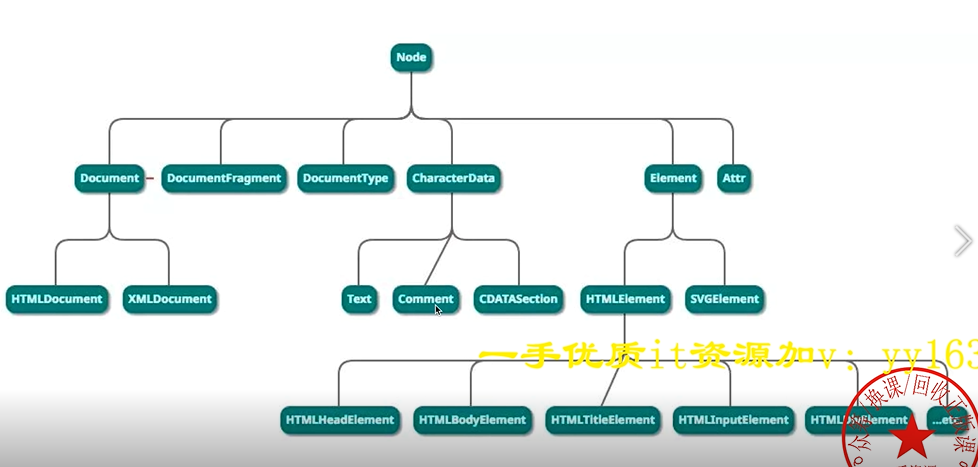
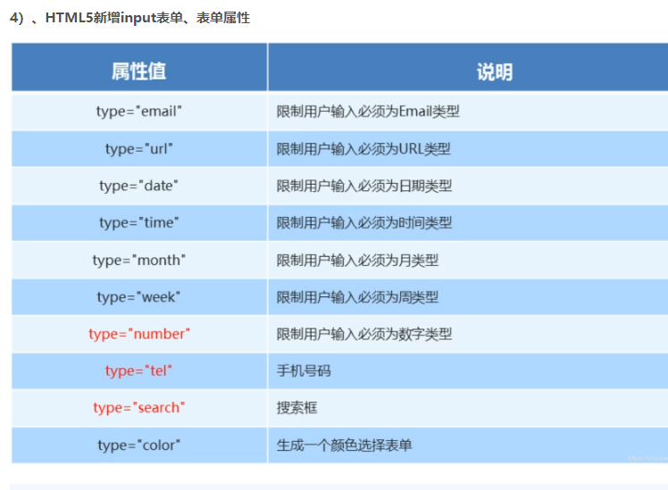

- 1.calc属性  是css3的一个计算属性 设置动态值 calculate
  （1）calc是英文单词calculate(计算)的缩写，是css3的一个新增的功能，你可以使用calc()给元素的border、margin、padding、font-size和width等属性设置动态值。
  （3）calc()函数支持 “+”, “-“, “*”, “/” 运算；
  （4）calc()函数使用标准的数学运算优先级规则；
  （5）但需要注意的是 + - 必须用空格隔开;
  [原文链接](https://blog.csdn.net/m0_38099607/article/details/73012637)
  
- 2 盒模型的组成：外边距（margin）+ border（边框） + 内边距（padding）+ content（内容），可以把每一个容器，比如div，都看做是一个盒子模型
   分为  标准盒模型 box-sizing:content-box  设置的width是content的宽度  div的宽高是 content加padding加border
        怪异盒模型 box-sizing:border-box   设置的width是content+padding+border的宽度  div的宽高是 设置的宽高
  标准盒模型大小等于width+padding+border，例如设置width为100，padding为10，border为10，那么这个盒模型的大小为140，
  IE盒模型设置width为100，那么这个盒模型的大小就为100，且content等于100-40=60。
  二 offSetWidth 布局宽度：content + padding + border ； clientWidth 内容宽度 content + padding ；scrollWidth 滚动内容宽度 ：padding + 实际内容尺寸
  
- 3.BFC相关原理及特性？ [什么是BFC，他有什么用？](https://blog.csdn.net/sqLeiQ/article/details/125261564)
BFC(Block Formatting Context)：块级格式化上下文，BFC是一块块独立的渲染区域，它有一套渲染规则，决定了其子元素将如何定位，以及和其他元素的关系和相互作用。
  
- BFC的布局规则：
1 内部的Box会在垂直方向，一个接一个地放置。
2 Box垂直方向的距离由margin决定。属于同一个BFC的两个相邻Box的margin会发生重叠。
3 每个盒子（块盒与行盒）的margin box的左边，与包含块border box的左边相接触(对于从左往右的格式化，否则相反)。即使存在浮动也是如此。
4 BFC的区域不会与float box重叠。
5 BFC就是页面上的一个隔离的独立容器，容器里面的子元素不会影响到外面的元素。反之也如此。
6 计算BFC的高度时，浮动元素也参与计算。
  
- 创建BFC的情况。
1.根元素，即HTML标签。
2.position设置为absolute和fixed。
3.float元素设置为非none即left right。
4.display的inline-block和flex、table-cell、table、grid等。
5.overflow设置为非visible（默认值。内容不会被修剪，会呈现在元素框之外）。
  
- 应用：1.解决margin会导致的外边距塌陷问题。2.清除浮动。3.阻止元素被浮动元素覆盖。
margin外边距的塌陷问题
margin塌陷现象：在垂直方向如果有两个元素的外边距有相遇，两个元素的外边距不是两个间距的加和，而是两个边距中值比较大的，边距小的塌陷到了边距值大的值内部。
兄弟关系：1. 同级元素塌陷：上面的元素有下边距，下面的元素有上边距，两个边距相遇，真正盒子间距离是较大的那个值。
父子关系：2. 父子元素塌陷：父子元素之间也会出现margin塌陷，（1）父元素和子元素都设置了同方向的margin-top值，两个属性之间没有其他内容进行隔离，导致两个属性相遇，发生margin塌陷。
（2）本身父元素与上一个元素的距离是0，子元素如果设置了垂直方向的上边距，会带着父级元素一起掉下来（父元素的上边距0塌陷到了子元素的上边距50里面）。
解决方法： （1）同级元素：如果两个元素垂直方向有间距，只需要设置给一个元素，不要进行拆分。
（2）父子元素：1 让两个边距不要相遇，中间可以使用父元素border或padding将边距分隔开；2 更加常用的方法，父子盒模型之间的距离就不要用子元素的margin去设置，
而是用父元素的padding挤出来。3利用伪元素给父元素的前面添加一个空元素(伪元素是行内元素)  .father::before {content:'';display:table}  4 最常用的方法：给父元素添加overflow：hidden（注意是给父级元素添加）
注：水平方向没有margin塌陷 除非设置writing-mode(书写模式，比如实现古代诗词竖向效果) 。
  
- 清除浮动主要是为了解决，父元素因为子级元素浮动引起的内部高度为0的问题（高度塌陷）
方法：1父级添加overflow:hidden方法： 可以通过触发BFC的方式，实现清除浮动效果。
优点： 简单、代码少、浏览器支持好 缺点： 内容增多时候容易造成不会自动换行导致内容被隐藏掉，无法显示需要溢出的元素。不能和position配合使用，因为超出的尺寸的会被隐藏。
2在浮动元素后使用一个空元素如

，并在CSS中赋予.clear{clear:both;}属性即可清理浮动。亦可使用 或
来进行清理。
3使用after伪元素清除浮动：.father::after{content:"";display:block;clear:both} （clear：none/left/right/both 左侧/右侧/两边不能出现浮动元素 ）
:after方式为空元素的升级版，好处是不用单独加标签了。IE8以上和非IE浏览器才支持:after，
zoom(IE专有属性)可解决ie6,ie7浮动问题（较常用推荐）
优点： 符合闭合浮动思想，结构语义化正确，不容易出现怪问题（目前：大型网站都有使用，如：腾迅，网易，新浪等等） 
缺点： 由于IE6-7不支持：after，使用zoom：1   zoom在ie、chorm支持，在火狐Firefox中不支持
  
- 4伪元素 伪类   伪类本质上是为了弥补常规CSS选择器的不足，以便获取到更多信息；  伪元素本质上是创建了一个有内容的虚拟容器
一 伪元素：::before  ::after
    1 ::first-letter
    伪元素 ::first-letter 用来设置指定元素中内容第一个字符的样式，通常用来配合 font-size 和 float 属性制作首字下沉效果。需要注意的是，伪元素 ::first-letter 仅可以用于块级元素，行内元素想要使用该伪元素，则需要先将其转换为块级元素。
    2 ::first-line
    伪元素 ::first-line 用来设置指定元素中内容第一行的样式，与 ::first-letter 类似，伪元素 ::first-line 也仅可以用于块级元素，行内元素想要使用该伪元素，则需要先将其转换为块级元素。
    3 ::selection
    伪元素 ::selection 用来设置对象被选中时的样式，需要注意的是，伪元素 ::selection 中只能定义元素被选中时的 color、background、cursor、outline 以及 text-shadow（IE11 尚不支持定义该属性）等属性。
    4::placeholder
    伪元素 ::placeholder 用来设置表单元素（、 元素）的占位文本（通过 HTML 的 placeholder 属性设置的文本）比如： input.text::placeholder{ color: red; background-color: #CCC; }
  二

- 5通过修改文字方式如何控制div大小？
    使用em rem单位

- 6 flex属性 [Flex 布局教程：语法篇](http://www.ruanyifeng.com/blog/2015/07/flex-grammar.html)
  一 定义
  Flex是Flexible Box的缩写，意为”弹性布局”，用来为盒状模型提供最大的灵活性。
  任何一个容器都可以指定为Flex布局。 .box{display:flex;}
  行内元素也可以使用Flex布局。 .box{display:inline-flex;}
  Webkit内核的浏览器，必须加上-webkit前缀。 .box{display:-webkit-flex;/* Safari */display:flex;}
  注意，设为Flex布局以后，子元素的float、clear和vertical-align属性将失效。
  二 基本概念
  基本概念 
  三 容器属性
  3.1 flex-direction(方向) 属性 属性决定主轴的方向（即项目的排列方向
  .box { flex-direction: row | row-reverse | column | column-reverse; }
  row（默认值）：主轴为水平方向，起点在左端。
  row-reverse：主轴为水平方向，起点在右端。
  column (列 美[ˈkɑːləm])：主轴为垂直方向，起点在上沿。
  column-reverse：主轴为垂直方向，起点在下沿。
  
  3.2 flex-wrap（包 （使文字）换行 美[ræp]）属性定义，如果一条轴线排不下，如何换行 
  .box{ flex-wrap: nowrap | wrap | wrap-reverse; }
  nowrap（默认）：不换行。
  wrap：换行，第一行在上方
  wrap-reverse：换行，第一行在下方。
  3.3 flex-flow  是flex-direction属性和flex-wrap属性的简写形式，默认值为row nowrap
  .box { flex-flow: <flex-direction> || <flex-wrap>; }
  3.4 justify(使每行排齐)-content 定义了项目在主轴上的对齐方式。
  .box { justify-content: flex-start | flex-end | center | space（ 空间; (可利用的)空地; 空隙; 空子 美[speɪs]）-between | space-around; } 
  flex-start（默认值）：左对齐
  flex-end：右对齐
  center： 居中
  space-between：两端对齐，项目之间的间隔都相等。
  space-around：每个项目两侧的间隔相等。所以，项目之间的间隔比项目与边框的间隔大一倍。
  3.5 align(排列)-items(项目) 属性 项目在交叉轴上如何对齐。
  .box { align-items: flex-start | flex-end | center | baseline | stretch; }
  3.6 align-content属性定义了多根轴线的对齐方式。如果项目只有一根轴线，该属性不起作用。
  .box { align-content: flex-start | flex-end | center | space(空隙)-between | space-around | stretch[伸展 美 [stretʃ]; }
  四、项目的属性
  4.1 order(顺序 美[ˈɔːrdər])属性 定义项目的排列顺序。数值越小，排列越靠前，默认为0。.item { order: <integer>; } 
  4.2 flex-grow(扩大，增加 美[ɡroʊ])属性定义项目的放大比例，默认为0，即如果存在剩余空间，也不放大。 .item { flex-grow: <number>; /* default 0 */ }
    如果所有项目的flex-grow属性都为1，则它们将等分剩余空间（如果有的话）。如果一个项目的flex-grow属性为2，其他项目都为1，则前者占据的剩余空间将比其他项多一倍。
  4.3 flex-shrink (收缩 美[ʃrɪŋk]) 定义了项目的缩小比例，默认为1，即如果空间不足!!!，该项目将缩小
  .item { flex-shrink: <number>; /* default 1 */ } 
  4.4 flex-basis（基准; 准则 美[ˈbeɪsɪs]） 属性定义了在分配多余空间之前，项目占据的主轴空间（main size）。浏览器根据这个属性，计算主轴是否有多余空间。它的默认值为auto，即项目的本来大小。
  .item { flex-basis: <length> | auto; /* default auto */ } 它可以设为跟width或height属性一样的值（比如350px），则项目将占据固定空间
  [flex弹性布局教程-03-项目属性flex-basis](https://blog.csdn.net/chenjiebin/article/details/120378207)
  flex-basis 属性设置在项目上的。
  flex-basis 是设置项目 占据主轴空间的大小、不全等于width。
  flex-basis 优先级比 width 更高。
  4.5 flex属性 flex属性是flex-grow, flex-shrink 和 flex-basis的简写，默认值为0 1 auto。后两个属性可选。
  .item {flex: none | [ <'flex-grow'> <'flex-shrink'>? || <'flex-basis'> ]} 该属性有两个快捷值：auto (1 1 auto) 和 none (0 0 auto)。
  建议优先使用这个属性，而不是单独写三个分离的属性，因为浏览器会推算相关值。
  4.6 align-self属性 align-self属性允许单个项目有与其他项目不一样的对齐方式，可覆盖align-items属性。默认值为auto，表示继承父元素的align-items属性，如果没有父元素，则等同于stretch。
  .item { align-self: auto | flex-start | flex-end | center | baseline | stretch; } 
  
- 7 水平垂直居中 
1、父元素设置 display: flex; justify-content 项目在主轴上的对齐方式: center; align-items 项目在交叉轴上如何对齐: center; ，唯一的子元素就能水平垂直居中
2、父级元素设置 flex，子元素设置 margin: auto;   
3、子元素 position: relative; left: 50%; top: 50%; transform: translate(-50%, -50%); 
4、margin:auto+absolute + 四个方向的值相等 一般用于弹出层，需要设置弹出层的宽高 :.son:width:100px;height:100px; margin: auto; position: absolute; top: 0; left: 0; right: 0; bottom: 0;
5、父元素 display: table-cell; text-align: center; vertical-align: middle;
6、网格布局 父元素display: grid; 子元素 justify-self: center;水平方向    align-self: center;垂直方向
  [CSS 不定宽高的垂直水平居中](https://juejin.cn/post/6844903933350150158#heading-4)

-圣杯布局 
父盒子：padding：0 200px  三个子盒子：float:left  position:relative  中间子盒子：width：100% 
左边盒子：width：200px margin-left:-100% left：-200px   右边盒子： width：200px  margin-left：200px  right：-200px

- 8 position属性
static（静态定位）
对象遵循标准文档流中，top, right, bottom, left 等属性失效。
relative（相对定位）
对象遵循标准文档流中，依赖top, right, bottom, left 等属性相对于该对象在标准文档流中的位置进行偏移，同时可通过z-index定义层叠关系。
absolute（绝对定位）
对象脱离标准文档流，使用top, right, bottom, left 等属性进行绝对定位（相对于static定位以外的第一个父元素进行绝对定位） 同时可通过z-index定义层叠关系。
fixed（固定定位）
对象脱离标准文档流，使用top, right, bottom, left 等属性进行绝对定位（相对于浏览器窗口进行绝对定位）同时可通过z-index定义层叠关系。
  
- 9 margin 和 padding 的区别 
    作用对象不同，padding是施加于自身的，margin是施加于外部的
  
- 10 px、%、em、vw、vh、vmax、vmin、rem区别
  % 相对于自己的父级。
em 相对于自己的字体大小。具体就是，如果自己设置了字体大小，那么你设置width:1em;就会相对于自己，如果自己没有设置，它就会逐级向上找或者说它自己继承于谁的字体大小，
如果谁都没设置字体大小，那就是浏览器默认的字体大小，就是16px，此时就是1em=16px了。
所以一定不要以为em是相对于父级了，是相对于自己或者继承过来的字体大小，没有就是浏览器默认的16px。
vw 相对于浏览器可视区的宽度，单位是1vw=1%，可视区的宽度不是屏幕宽度哈，这里需要注意，不是指你的屏幕可视区，而是相对于浏览器的可视区大小。
vmax指浏览器可视区的宽、高，以最大的进行百分计算。
vmin指浏览器可视区的宽、高，以最小的进行百分比的计算。
rem 是相对于根字体的大小。1rem等于根字体大小px
  
- 11 块级元素跟行内元素区别
块元素可以设置宽高，宽度默认继承父元素的宽度
行内元素不能设置宽高，他的大小由内容撑起来的
  
- 12如何让浏览器支持小字体 
谷歌最小是12px   transform:scale(0.8)   	美[skeɪl] 天平，秤 调节
  
- 13 移动端1px解决方案
1px问题产生的原因
从移动端的角度说个具体的场景，以iphone6为例。
iphone6的屏幕宽度为375px，设计师做的视觉稿一般是750px，也就是2x，这个时候设计师在视觉稿上画了1px的边框，于是你就写了“border-width:1px”，so...1px边框问题产生了。
对设计师来说它的1px是相对于750px的（物理像素），对你来说你的1px是相对于375px的（css像素）“实际上你应该是border-width:0.5px”。
媒体查询 + 伪元素 + transfrom:scale
@media(媒体) screen(屏幕) and (-webkit（网络套件）-min-device（装置）-pixel（像素）-ratio（率）: 2) {
.border-top::after {
content: "";
position: absolute;
top: 0;
left: 0;
right: 0;
border-top: 1px solid #000;
transform-origin: left top;
transform: scaleY(.5);
}
}
@media screen and (-webkit-min-device-pixel-ratio: 3) {
.border-top::after {
/* 省略无关代码 */
transform: scaleY(1 / 3);
}
}
  
- 14 HTMLCollection 和NodeList 区别
 一、Node和element  text comment（注释）
     1 Dom是一棵树，所有节点都是Node  2 Node是ELement的基类 3 Element是其他HTML元素的基类，如HTMLDivELement
  二、 HtmlCollection是Element的集合 NodeLsit是Node的集合
  三 HTMLCollection 和NodeList 是类数组 本质是对象 ，类数组list可以用Array.from(list)  [...list] 来转成数组
  
- 15[HTML 替换（置换）元素和非替换（置换）元素](https://blog.csdn.net/huanan__/article/details/117285403?spm=1001.2101.3001.6661.1&utm_medium=distribute.pc_relevant_t0.none-task-blog-2%7Edefault%7ECTRLIST%7ERate-1-117285403-blog-79510379.pc_relevant_recovery_v2&depth_1-utm_source=distribute.pc_relevant_t0.none-task-blog-2%7Edefault%7ECTRLIST%7ERate-1-117285403-blog-79510379.pc_relevant_recovery_v2&utm_relevant_index=1)
一、替换元素
1 定义
  简单来说就是浏览器通过其标签的元素属性来判断显示具体的内容的元素，元素本身一般拥有固有尺寸（宽度，高度，宽高比）
2 举例说明
元素：浏览器根据src来显示图片内容；
<input>元素：浏览器根据其type值来选择显示输入框还是其他类型。
3 替换元素有哪些
3 html中的替换元素有：, <input>, <textarea>, <select>, <object> 等
二、非替换元素
1 定义
html中大多数都是非替换元素，他们直接将内容告诉浏览器，直接显示出来，通常都是双标签。
2 举例说明 :元素，浏览器会直接显示span标签里的内容。
元素，浏览器会直接显示p标签里的内容。
3 非替换元素有哪些
非替换元素（non-replaced element）就是除了 img, input, textarea, select, object 等替换元素以外的元素，如：
,,
,h标签等文本类标签。
  
- 16 margin:auto和margin:0 auto的区别
  1、意思不同。margin:auto=margin:auto auto auto auto，表示上下左右都为auto；margin:0 auto=margin:0 auto 0 auto，表示上下为0，左右为auto；
  2、居中方式不同。margin:auto表示横竖都居中，margin: 0 auto表示横居中，竖不居中；
    margin后面一般会跟4个参数，如margin:1px、1px、1px、1px，分别表示上外边距为1px、右外边距为1px、下外边距为1px、左外边距为1px。
    如果后面只写2个参数的话，如margin：1px、2px，则表示上下外边距为都为1px，左右外边距都为2px。

- html5
  一、新增语义化标签  
  header — 头部标签
  nav — 导航标签
  article — 内容标签
  section — 块级标签
  aside — 侧边栏标签
  footer — 尾部标签
  二、多媒体标签 音频：<audio> 视频：<video>
  三、input表单类型 表单属性    
  <li>邮箱：<input type="email" /></li>
  <li>网址：<input type="url" /></li>
  <li>日期：<input type="date" /></li>
  <li>时间：<input type="date" /></li>
  <li>数量：<input type="number" /></li>
  <li>手机号码：<input type="tel" /></li>
  <li>搜索：<input type="search" /></li>
  <li>颜色：<input type="color" /></li>

-css3新属性    [CSS3动画详解（图文教程）](https://www.cnblogs.com/qianguyihao/p/8435182.html)
一、属性选择器  
比如 a[id='123'] 就是选择id为123的a标签
二、伪类选择器 
三、伪元素选择器 
四、过渡 transition 可以实现元素不同状态间的平滑过渡（补间动画），经常用来制作动画效果
      transition 包括以下属性：
        transition-property: all; 如果希望所有的属性都发生过渡，就使用all。
        transition-duration: 1s; 过渡的持续时间。
        transition-timing-function: linear; 运动曲线。属性值可以是：
          linear 线性
          ease 减速
          ease-in 加速
          ease-out 减速
          ease-in-out 先加速后减速
        transition-delay: 1s; 过渡延迟。多长时间后再执行这个过渡动画。
  上面的四个属性也可以写成综合属性：
      transition: 让哪些属性进行过度 过渡的持续时间 运动曲线 延迟时间;
      transition: all 3s linear 0s;
五、2D转换 transform  可以实现元素的位移、旋转、变形、缩放，甚至支持矩阵方式。
  转换再配合过渡和动画，可以取代大量早期只能靠 Flash 才可以实现的效果。
  在 CSS3 当中，通过 transform 转换来实现 2D 转换或者 3D 转换。
  2D转换包括：缩放、移动、旋转。2D转换并不能把兄弟元素挤走
  1、缩放：scale
	transform: scale(x, y);
	transform: scale(2, 0.5);
    参数解释： x：表示水平方向的缩放倍数。y：表示垂直方向的缩放倍数。如果只写一个值就是等比例缩放。
  2、位移：translate
      transform: translate(水平位移, 垂直位移);
      transform: translate(-50%, -50%);
  参数解释： 参数为百分比，相对于自身移动。
  正值：向右和向下。 负值：向左和向上。如果只写一个值，则表示水平移动。
  3、旋转：rotate
      transform: rotate(角度);
      transform: rotate(45deg);
  参数解释：正值 顺时针；负值：逆时针。
     rotate 旋转时，默认是以盒子的正中心为坐标原点的。如果想改变旋转的坐标原点，可以用transform-origin属性。格式如下：
        transform-origin: 水平坐标 垂直坐标;
        transform-origin: 50px 50px;
        transform-origin: center bottom;   //旋转时，以盒子底部的中心为坐标原点
六、3D转换
  1、旋转
    transform: rotateX(360deg);    //绕 X 轴旋转360度
	transform: rotateY(360deg);    //绕 Y 轴旋转360度
	transform: rotateZ(360deg);    //绕 Z 轴旋转360度
  2、移动：translateX、translateY、translateZ
	transform: translateX(100px);    //沿着 X 轴移动
	transform: translateY(360px);    //沿着 Y 轴移动
	transform: translateZ(360px);    //沿着 Z 轴移动  必须配合透视来使用  perspective: 1000px;
3、透视：perspective
  电脑显示屏是一个 2D 平面，图像之所以具有立体感（3D效果），其实只是一种视觉呈现，通过透视可以实现此目的。
  透视可以将一个2D平面，在转换的过程当中，呈现3D效果。但仅仅只是视觉呈现出3d 效果，并不是正真的3d。
    格式有两种写法：
    作为一个属性，设置给父元素，作用于所有3D转换的子元素
    作为 transform 属性的一个值，做用于元素自身。
4、3D呈现（transform-style）
  3D元素构建是指某个图形是由多个元素构成的，可以给这些元素的父元素设置transform-style: preserve-3d来使其变成一个真正的3D图形。属性值可以如下：
	transform-style: preserve-3d;     //让 子盒子 位于三维空间里
	transform-style: flat;            //让子盒子位于此元素所在的平面内（子盒子被扁平化）
七、动画
动画是CSS3中具有颠覆性的特征，可通过设置多个节点 来精确控制一个或一组动画，常用来实现复杂的动画效果。
  1、定义动画的步骤
  （1）通过@keyframes定义动画；
  （2）将这段动画通过百分比，分割成多个节点；然后各节点中分别定义各属性；
  （3）在指定元素里，通过 animation 属性调用动画。
  之前,我们在 js 中定义一个函数的时候，是先定义，再调用：
      js 定义函数：
          function fun(){ 函数体 }
       调用：
          fun();
  同样，我们在 CSS3 中定义动画的时候，也是先定义，再调用：
      定义动画：
          @keyframes 动画名{
              from{ 初始状态 }
              to{ 结束状态 }
          }
       调用：
        animation: 动画名称 持续时间；
  其中，animation属性的格式如下：
animation: 定义的动画名称(animation-name 必选) 持续时间(animation-duration 必选)  执行次数（animation-iteration-coun infinite 表示无限次） 
            是否反向（animation-direction: alternate; 属性值：normal 正常，alternate 反向。）
            运动曲线（animation-timing-function: ease-in; 属性值可以是：linear ease-in-out steps()等。
                注意，如果把属性值写成steps()，则表示动画不是连续执行，而是间断地分成几步执行。） 
            延迟执行（animation-delay: 1s）。
animation: move1 1s  alternate linear 3;
animation: move2 4s;

文本阴影属性：text-shadow:水平距离 垂直距离 模糊半径(模糊程度) 阴影颜色
盒子阴影 box-shadow : 水平距离(必填，可为负值) 垂直距离(必填，可为负值) 模糊距离 阴影大小 阴影颜色 阴影位置(内侧或外侧)
文本换行  word-wrap
CSS圆角属性 border-radius：一个值代表四个方向，上右下左

-画三角形
transparent 它代表着全透明黑色，即一个类似rgba(0,0,0,0)这样的值。
设置div宽高为0 设置要显示的方向的三角为有颜色 其他的三个方向设置透明色transparent
width: 0px;
height: 0px;
border-top: 100px solid red;
border-right: 100px solid transparent;
border-bottom: 100px solid transparent;
border-left: 100px solid transparent;

