- 1var let const 区别
  一 var有 声明提升：把声明提升到作用域的顶部，即提升到所有可执行代码之前。 （作用域分为全局作用域、函数作用域、块级作用域，此处仅指前两个作用域。）
  声明提升分为“变量”声明提升、“函数”声明提升。（类定义不能提升） 提升会导致一些奇怪现象。let const没有声明提升
 [](https://zhuanlan.zhihu.com/p/519406888)
  二、重复声明 var可以 let、const不行
  三、let定义的变量 。 const定义常量，必须初始化值，并且不能修改指针，只能修改对象里面的属性
  四、在全局作用域下var声明的变量会挂载在window上，这样可能会覆盖window上的属性。而let const不会

- 2作用域 变量 作用域链 [原生js作用域以及变量提升和函数提升的理解](https://blog.csdn.net/weixin_39755186/article/details/93161335)
作用域 一：全局作用域：在整个script标签或者一个单独的js文件内起作用 二：函数作用域（局部作用域）：只能在函数内部起效果和作用
三：块级作用域：在for(){},if(){},else{}，try{},cath(){}等等的花括号{}内部的作用域，ES6中新增了块级作用域 
在块级作用域中，var定义的变量是全局变量，let定义的变量是局部变量。而在局部作用域中，无论是用var定义的变量还是用let定义的变量都是局部变量。
无论是在块级作用域还是局部作用域，省略变量前面的var或者let都会变成一个全局变量。
注意：①对象的{}不属于块级作用域，像for(){},if(){},else{}，try{},cath(){}等等的花括号才是块级作用域
②对象的{}的作用域 是什么作用域取决于对象所处的作用域，比如对象在全局作用域下定义的，那么对象的{}的作用域就是全局作用域 
全局变量和局部变量 根据作用域的不同，变量可以分为全局变量和局部变量。
（1）全局变量：在全局作用域下的变量，在全局下都可以使用，包括函数内部。并且，全局变量只有浏览器关闭的时候才会销毁，比较占内存资源。
（2）局部变量：在局部作用域下的变量，或者说成在函数内部的变量。并且，局部变量在程序执行完毕后就会立即销毁，比较节约内存资源。
注意： （1）在函数内部没有声明就直接赋值的变量是全局变量 （2）函数的形参可以看作是局部变量 
作用域链:内部作用域访问外部作用域的变量，采取的是链式查找的方式来决定取哪个值，这种结构我们称为作用域链，采取就近原则的方式向上一级一级的作用域来查找变量值， 最顶级是全局作用域，如果到全局作用域也没找值，那么就会报错。

- 3数据类型 基本数据类型：String Number Boolean Null Undefined Symbel Bigint 引用数据类型 Object Array Function
undefined 表示未定义的变量。 null 值表示一个空对象指针 undefined表示"缺少值"，就是此处应该有一个值，但是还没有定义。
典型用法是： -变量被声明了，但没有赋值时，就等于 undefined。 -调用函数时，应该提供的参数没有提供，该参数等于undefined。
-对象没有赋值的属性，该属性的值为 undefined。 -函数没有返回值时，默认返回 undefined。 
null表示"没有对象"，即该处不应该有值。，典型的用法如下 -作为函数的参数，表示该函数的参数不是对象。 -作为对象原型链的终点。 
为什么typeof null 是object 第一版的 JavaScript 是用 32 位比特来存储值的，且是通过值的低 1 位或 3 位来识别类型的，对象的类型标签是 000 。由于 null
代表的是空指针（低三位也是 000 ），因此，null 的类型标签是 000，typeof null 也因此返回 "object"。

- 4判断数组的方法 
• Object.prototype.toString.call()。 每一个继承 Object 的对象都有 toString 方法，如果 toString 方法没有重写的话，会返回 [Object type]，其中
type 为对象的类型  
• Array.isArray()
const a = [];const b = {};Array.isArray(a);//trueArray.isArray(b);//false 
• instanceof。 instanceof 运算符可以用来判断某个构造函数的 prototype 属性所指向的對象是否存在于另外一个要检测对象的原型链上。因为数组的构造函数是 Array，所以可以通过以下判断。
注意：因为数组也是对象，所以 a instanceof Object 也为 true 
const a = [];const b = {};console.log(a instanceof Array);//true console.log(a instanceof Object);//true,
在数组的原型链上也能找到Object构造函数 console.log(b instanceof Array);//false 
• constructor。通过构造函数实例化的实例，拥有一个 constructor 属性。
function B() {};let b = new B();console.log(b.constructor === B) // true 而数组是由一个叫 Array 的函数实例化的。所以可以 let c = []
;console.log(c.constructor === Array) // true 注意：constructor 是会被改变的。所以不推荐这样判断 
isArray >Object.prototype.toString.call() > instanceof > constructor
[帮你彻底搞懂JS中的prototype、__proto__与constructor（图解）](https://chen-cong.blog.csdn.net/article/details/81211729?spm=1001.2101.3001.6661.1&utm_medium=distribute.pc_relevant_t0.none-task-blog-2%7Edefault%7ECTRLIST%7ERate-1-81211729-blog-124744136.pc_relevant_multi_platform_whitelistv4&depth_1-utm_source=distribute.pc_relevant_t0.none-task-blog-2%7Edefault%7ECTRLIST%7ERate-1-81211729-blog-124744136.pc_relevant_multi_platform_whitelistv4&utm_relevant_index=1)

- 5 symbel 1、什么是 Symbol我们可以通过调用内置函数 Symbol() 创建，这个函数会动态的生成一个匿名、全局唯一的值。 
const a = Symbol('描述啊'); String(a) // "Symbol(描述啊)"  a.toString() // "Symbol(描述啊)"  a.description // "描述啊"
2、用处 一，避免对象的键被覆盖。Symbol用于对象的属性名时，能保证对象不会出现同名的属性。这对于一个对象由多个模块构成的情况非常有用，能防止某一个键被不小心改写或覆盖。
二，避免魔术字符串。魔术字符串的诠释是：在代码之中多次出现、与代码形成强耦合的某一个具体的字符串或者数值。风格良好的代码，应该尽量消除魔术字符串，改由含义清晰的变量代替。 
3 方法 Symbol.for()方法接受一个字符串作为参数，然后全局搜索有没有以该参数作为描述值的 Symbol 值。如果有，就返回这个 Symbol 值，否则就新建一个以该字符串为名称的 Symbol 值，并将其注册到全局
Symbol.keyFor()方法返回一个已全局注册的 Symbol 类型值的描述值，如果该 Symbol 类型值未全局注册，则返回undefined。 它类似于通过Symbol值的属性description直接获取描述内容

- 6原型 原型链 所有的对象都有原型，一个是隐式原型__proto__,一个是显式原型prototype，隐式原型的属性值指向其构造函数显式原型的属性值,比如：[].__proto__ === Array.prototype
prototype是函数独有的 __proto__ constrctor是对象独有的 因为函数也是对象，所以函数也有__proto__ constrctor
        ```javascript
        function Person(name) {
            this.name = name
            return this // 其实这行可以不写，默认返回 this 对象
        }
        var nick = new Person("nick")
        nick.toString
        // ƒ toString() { [native code] }
        ```
按理说， nick是 Person构造函数生成的实例，而 Person的 prototype并没有 toString方法，那么为什么， nick能获取到 toString方法？
这里就引出 原型链的概念了， nick实例先从自身出发检索自己，发现并没有 toString方法。找不到，就往上走，找 Person构造函数的 prototype属性，还是没找到。
构造函数的 prototype也是一个对象嘛，那对象的构造函数是 Object，所以就找到了 Object.prototype 下的 toString方法。
画出下面代码的原型链图
        ```javascript
        class A {}
        class B extends A {}
        const b = new B();
        ```


- 7构造函数分为 实例成员 和 静态成员 [ js原型及原型链](https://juejin.cn/post/6844904093828251662)
实例成员： 实例成员就是在构造函数内部，通过this添加的成员。实例成员只能通过实例化的对象来访问。
静态成员： 在构造函数本身上添加的成员，只能通过构造函数来访问
        ```javascript
            function Star(name,age) {
                //实例成员
                this.name = name;
                this.age = age;
            }
            Star.sex = '女';//静态成员
            let stars = new Star('小红',18);
            console.log(stars);      // Star {name: "小红", age: 18}
            console.log(stars.sex);  // undefined     实例无法访问sex属性
            console.log(Star.name); //Star     通过构造函数无法直接访问实例成员
            console.log(Star.sex);  //女       通过构造函数可直接访问静态成员
        class Preson{
            constructor(name){
                this.name = name
            }
            pritName(){
                console.log("pritName")
            }
        }
        class Student extends Person{
            constructor(name,score){
                super(name)
                this.score = score
            }
          printScore(){
                console.log("printScore")
          }
        }
        ```

- 8箭头函数为什么不能作为构造函数
箭头函数没有自己的 this，
箭头函数没有自己的 prototype， new实例化的过程中不能继承原型对象

- 9箭头函数与普通函数的区别？
1.this指向不同，普通函数指向最终调用对象，而箭头函数没有自己的this，this的值取决于执行上下文,箭头函数的外层如果有普通函数，
  那么箭头函数的this就是这个外层的普通函数的this，箭头函数的外层如果没有普通函数，那么箭头函数的this就是全局变量不能使用call apply bind改变this指向。
2.箭头函数不能作为构造函数。因为它没有prototype属性。
3.箭头函数没有自己的arguments，可以调用外围函数的arguments。箭头函数可以通过拓展运算符获取传入的参数 (...args) => {console.log(args)}。

- 10箭头函数不能用的情况
1 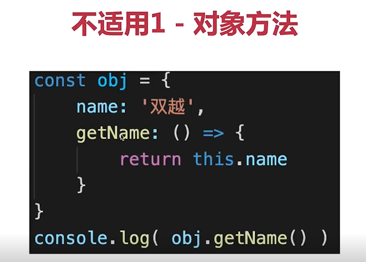 2 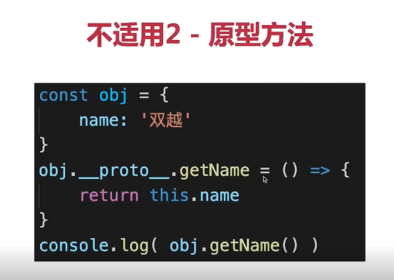 3 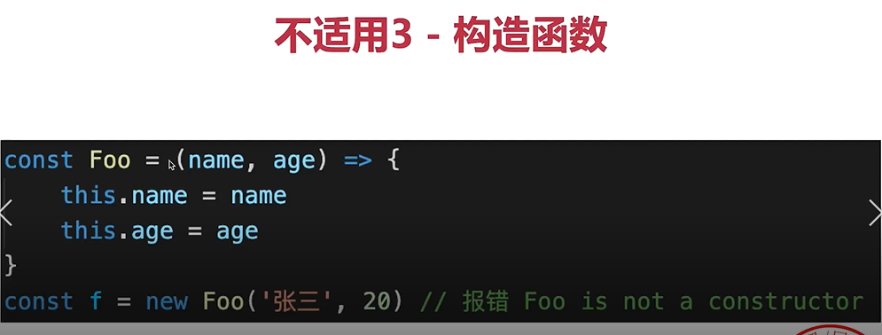
   4 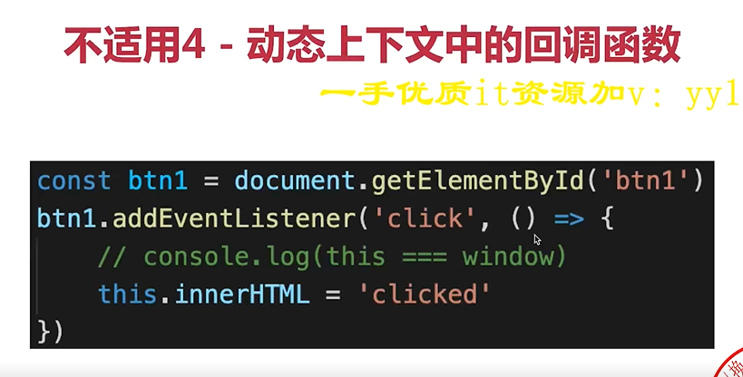  5 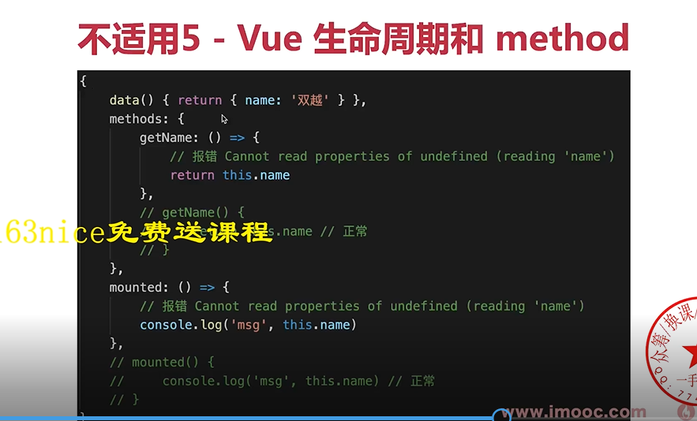
   传统vue组件是js对象 传统React 组件是class

- 11[this、apply、call、bind](https://juejin.cn/post/6844903496253177863)
一、es5中this 的指向:this 永远指向最后调用它的那个对象
二、改变 this 的指向的方法：
    1)使用 ES6 的箭头函数 ：ES6箭头函数的 this 始终指向函数定义时的 this，而非执行时。箭头函数需要记着这句话：“箭头函数中没有 this 绑定，必须通过查找作用域链来决定其值，
    如果箭头函数被非箭头函数包含，则 this 绑定的是最近一层非箭头函数的 this，否则，this 为 undefined”。
        ```javascript
            var name = "windowsName";
            var a = {
                name : "Cherry",
                func1: function () {
                    console.log(this.name)     
                },
                func2: function () {
                    setTimeout( () => {
                        this.func1()
                    },100);
                }
            };
            a.func2()     // Cherry
        ```
    2)在函数内部使用 _this = this   如果不使用 ES6，那么这种方式应该是最简单的不会出错的方式了，我们是先将调用这个函数的对象保存在变量 _this 中，
    然后在函数中都使用这个 _this，这样 _this 就不会改变了。
        ```javascript
            var name = "windowsName";
            var a = {
                name : "Cherry",
                func1: function () {
                    console.log(this.name)     
                },
                func2: function () {
                    var _this = this;
                    setTimeout( function() {
                        _this.func1()
                    },100);
                }
            };
            a.func2()       // Cherry
        ```
    3)使用 apply、call、bind  
        ```javascript
        //使用apply call bind
            var a = {
                name : "Cherry",
                func1: function () {
                    console.log(this.name)
                },
                func2: function () {
                    setTimeout(  function () {//apply
                        this.func1()
                    }.apply(a),100);
                    // setTimeout(  function () {//call
                    //     this.func1()
                    // }.call(a),100);
                    // setTimeout(  function () {//bind
                    //     this.func1()
                    // }.bind(a)(),100);
                }
            };
            a.func2()            // Cherry
        ```

- 12 apply、call、bind 区别:
  1))apply定义：apply() 方法调用一个函数, 其具有一个指定的this值，以及作为一个数组（或类似数组的对象）提供的参数
  语法：fun.apply(thisArg, [argsArray]) ：
  thisArg：在 fun 函数运行时指定的 this 值。需要注意的是，指定的 this 值并不一定是该函数执行时真正的 this 值，如果这个函数处于非严格模式下，
  则指定为 null 或 undefined 时会自动指向全局对象（浏览器中就是window对象），同时值为原始值（数字，字符串，布尔值）的 this 会指向该原始值的自动包装对象。
  argsArray：一个数组或者类数组对象，其中的数组元素将作为单独的参数传给 fun 函数。
  如果该参数的值为null 或 undefined，则表示不需要传入任何参数。从ECMAScript 5 开始可以使用类数组对象。浏览器兼容性请参阅本文底部内容。
  2))apply 和 call 的区别
  call语法：fun.call(thisArg[, arg1[, arg2[, ...]]])
  区别:call 方法接受的是若干个参数列表，而 apply 接收的是一个包含多个参数的数组。
  3))bind 和 apply、call 区别   call的性能比apply好，因为apply的入参是数组，需要对把数组处理成单个参数
  bind的入参跟call一致，可以传多个参数，但是bind 是创建一个新的函数，我们必须要手动去调用
        ```javascript
            var a ={
                name : "Cherry",
                fn : function (a,b) {
                    console.log( a + b)
                }
            }
            var b = a.fn;
            b.bind(a,1,2)()           // 3  手动调用
        ```

- 13 JS 中的函数调用：
1)作为一个函数调用:
        ```javascript
            var name = "windowsName";
            function a() {
                var name = "Cherry";
                console.log(this.name);          // windowsName
                console.log("inner:" + this);    // inner: Window
            }
            a();
            console.log("outer:" + this)         // outer: Window
        ```  
这样一个最简单的函数，不属于任何一个对象，就是一个函数，这样的情况在 JavaScript 的在浏览器中的非严格模式默认是属于全局对象 window 的，在严格模式，就是 undefined。
但这是一个全局的函数，很容易产生命名冲突，所以不建议这样使用
2）函数作为方法调用
        ```javascript
            var name = "windowsName";
            var a = {
                name: "Cherry",
                fn : function () {
                    console.log(this.name);      // Cherry
                }
            }
            a.fn();
        ```
这里定义一个对象 a，对象 a 有一个属性（name）和一个方法（fn）。
然后对象 a 通过 . 方法调用了其中的 fn 方法。
然后我们一直记住的那句话“this 永远指向最后调用它的那个对象”，所以在 fn 中的 this 就是指向 a 的。
4)new 实例化一个对象 手写new
        ```javascript
        //手写new
            function  myNew(constrc,...args){
                //1,2 创建空对象并且把空对象的__proto__指向constrc的原型对象
                let obj = Object.create(constrc.prototype)
                console.log("obj",obj)
                //3 改变constrc中this的指向并执行
                let res = constrc.apply(obj,args)
                console.log("res",res)
                console.log("res instanceof Object",res instanceof Object)
                //如果构造函数返回的是对象，则使用构造函数执行的结果。否则，返回新创建的对象
                return res instanceof Object ?res:obj
            }
            let  aaa = {}
            function person(name,age){
                // this.name = name;
                // this.age = age;
                return aaa
            }
            const person1 = myNew(person,'xiaoming',18)
            const person2 = new person('xiaoming',18)
            console.log('person1',person1,person2,person1 == person2)
        ```
Object.create() 方法用于创建一个新对象，使用现有的对象来作为新创建对象的原型（prototype）

-14对象字面量创建对象(obj = {})与 Object.create(null) 创建对象有什么区别
通过Object.create(null)创建的对象是非常纯净的，原型链的属性和方法都不会携带。这就非常适合数组对象开发的时候，从对象中取值，提高循环效率。


-15 map和set，map和object，map和weakMap，weakMap和weakSet？
一  Map Set ES6提供了新的数据结构Set数据结构和Map数据结构
  1）Map 对象保存键值对，并且能够记住键的原始插入顺序。任何值（对象或者原始值）都可以作为一个键或一个值。
    let iMap = new Map([['name', '张三'], ['name', 20]]);
  2）Set 结构类似于数组，Set 中的元素是唯一的。Set 是值的集合，是无序的。
    let iSet = new Set(['张三', 12, true])
    Set 对象是一个类数组对象，它长得就很像数组。
    Set 对象存储的值是不重复的，所以我们通常使用它来实现数组去重。
    Set 对象存储的数据不是键值对的形式，而且它可以存储任何类型的数据。
  使用场景 ：数组去重 let arr = [1, 2, 3, 4, 5, 6, 3, 2, 5, 3, 2]; console.log([...new Set(arr)]); // [1, 2, 3, 4, 5, 6]
二 Array和Set区别：Array是有序结构 Set是无序结构
三 Object和Map区别：
  1）key的有序和无序 ： Object是无序结构 Map是有序结构
  2）继承： Map 对象继承自 Obeject 对象
  3）创建实例 ： 创建 Map 实例只有一种方式,就是使用其内置的构造函数以及 new 语法,而创建对象则有多种方法,  
      const m = new Map([["key", "value"]]);
      const object = {...};
      const object = new Object();
      const object = Object.create(null);
      而通过使用 Object.create(null) 来创建的对象,它可以生成一个不继承 Object.prototyoe 的实例对象。
  4）迭代： 通过 Map 创建出来的实例对象能通过 for...of 方法进行遍历,而普通对象则不能,但是能通过 for...in 方法去枚举所有的 key,
    要想查看当前对象是否可以被 for...of 遍历,我们通过查看该对象本身是否有定义了 Symbol.Iterator 方法,,如果存在则可以变遍历:
    const map = new Map();
    const object = {};
    console.log(map[Symbol.iterator]); // [Function: entries]
    console.log(object[Symbol.iterator]); // undefined
  5） 键的值 ：在 Map 对象中,该对象的 key 可以是任何类型的值,
    而在普通对象中的 key 只能是 string 类型(number类型会自动转变成 string 类型)和 Symbol 类型,如果传进来的是复杂类型会自动报错:
四  WeakSet WeakMap [深入了解ES6的Set，WeakSet，Map和WeakMap](https://juejin.cn/post/7062921417196568607#heading-9)
    1）WeakSet  和Set结构类似，也是不重复的值的集合，但WeakSet的成员只能是对象。
    其次，WeakSet 中的对象都是弱引用，即垃圾回收机制不考虑 WeakSet 对该对象的引用，也就是说，如果其他对象都不再引用该对象，那么垃圾回收机制会自动回收该对象所占用的内存，不考虑该对象还存在于 WeakSet 之中。
    这是因为垃圾回收机制根据对象的可达性（reachability）来判断回收，如果对象还能被访问到，垃圾回收机制就不会释放这块内存。结束使用该值之后，有时会忘记取消引用，导致内存无法释放，进而可能会引发内存泄漏。WeakSet 里面的引用，都不计入垃圾回收机制，所以就不存在这个问题。
    因此，WeakSet 适合临时存放一组对象，以及存放跟对象绑定的信息。只要这些对象在外部消失，它在 WeakSet 里面的引用就会自动消失。
    由于上面这个特点，WeakSet 的成员是不适合引用的，因为它会随时消失。另外，由于 WeakSet 内部有多少个成员，取决于垃圾回收机制有没有运行，运行前后很可能成员个数是不一样的，而垃圾回收机制何时运行是不可预测的，因此 ES6 规定 WeakSet 不可遍历。
    2）WeakMap
        WeakMap结构与Map结构类似，也是用于生成键值对的集合。
        WeakMap与Map的区别有两点：
          首先，WeakMap只接受对象作为键名（null除外），不接受其他类型的值作为键名。
          其次，WeakMap的键名引用对象是弱引用，弱引用不参与垃圾回收的机制，也就是说GC在回收时不考虑弱引用的影响。当一个对象被回收后，相关的弱引用也会自动消失
        WeakMap只有四个方法可用：get()、set()、has()、delete()
        总之，WeakMap的专用场合就是，它的键所对应的对象，可能会在将来消失。WeakMap结构有助于防止内存泄漏。 注意，WeakMap 弱引用的只是键名，而不是键值。键值依然是正常引用
    [案例演示WeakMap的弱引用与垃圾回收](https://blog.csdn.net/mochenangel/article/details/125503606)
    价值：能够建立两个对象之间的联系，同时又不会影响垃圾回收对两个对象的垃圾回收，防止内存泄漏
- 1.说一下ES6的Proxy？

> Proxy对象用于创建一个对象的代理，从而实现基本的拦截和自定义（属性查找，赋值，枚举，函数调用等）。

> 语法：
```javascript
let p = new Proxy(target, handler);
```
> 参数：target：要使用Proxy包装的目标对象。handler：一个通常以函数作为属性的对象，各属性中的函数分别定义了在执行操作时代理p的行为。

> Proxy本质上是一个构造函数。

> Proxy.revocable()用来创建一个可撤销的Proxy对象，撤销方法revoke()。

> Proxy作用：用于拦截和自定义对象的一些操作。

- 总结：Proxy对象用于创建一个对象的代理，从而实现对对象的一些操作，例如拦截和自定义。Vue3中就使用了Proxy代替了Vue2中的Object.defineProperty。

- Object.assign() 方法用于将所有可枚举属性的值从一个或多个源对象复制到目标对象。它将返回目标对象。 
  简单来说，就是Object.assign()是对象的静态方法，可以用来复制对象的可枚举属性到目标对象，利用这个特性可以实现对象属性的合并。
  [Object.assign用法](https://blog.csdn.net/weixin_43290151/article/details/124715850)

- 2.深拷贝与浅拷贝的区别？怎么实现一个深拷贝？

> [参考链接](https://juejin.cn/post/6908309980206759943)
> [JS 深拷贝的原生终结者 structuredClone API](https://juejin.cn/post/7080433165264748557)
> 浅拷贝：一个对象直接拷贝已存在对象的引用。

> 当原对象属性值都是基本数据类型时，改变新拷贝的对象属性并不会影响到原对象。

> 浅拷贝的方式：Object.assign()，展开语法，循环遍历。

> 深拷贝：复制一个一模一样的对象，不共享内存，修改其中一个对象，不会影响到另一个对象。

> 深拷贝方式：1.利用JSON.parse(JSON.stringify(obj))。

```javascript
        let obj = {
    age: 20,
    friends: ['小花', '小丽']
}
let obj1 = JSON.parse(JSON.stringify(obj));
obj1.age = 100;
obj1.friends[0] = '1123';
console.log(obj);
console.log(obj1);
```
> 上面这种方式不能处理undefined，function对象和Symbol类型，原因是JSON.stringify()在处理这些类型的时候，这些类型会被忽略。
> 2.递归，对每层数据进行遍历然后进行拷贝。

```javascript
const obj = {
    age: 20,
    friends: ['小花', '小丽']
}

function copyObj(obj) {
    const obj1 = Array.isArray(obj) ? [] : {};
    for (const key in obj) {
        if (typeof obj[key] === 'object') {
            obj1[key] = copyObj(obj[key]);
        } else {
            obj1[key] = obj[key];
        }
    }
    return obj1;
}

const obj2 = copyObj(obj);
obj2.age = 100;
obj2.friends[0] = '1245';
console.log(obj);
console.log(obj2);
```
>无法处理map set 以及循环引用
> 3.jQuery中实现深拷贝，jQuery中实现深拷贝的原理也是递归。

> $.extend()方法，$extend(true,obj1,obj2);obj1目标对象，obj2合并到obj1中的对象。

```javascript
const obj = {
    name: {
        firstName: '小',
        lastName: '星',
    },
    age: undefined,
    sayName() {
    }
}
const obj2 = $.extend(true, {}, obj);
console.log(obj);
console.log(obj2);
```

> $.extend()方法也处理不了undefined。

> 4.Lodash实现深拷贝，_.defaultsDeep()方法。

```javascript
        let obj = {
    age: 25,
    un: undefined,
    sy: Symbol(),
    fu: function () {
    },
    arr: [1]
}
let obj2 = _.defaultsDeep({}, obj);
obj2.arr[0] = 20;
console.log(obj);
console.log(obj2);
```

> Lodash能处理function，undefined和Symbol()类型。

使用 structuredClone  美[ˈstrʌktʃərd]
const obj = {id: 'abcd1234', values: ['a', 'b']};
const clone2 = structuredClone(obj)

- 总结：深浅拷贝是针对引用类型的，浅拷贝是指拷贝对象属性的引用，而深拷贝是复制一个一模一样的对象，不共享内存，修改一个对象不会影响到另一个对象。 浅拷贝有3种方式，使用Object.assign()方法，使用展开语法，循环遍历。
  而深拷贝有4种方式，使用JSON.parse(JSON.stringify())，注意这种方法处理不了function、undefined和Symbol类型，第2种使用递归， 第3种使用jQuery的$.extend()
  方法，第4种使用lodash库的_.defaultsDeep()方法。 

-如何解决深拷贝递归的循环引用问题？
    使用WeakMap解决循环引用的问题。
```javascript
 function deepCopy2(obj,weakMap = new WeakMap){
    let res  = Object.prototype.toString.call(obj) == '[object Array]'?[]:{}
    if (weakMap.has(obj)) return weakMap.get(obj)
    weakMap.set(obj,res)
    Object.keys(obj).forEach(k =>{
        if (typeof obj[k] == 'object'&& obj[k] !== null ){
            res[k] = deepCopy2(obj[k],weakMap)
        }else{
            res[k] = obj[k]
        }
    })
    return  res
}
console.log('deepcopy2',deepCopy2(obj))

```

- 3.怎么理解原型链？

> 对象可以通过_proto_属性找到不属于该对象的属性，_proto_将对象连接起来组成原型链。

> _proto_和prototype之间的区别，prototype只有函数有，而且只有当函数在用作构造函数时，prototype才是函数的原型，当函数用作对象时，那么函数的原型时_proto_。

> 原型对象就是构造函数的prototype属性。

> 原型链的作用主要是为了实现对象的继承。

> 原型链种的最后一个环节为null。

> 再看一遍红宝书这章。

> 什么是原型链？什么是原型对象?

> 实例与构造函数原型之间有直接联系，但是与构造函数本身没有联系。

- 4.写出new的执行过程，并自己实现一个new函数？

> new关键字的执行过程：

> 1.创建一个空的JavaScript对象（即{}）；

> 2.链接该对象（设置该对象的constructor）到另一个对象；

> 3.将步骤1新创建的对象作为this的上下文；

> 4.如果该函数没有返回**对象**，则返回this。

> 手写一个new：

```javascript
        // 传参写法
function myNew(fn, ...rest) {
    const obj = {};
    obj.__proto__ = fn.prototype;
    const res = fn.apply(obj, rest);
    return res instanceof Object ? res : obj;
}

// 不传参写法
function myNew() {
    const arg = arguments[0],
        args = [...arguments].slice(1);
    const obj = Object.create(arg.prototype);
    const res = arg.apply(obj, args);
    return res instanceof Object ? res : obj
}
```

- 5.说一说instanceof？

> instanceof用于检查实例的原型链中是否包含指定构造函数的原型。

- 6.创建对象的方式？

> Object构造函数，对象字面量，工厂模式，构造函数模式，原型模式。

```javascript
        // 工厂模式
function Person(name) {
    const obj = new Object();
    obj.name = name;
    return obj;
}
```

```javascript
        // 构造函数模式
function Person(name) {
    this.name = name;
};
const p = new Person('小李');
```

```javascript
        // 原型模式
function Person() {
}

Person.prototype.name = '小李';
Person.prototype.say = function () {
    console.log(123);
}
const p = new Person();
```

- 7.

- 8.实现一个函数柯里化？

> 柯里化是指将多个参数的函数转换成一系列使用一个参数的函数。

```javascript
        // 将fn(a,b,c)转换为fn(a)(b)(c)
function fn(f) {
    return function (a) {
        return function (b) {
            return f(a, b);
        }
    }
}
```

> 柯里化的好处，延迟执行，提前返回。

- 9.对函数式编程的理解？

> 函数式编写就是将过程逻辑写成函数，定义好输入参数，只关心输出结果。

> 纯函数就是没有副作用并且不依赖外部作用域数据的函数，坚持单一原则，输出只跟输入有关系。

> 优点：复用性强，方便维护。

> 缺点：可能产生性能缺陷，可能对方法进行过度包装，从而产生上下文切换的开销。

- 10.链式调用？

> 链式调用的原理是作用域链，返回对象本身的引用进行链式调用，利用闭包，存储需要用的值，以便后面使用。

- 11.JS函数的4种调用方式？

> 1.直接调用。2.通过对象方法调用。3.通过apply或call调用。4.使用new调用构造函数。

- 12.数组方法slice和splice的区别？

> splice(拼接) array.splice(startingIndex, length, ...items) 从数组固定位置对原数组进行删除添加操作。会改变原数组。返回的是startIndex和length取出的值组成的数组

> slice（片） array.slice(startingIndex, endingIndex)从数组中提取一部分元素组成数组并返回。不会改变原数组

- 13.类数组转换成数组的方法？

> 1.Array.from()。

> 2.Array.prototype.slice.call()。

> 3.展开语法。

- 14.数组去重的方式？

> 1.new Set()

> 2.双循环。

> 3.利用indexOf。

> 采用fiter，map，reduce等方法。

- 15.数组有哪些方法？

> map()、reduce()、fiter()、some()、erery()、forEach()、unshift()向数组的开头添加一个或更多元素，并返回新的长度 、shift()删除数组第一个元素，返回被删除的元素、
push()数组的末尾添加一个或多个元素，并返回新的长度、pop()删除最后一个元素，返回被删除的元素、 fill()、copyWith()、sort()、reverse()颠倒数组中元素的顺序、splice()、slice()、concat()、
  join() 把数组中的所有元素转换一个字符串 array.join(separator) separator	 可选。指定要使用的分隔符。如果省略该参数，则使用逗号作为分隔符、keys()、values()、entries()、reduceRight、indexOf()、find()、includes()、flat()、flatMap()
  Array.from()方法从类似数组或可迭代对象创建一个新的(浅拷贝)的数组实例

-reduce  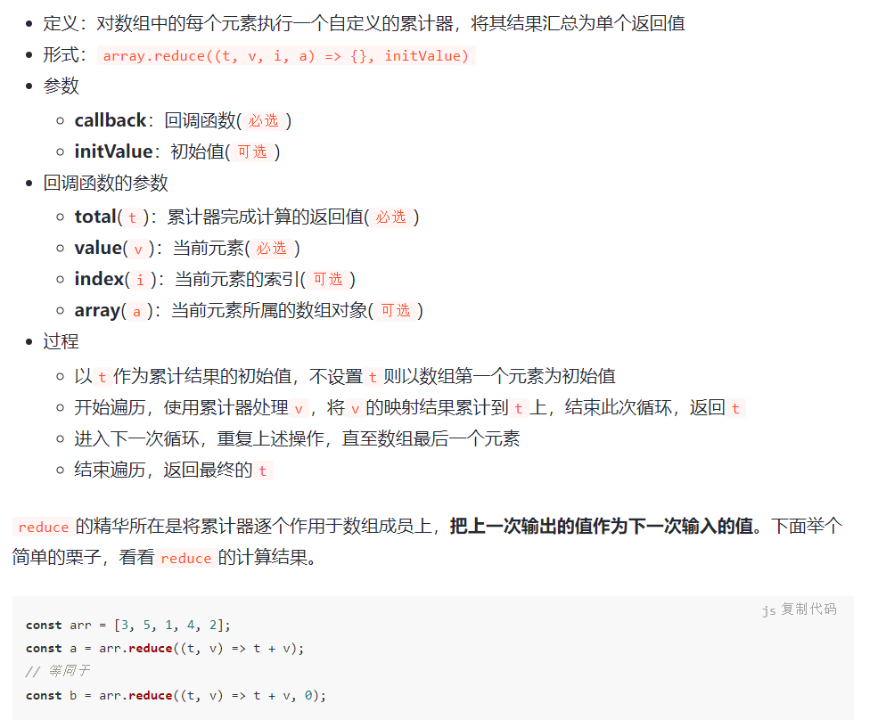

- 字符串有哪些方法？
> str.charAt(index) 获取指定位置的字符;
> str.charCodeAt(index) 获取指定位置字符的编码; 
> str.indexOf(searchvalue,fromindex)返回字符串中一个子串第一处出现的索引 从字符串中左边开始搜索规定的字符子串 返回值：字符子串的索引值，如果没有找到，则返回-1; 
> str.lastIndexOf(searchvalue,fromindex) 返回字符串中一个子串最后一处出现的索引 功能：从字符串中右边开始搜索规定的字符子串 返回值：字符子串的位置，如果没有找到，则返回-1;
> str.slice(start，end) (片); 截取字符串 ①start：必需，指定字符串的开始位置 ②end：可选，指定字符串的结束位置，省略时截取至字符串末尾；end本身不在截取范围内； ③当参数为负数时，会将传入的负值与字符串的长度相加，之后再确定相应的位置。
>str.split(" ") （(使)分裂）;把一个字符串分割成字符串数组
> str.replace(regexp/substr,replacement);在字符串中用一些字符替换另一些字符，或替换一个与正则表达式匹配的字符串 ①regexp/substr：必需，规定字符串或要替换的模式的RegExp对象； ②replacement：必需，字符串值； ③replace()方法不会修改原来的字符串，只会生成原字符串的副本。
> str.includes(searchString[, position]) searchString	需要查找的目标字符串 position	(可选) 从当前字符串的哪个索引位置开始搜寻子字符串，默认值为 0
> 字符串的转换大小写方法：toUpperCase()、toLowerCase()
> trim() 去掉字符串前后的空格

- 16.[iterable](https://blog.csdn.net/zhouyuzhu666/article/details/120515394) 
  iterable是es6新增的类型，iterable类型的数据有，Array,Set,Map,Set和Map是es6新增的数据类型，

  

- 17.JS中的sort方法内部使用的什么排序？

> sort中采用的是插入排序和快速排序结合的排序方式。

- 18.实现一个发布订阅系统，包括 on、emit、off 等等？

- 19.SVG和Canvas各自的优缺点？

> SVG优点：矢量图，放大后不会失真。

> SVG缺点：涉及到动画需要更新dom，性能较低。

> canvas优点:定制性强，通过JS进行绘制，涉及到动画性能较高。

> canvas缺点:放大会失真，依赖于像素。

- 20.说说事件循环吧？ 浏览器事件循环和Node事件循环？
一、单线程和异步
  js是单线程的（无论在浏览器还是node.js当中）
  浏览器中js执行和DOM渲染共用一个线程 
二、宏任务 微任务 
  宏任务：js（整体代码） setTimeOut setInterval ajax
  微任务：promise async/await Mutationobserver(监听dom变化)
  微任务在下一轮dom渲染之前执行 ，宏任务在之后执行。 只是dom的渲染，不是dom的操作

  EventLoop 中每一次循环被称为 tick，tick的步骤是 先执行script（宏任务），执行完所有的同步代码，遇到异步的API或函数，就分别放到宏任务队列或微任务队列（遇到setTImeOut延迟对应的时间再放）
  等到当前宏任务执行完毕，检查微任务队列有没有微任务，有的话就清空微任务队列并且全部执行完。
  微任务队列清空后，如果宿主环境为浏览器可能会有渲染 DOM 的操作，不过浏览器也会有相应的优化多个 tick 后合并成一次渲染操作。到此当前 tick 结束
  接着就是进入下一次 tick，如果当前执行栈是空闲状态会从宏任务队列中取出一个任务执行，宏任务的执行完毕后紧跟着的又是清空微任务队列，这里可以理解为微任务始终是在当前 tick 末尾执行。
  以上步骤循环反复就形成了 EventLoop。

 
三 nodejs异步 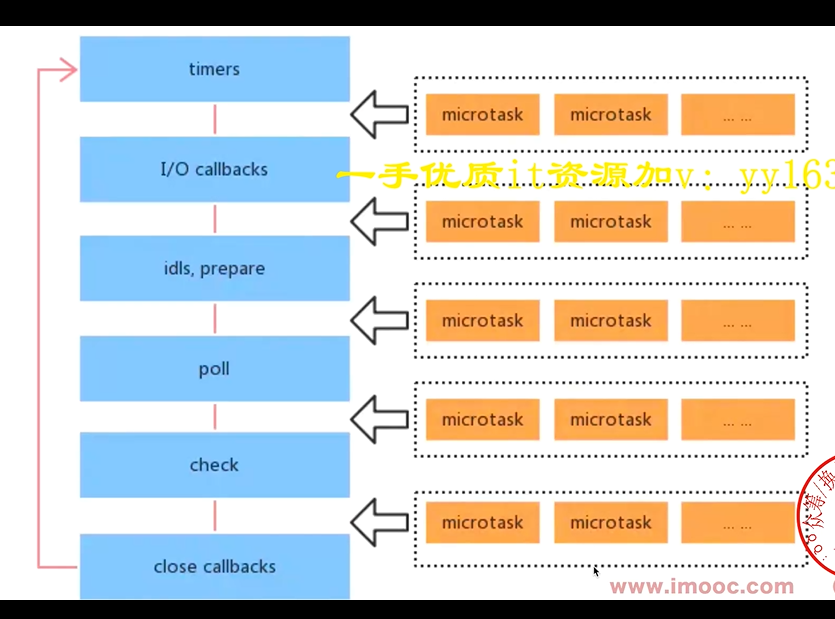
  用setImmediate代替process.nextTick 因为process.nextTick优先级最高如果里面的程序很耗时那就阻塞后面的了 
四  浏览器事件循环和Node事件循环区别： nodejs宏任务和微任务分类型，有优先级，而浏览器不分类型，没有优先级
  


- 21.说一说JS闭包吧？

> 函数嵌套函数，且内部函数调用父级作用域的变量就可以称之为闭包了 再解释下作用域 作用域链 变量

> 闭包的作用，可以读取函数内部变量，实现私有变量的保护。

> 闭包的原理是作用域链。

> 闭包的缺点，可能会导致内存泄漏。

- 22.防抖节流？
一 防抖：触发高频事件后n秒内函数只会执行一次，如果n秒内高频事件再次被触发，则重新计算时间。
一 节流：高频事件触发，但在n秒内只会执行一次，所以节流会稀释函数的执行频率。
  
```javascript
 //防抖 bounce[baʊns]
   function debounce(delay,fn){
       let timer = null
       return function (e){
           clearTimeout(timer)
           timer = setTimeout(() =>{
               fn.call(this,arguments)
           },delay)
       }
   }
   //节流 throttle [ˈθrɑːtl]
    function throttle(delay,fn){
       let isRun = true//1 定义一个标识决定定时器是否执行完毕
        return function (){
           if (!isRun) return// 2 如果没执行完直接return
            isRun = false//执行完毕就置为正在执行
            setTimeout( () =>{
                fn.call(this,arguments)
                isRun = true//置为执行完毕
            },delay)
        }
    }
    

```
  

- 23.跨域？

- 24.重绘与重排？

> 重排会导致页面重新渲染。

> 而重绘不会导致页面重新渲染。

- 25.var、let、const区别？


- 27.如何实现图片轮播？

- for...in for...of 区别 for(let key in arr||string||arguments){}  for(let val of arr||string||arguments){}
1.for in 遍历得到key  for of遍历得到value
2 遍历对象：for in可以 for of 不可以    遍历Map、Set、generator：for of可以  for in不可以
3 for in用于可枚举数据  对象 数组 字符串 , for of用于可迭代数据   数组 字符串 Map Set  
4 使用for-in循环，返回的是所有能够通过对象访问的、可枚举的属性，其中既包括存在于实例中的属性，又包括存在于原型中的属性。
  屏蔽了原型中不可枚举属性的实例属性也会在for-in循环中返回。   如果想要只遍历实例对象的属性，不遍历原型链中的属性，可以使用hasOwnProperty 方法过滤一下。
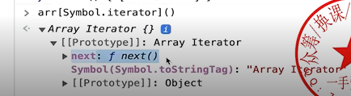
可枚举对象的一个定义特征是：当我们通过赋值运算符将属性赋值给对象时，我们将内部可枚举（enumerable ）设置为 true。这是默认值。
但是，我们可以通过将其设置为 false 来更改此行为。
经验法则是，可枚举属性总是出现在 for...in 循环中。
Object.keys()   （ES6对象的拓展） ：用于获取对象自身所有的可枚举的属性，但不包括原型中的属性，然后返回一个由属性名组成的数组。注意它同for..in一样不能保证属性按对象原来的顺序输出。

- for await ...of 用于遍历多个Promise 和Promise.all的作用一样

- forEach:不能跳出循环 。 
  [Js中forEach map无法跳出循环问题以及forEach会不会修改原数组](https://blog.csdn.net/weixin_43190804/article/details/125643403?spm=1001.2101.3001.6661.1&utm_medium=distribute.pc_relevant_t0.none-task-blog-2%7Edefault%7EOPENSEARCH%7ERate-1-125643403-blog-127126782.pc_relevant_aa&depth_1-utm_source=distribute.pc_relevant_t0.none-task-blog-2%7Edefault%7EOPENSEARCH%7ERate-1-125643403-blog-127126782.pc_relevant_aa&utm_relevant_index=1)
一  forEach/map ：不能跳出循环   因为功能是遍历
  for 循环 ：return 跳出循环
  every() ：当内部 return false 时跳出整个循环（需要写 return true ）
  some ()  ：当内部 return true 时跳出整个循环 
二 forEach会不会改变原数组？
  答：如果数组中的值是基本类型, 改变不了;如果是引用类型分两种情况：
  1、没有修改形参元素的地址值, 只是修改形参元素内部的某些属性，
  会改变原数组；2、直接修改整个item对象时，无法改变原数组；
  
-
-for 和forEach哪个更快
for更快  因为forEach每次都要创建一个函数来调用，而for不会创建函数。 函数会有独立的作用域，会有额外的开销
  

-Ajax Fetch axios 区别 
Ajax是技术统称，  Fetch 具体API ，Axios 第三方库
Fetch:浏览器原生API，用于网络请求，更加简洁，易用，支持promise
```javascript
//用XMLHttpRequest fetch 实现 ajax
function ajax1(url,sucessFn){
    const xhr = new XMLHttpRequest()
    xhr.open('GET',url,false)//false 异步
    xhr.onreadystatechange = function () {
        if (xhr.readyState ==4){
            if(xhr.status == 200){
                sucessFn(xhr.responseText)
            }
        }
    }
    xhr.send(null)
}
    ajax1('https://www.fastmock.site/mock/8d2379d99cbc63432bfc2dcdb7d4af0a/runmonitor/serveInfo/paginQuery',function (res){console.log(res)})
function ajax2(url){
  fetch(url).then(
          function(res) {
            if (res.status === 200) {
              return res.json()
            } else {
              return Promise.reject(res.json())
            }
          }
  ).then(function(data) {
    console.log(data);
  }).catch(function(err) {
    console.log(err);
  })
}
ajax2('https://www.fastmock.site/mock/8d2379d99cbc63432bfc2dcdb7d4af0a/runmonitor/serveInfo/paginQuery')

```
-  js严格模式的特点
```javascript
'use strict' //全局开启严格模式
function fn(){
    'use strict'//只对函数开启
}
//特点
//1 全局变量必须声明  2 禁止使用with 3、 禁止this指向window 4 函数参数不能重名
```

- 跨域请求时为什么发送options请求 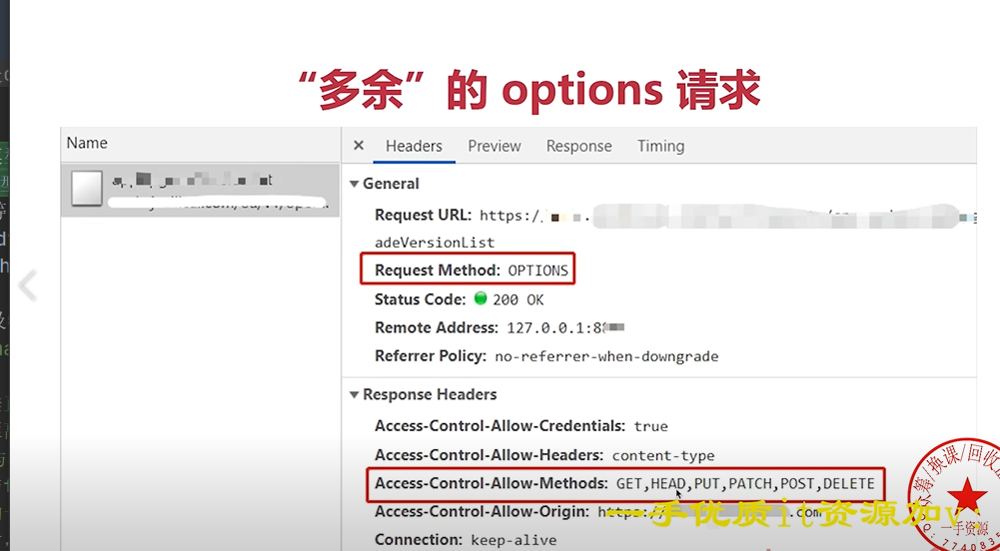
  有三个标签是允许跨域加载资源： <link href='xxx'> <script src='xxx'>
  options请求是跨域请求之前的预检查 浏览器自行发起的，无需我们干预
  
- 27.跨域问题？

>协议、域名、端口任何一个不一样都会造成跨域问题。

>解决跨域问题的方案：jsonp，CORS，postMessage、 nginx代理，websocket协议
    1 ）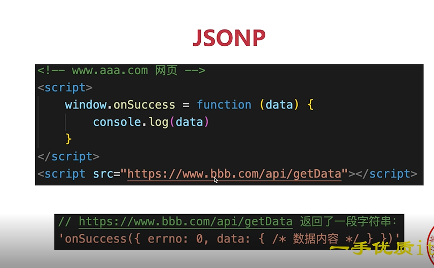 A网页通过scripte 的src 跨域请求一个b的接口，b接口直接返回一个字符串给
    A, A当做方法执行，拿到数据  缺点是仅支持get方法具有局限性, 不安全可能会遭受XSS攻击。
    2）CORS服务端配置
    3）postMessage是HTML5 XMLHttpRequest Level 2中的API，且是为数不多可以跨域操作的window属性之一，它可用于解决以下方面的问题： 
        页面和其打开的新窗口的数据传递
        多窗口之间消息传递
        页面与嵌套的iframe消息传递
        上面三个场景的跨域数据传递
- js中哪些情况会造成内存泄漏？

>1.闭包使用不当可能会导致内存泄漏。

>2.Dom对象内存泄漏。

>3.使用setTimeout和setInterval没有及时销毁。

>4.隐式声明的全局变量。


- [JSON对象](https://blog.csdn.net/qq_55316925/article/details/128616475)
  JSON 格式（JavaScript Object Notation 的缩写）是一种用于数据交换的文本格式，2001年由 Douglas Crockford 提出，目的是取代繁琐笨重的 XML 格式。
  JSON对象是 JavaScript 的原生对象，用来处理 JSON 格式数据。它有两个静态方法：JSON.stringify()和JSON.parse()。
  JSON.stringify()方法用于将一个值转为 JSON 字符串。该字符串符合 JSON 格式，并且可以被JSON.parse()方法还原。忽略对象的不可枚举的（enumerable: false）属性。
  JSON.parse()方法用于将 JSON 字符串转换成对应的值。

-nodejs如何开启多进程，进程如何通讯
一、进程 线程
进程：OS（操作系统）进行资源分配和调度的最小单位，有独立内存空间
线程：OS（操作系统）进行运算的最小单位，共享进程内存空间
二、为什么需要多进程
  压榨多核cpu 内存 单个进程的内存上限是2G
三、怎么开启子进程
    child_process.fork 和 cluster.fork 开启
    使用send on传递信息

-Js Bridge （美[brɪdʒ] 桥; 起联系作用的事物;）
一 、定义：js无法直接调用native Api,需要通过特定的‘格式’来调用，这些‘格式’统称js bridge ，例如微信JSSDK
二、实现方式：
    1 注册全局API  异步有问题
    2 URL  Scheme（方案;美[skiːm]） :URL scheme是App提供给外部的可以直接操作App的规则。
    
- 移动端H5 300ms延迟
背景：double tap to zoom （双击放大）
  解决：以前用FastClick（原理监听touchEnd）  现在在meta标签加 device-width知道移动端做响应式，就没必要有300ms延迟了
  <meta name=”viewport” content=”width=device-width, initial-scale=1, maximum-scale=1″>
width：控制 layout viewport 的大小，可以指定的一个值，如 600，或者特殊的值，如 device-width 为设备的宽度（单位为缩放为 100% 时的 CSS 的像素）。
viewport的width和scale是两个维度的放大或缩小。（用多大尺寸的放大镜或多高倍率的放大镜）
放大缩小仅仅针对可视视口，布局视口不会发生改变。（清明上河图那张纸不可能被拉伸或压缩）

- script标签中defer（延迟） async（异步）有什么区别 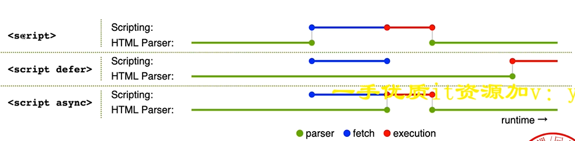
```javascript
<script src='' defer></script>   <script src='' async></script>
```
  一、parser 美[ˈpɑrsər] 解析器; 分析器; 剖析器; 解析; 语法分析器;
  fetch  美[fetʃ] vt.	获取
  execution 	美[ˌeksɪˈkjuːʃn] n.	 执行; 实施; 表演;
  二、
  无：暂停解析html，下载js，执行js，再解析html
  defer 是html解析跟js加载并行，解析html完成后再js执行 跟js放在body最后作用类似
  async 也是html解析跟js加载并行，加载js完成后js执行,再解析html
  
-prefetch 跟dns-prefetch  (prefetch 网络	预读; 数据预取; 预存取; 预载; 预读取文件夹;)
一、preload prefetch
preload 资源在当前页面使用，会优先加载
prefetch 资源在未来页面使用，空闲时加载
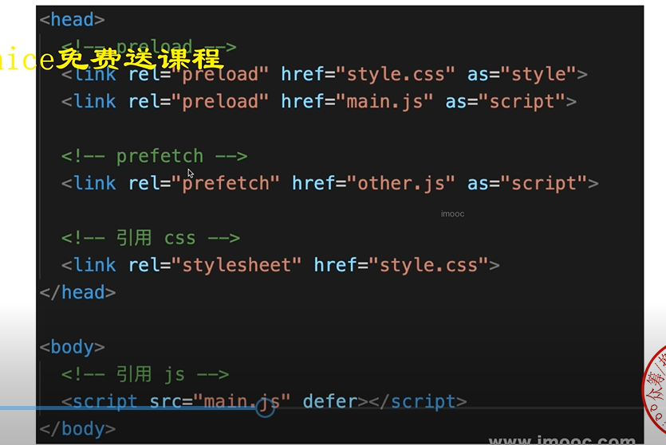
二、dns-prefetch preconnect 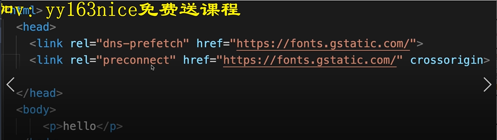
dns-prefetch DNS预查询
preconnect DNS预连接（tcp连接） connect 美[kəˈnekt] 使计算机连接(到互联网或计算机网络)  

- h5页面首屏优化
一 路由懒加载
  1 适用于spa 2 路由拆分 优先保证首页加载  vue中配置路由懒加载用import  component: ()=>import("@/components/HelloWorld")
  定义： 也叫延迟加载，即在需要的时候进行加载，随用随载。
  方式：
    1：vue-router配置路由，使用vue的异步组件技术，可以实现懒加载，此时一个组件会生成一个js文件。
        component: resolve => require(['放入需要加载的路由地址'], resolve)
    2 ES2020推荐方式imprort()—-推荐使用, import属于异步引用组件，需要特殊的babel-loader处理: syntax-dynamic-import
    const Aoo = () => import('../components/Aoo')
二、服务端渲染SSR
  SSR渲染过程简单，所以性能好，纯H5页面优化的终极方案
  ssr直接从服务器请求拿到带有数据的html 
三、APP预取
  1 如果H5在App webView中展示，可使用app预取
  2 用户在列表页的时候（微信朋友圈），app会预加载可视区域内新闻链接的首屏内容，等到用户进H5页面（点新闻链接），就直接从app中获取内容，
  瞬间展示首页
四 分页 对列表页 上拉加载更多
五 图片懒加载 
  原理： 监听滚动 节流  getBoundingClientRect().top //dom距离视窗的距离 小于 window.innerHeight //视窗高度  时就把src修改成对应的地址
  提前设置图片尺寸，尽量只重绘不重排
六 hybrid（混合）
  提前把html css js 下载到app内部 ，在app webview中使用file://协议加载页面文件 ，再用请求接口数据
  
- ES增加了哪些新特性？
一
ES6新增了类、模块、迭代器、生成器、箭头函数、Promise、反射、代理和众多新的数据类型。
ES6新增了，let和const，展开语法，箭头函数，Promise，类，模板字符串，函数参数默认值，对象数组解构，for...of...,for...in。
  

-ES2020 [可选链和模块动态导入](https://blog.csdn.net/KlausLily/article/details/124580720) 
 一、 可选链：
借助可选链特性我们可以通过 ?. 操作符在访问对象嵌套的属性而不需要校验这些属性是否存在。
?.操作符与传统的.操作符十分相似，但是在操作符前面的值为undefined或null时该语法不会导致程序报错，并且其获取到的属性值为undefined。
使用可选链特性可以使代码变得更简洁的同时确保在访问对象中不确定是否存在的属性时不会报错。
  二、模块动态导入
动态导入使得应用可以以原生的方式（译者注：之前的动态导入都是由打包工具，如 webpack 在本地编译打包的方式实现的）把 .js 文件作为模块动态地进行导入。
在 ES2020 之前，模块无论是否被使用到了都会被导入进来。这一特性，将极大的提升网页应用的性能。
动态导入语法实现了两个模块的动态导入。只有在对应模块对使用到时，其模块代码才会被加载，这样就减少了页面加载资源的大小并缩短了页面加载时间。

-[模块化方案](https://blog.csdn.net/Superman_H/article/details/126911615)
一 CommonJs (cjs)
cjs 是 Node 的模块化规范，使用 require & exports 进行导入导出
cjs 可作用于 node 环境 & webpack 环境，但不可作用浏览器
如果前端项目在 webpack 中，也可以理解为浏览器和 Node 都支持
二 ESModule (esm)
esm 是 ES6 的模块化规范，使用 import & export 进行导入导出
Node 及浏览器均支持 esm
如需动态导入，esm 也可使用import()表达式： import("./module.js") 进行导入
import()表达式返回一个解析为模块对象的 promise  新特性

-后端返回10W数据怎么处理
 1.本身就不合理，需要分页
2 自定义nodejs中间层，获取并拆分10w条数据
3 虚拟列表-第三方lib vue virtual（美[ˈvɜːrtʃuəl] 虚拟） scroll list
    只渲染可视区域的DOM

- 前端常见的设计模式和使用场景
一 设计原则
1最重要的思想：开放封闭原则  对扩展开放 对修改封闭（修改后不影响别的功能）
```javascript
//一 工厂模式：用一个工厂函数，来创建实例，隐藏new ， 如jQuery $函数 react creatELement
function Person(name) {
    const obj = new Object();
    obj.name = name;
    return obj;
}
let xiaoming = Person("xiaoming")
//二 单例模式：限制类只能有一个实例化对象。 全局唯一的实例 如 vuex redux的store  提示弹框
class SingelTon{
    private static instance:SingelTon | null = null
    private constructor(){}//私有属性
    public static getInstance():singelTon{
        if (this.instance == null) this.instance = new  singelTon()
        return this.instance
    }
    f1(){}
}
//三 代理模式 ：使用者不能直接 访问对象，而是访问一个代理层，在代理层可以监听get set 做很多事情。
// 如proxy实现vue3响应式 https://es6.ruanyifeng.com/#docs/proxy

//四 观察者模式  监听事件 btn.addEventListener('click',()=>{} )

//五 发布订阅 vue组件通信中的自定义事件.  绑定事件event.on()  触发事件event.emit()
```
二 观察者模式和发布订阅模式区别： 观察者模式没有中间媒介，发布订阅模式有
发布订阅模式：发布者=>事件中心<=>订阅者。
观察者模式：目标 <=> 观察者

- 扩展运算符
一 扩展运算符（spread运算符）用三个点号（…）表示，功能是把数组或类数组对象展开成一系列用逗号隔开的值。 
二 rest运算符
  rest运算符也是三个点号，不过其功能与扩展运算符恰好相反，把逗号隔开的值序列组合成一个数组
  
-如果proxy_pass末尾有斜杠/，proxy_pass不拼接location的路径
如果proxy_pass末尾无斜杠/，proxy_pass会拼接location的路径
一、proxy_pass末尾有斜杠
location  /api/ {
proxy_pass http://127.0.0.1:8000/;
}
请求地址：http://localhost/api/test
转发地址：http://127.0.0.1:8000/test
二、proxy_pass末尾无斜杠
location  /api/ {
proxy_pass http://127.0.0.1:8000;
}
请求地址：http://localhost/api/test
转发地址：http://127.0.0.1:8000/api/test

-[竞态问题](https://juejin.cn/post/7128205011019890695)
简单来说，竞态问题出现的原因是无法保证异步操作的完成会按照他们开始时同样的顺序
例子：有一个分页列表，快速地切换第二页，第三页；
先后请求 data2 与 data3，分页器显示当前在第三页，并且进入 loading；
但由于网络的不确定性，先发出的请求不一定先响应，所以有可能 data3 比 data2 先返回；
在 data2 最终返回后，分页器指示当前在第三页，但展示的是第二页的数据。
这就是竞态条件，在前端开发中，常见于搜索，分页，选项卡等切换的场景。
解决：1 取消请求  axios ：AbortController() 在处理请求错误时，需要判断 error 是否来自 cancel  abort 放弃;
```javascript
const controller = new AbortController();
axios.get('/xxx', {
    signal: controller.signal
}).then(function(response) {
//...
});

controller.abort() // 取消请求
```
2 忽略请求
使用唯一 id 标识每次请求  具体思路是：
利用全局变量记录最新一次的请求 id
在发请求前，生成唯一 id 标识该次请求
在请求回调中，判断 id 是否是最新的 id，如果不是，则忽略该请求的回调


-code review
一、1 代码规范 （变量命名 代码语义）  2重复代码要抽离 复用  3 单个函数内容过长需要拆分 
4 算法复杂度 5 安全问题 6 扩展性 

-不足 
限定在非核心技术领域 比如nodejs不是很熟  
翻转话题 面对nodejs不熟这个事，我正在进行学习，估计一个月就学完了

- 绝对路径，从根目录为起点到某一个目录的路径；
相对路径，从一个目录为起点到另外一个的目录的路径。

 


