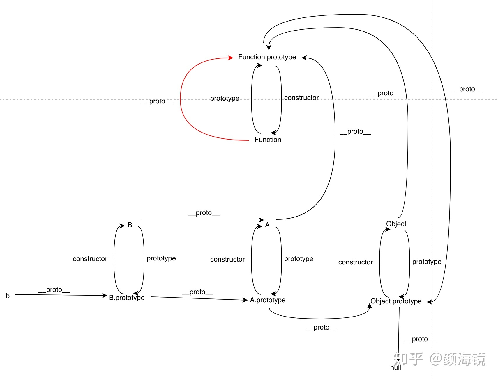

- let var 声明提升：把声明提升到作用域的顶部，即提升到所有可执行代码之前。 （作用域分为全局作用域、函数作用域、块级作用域，此处仅指前两个作用域。）
  声明提升分为“变量”声明提升、“函数”声明提升。（类定义不能提升） 提升会导致一些奇怪现象
 [](https://zhuanlan.zhihu.com/p/519406888)

-作用域 变量 作用域链 [原生js作用域以及变量提升和函数提升的理解](https://blog.csdn.net/weixin_39755186/article/details/93161335)
作用域 一：全局作用域：在整个script标签或者一个单独的js文件内起作用 二：函数作用域（局部作用域）：只能在函数内部起效果和作用
三：块级作用域：在for(){},if(){},else{}，try{},cath(){}等等的花括号{}内部的作用域，ES6中新增了块级作用域 
在块级作用域中，var定义的变量是全局变量，let定义的变量是局部变量。而在局部作用域中，无论是用var定义的变量还是用let定义的变量都是局部变量。
无论是在块级作用域还是局部作用域，省略变量前面的var或者let都会变成一个全局变量。
注意：①对象的{}不属于块级作用域，像for(){},if(){},else{}，try{},cath(){}等等的花括号才是块级作用域
②对象的{}的作用域 是什么作用域取决于对象所处的作用域，比如对象在全局作域 下定义的，那么对象的{}的作用域就是全局作用域 
全局变量和局部变量 根据作用域的不同，变量可以分为全局变量和局部变量。
（1）全局变量：在全局作用域下的变量，在全局下都可以使用，包括函数内部。并且，全局变量只有浏览器关闭的时候才会销毁，比较占内存资源。
（2）局部变量：在局部作用域下的变量，或者说成在函数内部的变量。并且，局部变量在程序执行完毕后就会立即销毁，比较节约内存资源。
注意： （1）在函数内部没有声明就直接赋值的变量是全局变量 （2）函数的形参可以看作是局部变量 
作用域链:内部作用域访问外部作用域的变量，采取的是链式查找的方式来决定取哪个值，这种结构我们称为作用域链，采取就近原则的方式向上一级一级的作用域来查找变量值， 最顶级是全局作用域，如果到全局作用域也没找值，那么就会报错。

1)基本数据类型：String Number Boolean Null Undefinded Symbel Bigint 引用数据类型 Object Array Function undefined 表示未定义的变量。
null 值表示一个空对象指针 undefined表示"缺少值"，就是此处应该有一个值，但是还没有定义。
典型用法是： -变量被声明了，但没有赋值时，就等于 undefined。 -调用函数时，应该提供的参数没有提供，该参数等于undefined。
-对象没有赋值的属性，该属性的值为 undefined。 -函数没有返回值时，默认返回 undefined。 
null表示"没有对象"，即该处不应该有值。，典型的用法如下 -作为函数的参数，表示该函数的参数不是对象。 -作为对象原型链的终点。 
为什么typeof null 是object 第一版的 JavaScript 是用 32 位比特来存储值的，且是通过值的低 1 位或 3 位来识别类型的，对象的类型标签是 000 。由于 null
代表的是空指针（低三位也是 000 ），因此，null 的类型标签是 000，typeof null 也因此返回 "object"。

2)判断数组的方法 • Object.prototype.toString.call()。 每一个继承 Object 的对象都有 toString 方法，如果 toString 方法没有重写的话，会返回 [Object type]，其中
type 为对象的类型  
• Array.isArray()
const a = [];const b = {};Array.isArray(a);//trueArray.isArray(b);//false 
• instanceof。 instanceof 运算符可以用来判断某个构造函数的 prototype 属性所指向的對象是否存在于另外一个要检测对象的原型链上。因为数组的构造函数是 Array，所以可以通过以下判断。
注意：因为数组也是对象，所以 a instanceof Object 也为 true 
const a = [];const b = {};console.log(a instanceof Array);//true console.log(a instanceof Object);//true,
在数组的原型链上也能找到Object构造函数 console.log(b instanceof Array);//false 
• constructor。通过构造函数实例化的实例，拥有一个 constructor 属性。
function B() {};let b = new B();console.log(b.constructor === B) // true 而数组是由一个叫 Array 的函数实例化的。所以可以 let c = []
;console.log(c.constructor === Array) // true 注意：constructor 是会被改变的。所以不推荐这样判断 
isArray >Object.prototype.toString.call() > instanceof > constructor
[帮你彻底搞懂JS中的prototype、__proto__与constructor（图解）](https://chen-cong.blog.csdn.net/article/details/81211729?spm=1001.2101.3001.6661.1&utm_medium=distribute.pc_relevant_t0.none-task-blog-2%7Edefault%7ECTRLIST%7ERate-1-81211729-blog-124744136.pc_relevant_multi_platform_whitelistv4&depth_1-utm_source=distribute.pc_relevant_t0.none-task-blog-2%7Edefault%7ECTRLIST%7ERate-1-81211729-blog-124744136.pc_relevant_multi_platform_whitelistv4&utm_relevant_index=1)

1、什么是 Symbol我们可以通过调用内置函数 Symbol() 创建，这个函数会动态的生成一个匿名、全局唯一的值。 
const a = Symbol('描述啊'); String(a) // "Symbol(描述啊)"  a.toString() // "Symbol(描述啊)"  a.description // "描述啊"
2、用处 一，避免对象的键被覆盖。Symbol用于对象的属性名时，能保证对象不会出现同名的属性。这对于一个对象由多个模块构成的情况非常有用，能防止某一个键被不小心改写或覆盖。
二，避免魔术字符串。魔术字符串的诠释是：在代码之中多次出现、与代码形成强耦合的某一个具体的字符串或者数值。风格良好的代码，应该尽量消除魔术字符串，改由含义清晰的变量代替。 
3 方法 Symbol.for()方法接受一个字符串作为参数，然后全局搜索有没有以该参数作为描述值的 Symbol 值。如果有，就返回这个 Symbol 值，否则就新建一个以该字符串为名称的 Symbol 值，并将其注册到全局
Symbol.keyFor()方法返回一个已全局注册的 Symbol 类型值的描述值，如果该 Symbol 类型值未全局注册，则返回undefined。 它类似于通过Symbol值的属性description直接获取描述内容

原型 原型链 所有的对象都有原型，一个是隐式原型__proto__,一个是显式原型prototype，隐式原型的属性值指向其构造函数显式原型的属性值,比如：[].__proto__ === Array.prototype
```javascript
function Person(name) {
    this.name = name
    return this // 其实这行可以不写，默认返回 this 对象
}
var nick = new Person("nick")
nick.toString
// ƒ toString() { [native code] }
```
按理说， nick是 Person构造函数生成的实例，而 Person的 prototype并没有 toString方法，那么为什么， nick能获取到 toString方法？
这里就引出 原型链的概念了， nick实例先从自身出发检索自己，发现并没有 toString方法。找不到，就往上走，找 Person构造函数的 prototype属性，还是没找到。
构造函数的 prototype也是一个对象嘛，那对象的构造函数是 Object，所以就找到了 Object.prototype 下的 toString方法。

画出下面代码的原型链图
```javascript
class A {}
class B extends A {}
const b = new B();
```



构造函数分为 实例成员 和 静态成员 [ js原型及原型链](https://juejin.cn/post/6844904093828251662)
实例成员： 实例成员就是在构造函数内部，通过this添加的成员。实例成员只能通过实例化的对象来访问。
静态成员： 在构造函数本身上添加的成员，只能通过构造函数来访问
```javascript
    function Star(name,age) {
        //实例成员
        this.name = name;
        this.age = age;
    }
    //静态成员
    Star.sex = '女';

    let stars = new Star('小红',18);
    console.log(stars);      // Star {name: "小红", age: 18}
    console.log(stars.sex);  // undefined     实例无法访问sex属性

    console.log(Star.name); //Star     通过构造函数无法直接访问实例成员
    console.log(Star.sex);  //女       通过构造函数可直接访问静态成员

class Preson{
    constructor(name){
        this.name = name
    }
    pritName(){
        console.log("pritName")
    }
}
class Student extends Person{
    constructor(name,score){
        super(name)
        this.score = score
      
    }
  printScore(){
        console.log("printScore")
  }
}
```

-[this、apply、call、bind](https://juejin.cn/post/6844903496253177863)
1 this 的指向:this 永远指向最后调用它的那个对象
2 改变 this 的指向的方法：
1)使用 ES6 的箭头函数 ：ES6箭头函数的 this 始终指向函数定义时的 this，而非执行时。箭头函数需要记着这句话：“箭头函数中没有 this 绑定，必须通过查找作用域链来决定其值，
如果箭头函数被非箭头函数包含，则 this 绑定的是最近一层非箭头函数的 this，否则，this 为 undefined”。
```javascript
    var name = "windowsName";
    var a = {
        name : "Cherry",

        func1: function () {
            console.log(this.name)     
        },
        func2: function () {
            setTimeout( () => {
                this.func1()
            },100);
        }

    };
    a.func2()     // Cherry
```
2)在函数内部使用 _this = this   如果不使用 ES6，那么这种方式应该是最简单的不会出错的方式了，我们是先将调用这个函数的对象保存在变量 _this 中，
然后在函数中都使用这个 _this，这样 _this 就不会改变了。
```javascript
    var name = "windowsName";

    var a = {

        name : "Cherry",

        func1: function () {
            console.log(this.name)     
        },

        func2: function () {
            var _this = this;
            setTimeout( function() {
                _this.func1()
            },100);
        }

    };

    a.func2()       // Cherry
```
3)使用 apply、call、bind  
```javascript
//使用apply call bind
    var a = {
        name : "Cherry",

        func1: function () {
            console.log(this.name)
        },

        func2: function () {
            setTimeout(  function () {//apply
                this.func1()
            }.apply(a),100);
            // setTimeout(  function () {//call
            //     this.func1()
            // }.call(a),100);
            // setTimeout(  function () {//bind
            //     this.func1()
            // }.bind(a)(),100);
        }

    };

    a.func2()            // Cherry
```
apply、call、bind 区别:
1))apply定义：apply() 方法调用一个函数, 其具有一个指定的this值，以及作为一个数组（或类似数组的对象）提供的参数
语法：fun.apply(thisArg, [argsArray]) ：
thisArg：在 fun 函数运行时指定的 this 值。需要注意的是，指定的 this 值并不一定是该函数执行时真正的 this 值，如果这个函数处于非严格模式下，
则指定为 null 或 undefined 时会自动指向全局对象（浏览器中就是window对象），同时值为原始值（数字，字符串，布尔值）的 this 会指向该原始值的自动包装对象。
argsArray：一个数组或者类数组对象，其中的数组元素将作为单独的参数传给 fun 函数。
如果该参数的值为null 或 undefined，则表示不需要传入任何参数。从ECMAScript 5 开始可以使用类数组对象。浏览器兼容性请参阅本文底部内容。
2))apply 和 call 的区别
call语法：fun.call(thisArg[, arg1[, arg2[, ...]]])
区别:call 方法接受的是若干个参数列表，而 apply 接收的是一个包含多个参数的数组。
3))bind 和 apply、call 区别
bind的入参跟call一致，可以传多个参数，但是bind 是创建一个新的函数，我们必须要手动去调用
```javascript
    var a ={
        name : "Cherry",
        fn : function (a,b) {
            console.log( a + b)
        }
    }
    var b = a.fn;
    b.bind(a,1,2)()           // 3  手动调用
```
- JS 中的函数调用：
1)作为一个函数调用:
```javascript
    var name = "windowsName";
    function a() {
        var name = "Cherry";

        console.log(this.name);          // windowsName

        console.log("inner:" + this);    // inner: Window
    }
    a();
    console.log("outer:" + this)         // outer: Window
```  
这样一个最简单的函数，不属于任何一个对象，就是一个函数，这样的情况在 JavaScript 的在浏览器中的非严格模式默认是属于全局对象 window 的，在严格模式，就是 undefined。
但这是一个全局的函数，很容易产生命名冲突，所以不建议这样使用
2）函数作为方法调用
```javascript
    var name = "windowsName";
    var a = {
        name: "Cherry",
        fn : function () {
            console.log(this.name);      // Cherry
        }
    }
    a.fn();
```
这里定义一个对象 a，对象 a 有一个属性（name）和一个方法（fn）。

然后对象 a 通过 . 方法调用了其中的 fn 方法。

然后我们一直记住的那句话“this 永远指向最后调用它的那个对象”，所以在 fn 中的 this 就是指向 a 的。


4)new 实例化一个对象


- 1.说一下ES6的Proxy？

> Proxy对象用于创建一个对象的代理，从而实现基本的拦截和自定义（属性查找，赋值，枚举，函数调用等）。

> 语法：
```javascript
let p = new Proxy(target, handler);
```
> 参数：target：要使用Proxy包装的目标对象。handler：一个通常以函数作为属性的对象，各属性中的函数分别定义了在执行操作时代理p的行为。

> Proxy本质上是一个构造函数。

> Proxy.revocable()用来创建一个可撤销的Proxy对象，撤销方法revoke()。

> Proxy作用：用于拦截和自定义对象的一些操作。

- 总结：Proxy对象用于创建一个对象的代理，从而实现对对象的一些操作，例如拦截和自定义。Vue3中就使用了Proxy代替了Vue2中的Object.defineProperty。

- 2.深拷贝与浅拷贝的区别？怎么实现一个深拷贝？

> [参考链接](https://juejin.cn/post/6908309980206759943)
> 浅拷贝：一个对象直接拷贝已存在对象的引用。

> 当原对象属性值都是基本数据类型时，改变新拷贝的对象属性并不会影响到原对象。

> 浅拷贝的方式：Object.assign()，展开语法，循环遍历。

> 深拷贝：复制一个一模一样的对象，不共享内存，修改其中一个对象，不会影响到另一个对象。

> 深拷贝方式：1.利用JSON.parse(JSON.stringify(obj))。

```javascript
        let obj = {
    age: 20,
    friends: ['小花', '小丽']
}
let obj1 = JSON.parse(JSON.stringify(obj));
obj1.age = 100;
obj1.friends[0] = '1123';
console.log(obj);
console.log(obj1);
```

> 上面这种方式不能处理undefined，function对象和Symbol类型，原因是JSON.stringify()在处理这些类型的时候，这些类型会被忽略。

> 2.递归，对每层数据进行遍历然后进行拷贝。

```javascript
const obj = {
    age: 20,
    friends: ['小花', '小丽']
}

function copyObj(obj) {
    const obj1 = Array.isArray(obj) ? [] : {};
    for (const key in obj) {
        if (typeof obj[key] === 'object') {
            obj1[key] = copyObj(obj[key]);
        } else {
            obj1[key] = obj[key];
        }
    }
    return obj1;
}

const obj2 = copyObj(obj);
obj2.age = 100;
obj2.friends[0] = '1245';
console.log(obj);
console.log(obj2);
```

> 3.jQuery中实现深拷贝，jQuery中实现深拷贝的原理也是递归。

> $.extend()方法，$extend(true,obj1,obj2);obj1目标对象，obj2合并到obj1中的对象。

```javascript
        const obj = {
    name: {
        firstName: '小',
        lastName: '星',
    },
    age: undefined,
    sayName() {
    }
}
const obj2 = $.extend(true, {}, obj);
console.log(obj);
console.log(obj2);
```

> $.extend()方法也处理不了undefined。

> 4.Lodash实现深拷贝，_.defaultsDeep()方法。

```javascript
        let obj = {
    age: 25,
    un: undefined,
    sy: Symbol(),
    fu: function () {
    },
    arr: [1]
}
let obj2 = _.defaultsDeep({}, obj);
obj2.arr[0] = 20;
console.log(obj);
console.log(obj2);
```

> Lodash能处理function，undefined和Symbol()类型。

- 总结：深浅拷贝是针对引用类型的，浅拷贝是指拷贝对象属性的引用，而深拷贝是复制一个一模一样的对象，不共享内存，修改一个对象不会影响到另一个对象。 浅拷贝有3种方式，使用Object.assign()方法，使用展开语法，循环遍历。
  而深拷贝有4种方式，使用JSON.parse(JSON.stringify())，注意这种方法处理不了function、undefined和Symbol类型，第2种使用递归， 第3种使用jQuery的$.extend()
  方法，第4种使用lodash库的_.defaultsDeep()方法。

- 3.怎么理解原型链？

> 对象可以通过_proto_属性找到不属于该对象的属性，_proto_将对象连接起来组成原型链。

> _proto_和prototype之间的区别，prototype只有函数有，而且只有当函数在用作构造函数时，prototype才是函数的原型，当函数用作对象时，那么函数的原型时_proto_。

> 原型对象就是构造函数的prototype属性。

> 原型链的作用主要是为了实现对象的继承。

> 原型链种的最后一个环节为null。

> 再看一遍红宝书这章。

> 什么是原型链？什么是原型对象?

> 实例与构造函数原型之间有直接联系，但是与构造函数本身没有联系。

- 4.写出new的执行过程，并自己实现一个new函数？

> new关键字的执行过程：

> 1.创建一个空的JavaScript对象（即{}）；

> 2.链接该对象（设置该对象的constructor）到另一个对象；

> 3.将步骤1新创建的对象作为this的上下文；

> 4.如果该函数没有返回**对象**，则返回this。

> 手写一个new：

```javascript
        // 传参写法
function myNew(fn, ...rest) {
    const obj = {};
    obj.__proto__ = fn.prototype;
    const res = fn.apply(obj, rest);
    return res instanceof Object ? res : obj;
}

// 不传参写法
function myNew() {
    const arg = arguments[0],
        args = [...arguments].slice(1);
    const obj = Object.create(arg.prototype);
    const res = arg.apply(obj, args);
    return res instanceof Object ? res : obj
}
```

- 5.说一说instanceof？

> instanceof用于检查实例的原型链中是否包含指定构造函数的原型。

- 6.创建对象的方式？

> Object构造函数，对象字面量，工厂模式，构造函数模式，原型模式。

```javascript
        // 工厂模式
function Person(name) {
    const obj = new Object();
    obj.name = name;
    return obj;
}
```

```javascript
        // 构造函数模式
function Person(name) {
    this.name = name;
};
const p = new Person('小李');
```

```javascript
        // 原型模式
function Person() {
}

Person.prototype.name = '小李';
Person.prototype.say = function () {
    console.log(123);
}
const p = new Person();
```

- 7.箭头函数与普通函数的区别？

> 1.this指向不同，普通函数指向调用对象，而箭头函数没有自己的this，this的值取决于执行上下文。

> 2.箭头函数不能作为构造函数。因为它没有prototype属性。

> 3.箭头函数没有arguments属性，不能通过arguments属性拿到变量。

- 8.实现一个函数柯里化？

> 柯里化是指将多个参数的函数转换成一系列使用一个参数的函数。

```javascript
        // 将fn(a,b,c)转换为fn(a)(b)(c)
function fn(f) {
    return function (a) {
        return function (b) {
            return f(a, b);
        }
    }
}
```

> 柯里化的好处，延迟执行，提前返回。

- 9.对函数式编程的理解？

> 函数式编写就是将过程逻辑写成函数，定义好输入参数，只关心输出结果。

> 纯函数就是没有副作用并且不依赖外部作用域数据的函数，坚持单一原则，输出只跟输入有关系。

> 优点：复用性强，方便维护。

> 缺点：可能产生性能缺陷，可能对方法进行过度包装，从而产生上下文切换的开销。

- 10.链式调用？

> 链式调用的原理是作用域链，返回对象本身的引用进行链式调用，利用闭包，存储需要用的值，以便后面使用。

- 11.JS函数的4种调用方式？

> 1.直接调用。2.通过对象方法调用。3.通过apply或call调用。4.使用new调用构造函数。

- 12.数组方法slice和splice的区别？

> splice array.splice(startingIndex, length, ...items) 从数组固定位置对原数组进行删除添加操作。会改变原数组。返回的是startIndex和length取出的值组成的数组

> slice array.slice(startingIndex, endingIndex)从数组中提取一部分元素组成数组并返回。不会改变原数组

- 13.类数组转换成数组的方法？

> 1.Array.from()。

> 2.Array.prototype.slice.call()。

> 3.展开语法。

- 14.数组去重的方式？

> 1.new Set()

> 2.双循环。

> 3.利用indexOf。

> 采用fiter，map，reduce等方法。

- 15.数组有哪些方法？

> map()、reduce()、fiter()、some()、erery()、forEach()、shift()数组头部删除、pop()数组尾部删除、unshift()向数组的开头添加一个或更多元素，并返回新的长度 、
> push()数组的末尾添加一个或多个元素，并返回新的长度、 fill()、copyWith()、sort()、reverse()、splice()、slice()、concat()、join()、keys()、values()、entries()、reduceRight、indexOf()、find()、includes()、flat()、flatMap()

- 16.for-in和for-of的区别？

> 1.for-in循环出来的是key，for-of循环出来的是value。

> 2.遍历对象的时候推荐使用for-in，遍历数组的时候使用for-of。

> 3.for-of不能用来循环遍历普通对象，只能遍历可迭代结构。

- 16.判断数组类型的几种方式？

> 1.Array.isArray().

> 2.Object.prototype.toString().call()

> 3.使用instanceOf进行判断。

> 4.使用arr.__proto__.constructor === Array进行判断。

- 17.JS中的sort方法内部使用的什么排序？

> sort中采用的是插入排序和快速排序结合的排序方式。

- 18.实现一个发布订阅系统，包括 on、emit、off 等等？

- 19.SVG和Canvas各自的优缺点？

> SVG优点：矢量图，放大后不会失真。

> SVG缺点：涉及到动画需要更新dom，性能较低。

> canvas优点:定制性强，通过JS进行绘制，涉及到动画性能较高。

> canvas缺点:放大会失真，依赖于像素。

- 20.说说事件循环吧？

> 事件循环就是控制浏览器调用函数的顺序。

- 21.说一说JS闭包吧？

> 闭包就是指函数在作用域范围之外执行就形成了闭包。

> 闭包的作用，可以读取函数内部变量。

> 闭包的原理是作用域链。

> 闭包的缺点，可能会导致内存泄漏。

- 22.防抖节流？

- 23.跨域？

- 24.重绘与重排？

> 重排会导致页面重新渲染。

> 而重绘不会导致页面重新渲染。

- 25.var、let、const区别？

- 26.this?

- 27.如何实现图片轮播？

- forEach:不能跳出循环 。 
  [Js中forEach map无法跳出循环问题以及forEach会不会修改原数组
  ](https://blog.csdn.net/weixin_43190804/article/details/125643403?spm=1001.2101.3001.6661.1&utm_medium=distribute.pc_relevant_t0.none-task-blog-2%7Edefault%7EOPENSEARCH%7ERate-1-125643403-blog-127126782.pc_relevant_aa&depth_1-utm_source=distribute.pc_relevant_t0.none-task-blog-2%7Edefault%7EOPENSEARCH%7ERate-1-125643403-blog-127126782.pc_relevant_aa&utm_relevant_index=1)
  map ：不能跳出循环   
  for 循环 ：return 跳出循环
  every() ：当内部 return false 时跳出整个循环（需要写 return true ）
  some ()  ：当内部 return true 时跳出整个循环
  
- forEach会不会改变原数组？
  答：如果数组中的值是基本类型, 改变不了;如果是引用类型分两种情况：
  1、没有修改形参元素的地址值, 只是修改形参元素内部的某些属性，
  会改变原数组；2、直接修改整个元素对象时，无法改变原数组；
