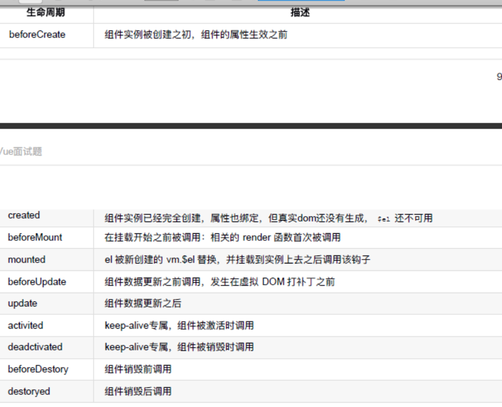

## Vue

>一往无前，方法论。

- 1.Vue响应式原理？(必问)

>[答案](https://juejin.cn/post/6844904084374290446#heading-1)

- 2.Vue组件通信？（必问）
1、路由传参  
    (1)	路由配置传参  path:'/页面b/:name/:age/:sex', 在path里面用 /:参数名  传参  用this.$route.params取参
    (2)	Params传参 this.$router.push({ name:'componentsB', params:{ exa:'我是传到组件B的参数' } })   在this.$router.push的时候加params字段名 值就是传得参 也是用$route.params取参
    (3)	query传参  this.$router.push({ name:'componentsB',// path:'/componentsB' query:{ que:'我是通过query传到组件B的参数' } })  用$route.query取参
    params传参和query传参区别类似于post和get方法。params传参地址栏不会显示参数，而query传参会将参数显示在地址栏中
    params传参刷新页面参数会丢失，另外两种不会
2、父子组件传参
    (1)	父向子传的时候，在父组件里面的子组件标签上注册传参的名，变量的话用v-bind也就是冒号：，在子组件里面用props接收参数
    export default{ 
        props:['message1','message2','message3'], 	created(){ console.log(this.message3) }
     }
    (2)子向父传的时候，子组件用this.$emit(event,[参数值])，触发父组件页面上子组件标签绑定的event，获得参数  
    子组件： this.$emit('emitToParent',’哈哈哈’)   父组件：<children @emitToParent='parentSayLove'></children> 
    js里   methods:{ 
                parentSayLove(data){ this.loveWho = data } 
             },
3、兄弟组件传参 自定义事件
    (1)	在first.vue和second.vue中分别引入bus.js。 	import Bus from '../bus.js'
    (2)	模拟情景：first.vue向second.vue传值。在first.vue通过在事件中添加Bus.$emit( event, 参数 )进行传值，在second.vue中通过Bus.$on(event,function(data){ data就是$emit中的参数 })进行监听
  
[VUE2 VUE3 父子、隔代、兄弟组件的传值方式](https://blog.csdn.net/alokka/article/details/87104189)
一 父子通信：
    1 父向子传递数据是通过 props，子向父是通过 $emit
    2 通过父链 / 子链也可以通信（$parent / $children(VUE2)、 $refs(VUE3)）
        this.$children[0].childMethod() // $children获取的是子组件的数组 通过索引找到对应的子组件的实例
        console.log(this.$children[0].msg)
        $refs 也可以访问组件实例  this.$refs.child.do()调用子组件事件  this.$refs.child.msg获取子组件值
    3 provide / inject （跨级 依赖注入） API 
        1. 跨级 Vue2.2.0 新增 API,这对选项需要一起使用，以允许一个祖先组件向其所有子孙后代注入一个依赖，不论组件层次有多深，并在其上下游关系成立的时间里始终生效。
        一言而蔽之：祖先组件中通过 provider 来提供变量，然后在子孙组件中通过 inject 来注入变量。
        传递响应式数据  provide(){
                        return{
                            info:computed(()=>this.name)
                        }
                    }
        传递静态数据 provide:{info:'aaa'}
    4 $attrs / $listeners(Vue3合到了attrs中  依赖于v-bind='$attrs')   attributes( 属性 美[əˈtrɪbjuːts])($attrs)中是没有被props $emits定义的属性或方法
二 兄弟通信：
    自定义事件： VUE2  eventBus  VUE3 第三方库： mitt 、tiny-emitter、 event-emitter  在组件销毁的时候要 event.off('事件名','函数名')
    Vuex
三 跨级通信：
    自定义事件： VUE2  eventBus  VUE3 第三方库： mitt 、tiny-emitter、 event-emitter  在组件销毁的时候要 event.off()
    provide (提供 [[prəˈvaɪd]) / inject API
    $attrs / $listeners(Vue3合到了attrs中  依赖于v-bind='$attrs')   attributes( 属性 美[əˈtrɪbjuːts])($attrs)中是没有被props $emits定义的属性或方法
    Vuex
>[答案](https://juejin.cn/post/6844904084374290446#heading-21)

- 3.Vue生命周期？（必问）
  beforeCreate  实例创建前   使用 setup() 创建一个空白的vue实例 data method尚未初始化，不可使用
  created       实例创建完成 使用 setup() 实例创建完成 ，完成响应式绑定   data method都已经初始化完成，可调用 。 尚未开始渲染模板
  beforeMount   挂载前  onBeforeMount 编译模板，调用render生成vdom
  mounted       挂载完成  onMounted
  beforeUpdate  更新前  onBeforeUpdate
  updated       更新完成 onUpdated
  beforeDestory 销毁前  onBeforeUnmount
  destoryed     销毁完成 onUnmounted
  
  

>[答案](https://juejin.cn/post/6844904084374290446#heading-5)

- 4.Vue2和Vue3的区别？(必问)

- 5.Vue和React的区别？(必问)

- 6.Vue项目如何做性能优化？(必问)

>[答案](https://juejin.cn/post/6844904084374290446#heading-23)

- 7.Vue的nextTick实现原理以及应用场景？(必问)

>[答案](https://juejin.cn/post/6844904084374290446#heading-4)

- 8.Vue中watch和computed的区别？(大概率) 以及改变数据computed变化情况？
computed是计算属性，用于计算现有数据并且产生新的数据  computed有缓存
watch用于监听现有数据
>[答案](https://juejin.cn/post/6844904084374290446#heading-7)

- 9.说下Vue的keepalive？(大概率)

>[答案](https://juejin.cn/post/6844904084374290446#heading-15)

- 7.你是如何理解MVVM与MVP以及MVC这些模式的？(大概率)

>[答案](https://juejin.cn/post/6844904084374290446#heading-0)

- 8.vue-router的实现原理？（大概率）

- 9.Vuex的实现原理？（大概率）
介绍vuex
官方解释: Vuex 是一个专为 Vue.js 应用程序开发的状态管理模式。它采用集中式存储管理应用的所有组件的状态，并以相应的规则保证状态以一种可预测的方式发生变化
大白话：对数据(data)统一的管理,如果涉及到了数据的处理，来，到vuex里面进出吧！就像是超市对商品的统一管理一样
import Vue from 'vue'; //首先引入vue
import Vuex from 'vuex'; //引入vuex
Vue.use(Vuex) 

export default new Vuex.Store({
    state: { 
        // state 类似 data
        //这里面写入数据
    },
    getters:{ 
        // getters 类似 computed 
        // 在这里面写个方法
    },
    mutations:{ // 突变 美[mjuˈteɪʃənz]  
        // mutations 类似methods
        // 写方法对数据做出更改(同步操作)

    },
    actions:{
        // actions 类似methods
        // 写方法对数据做出更改(异步操作)
    }
})
//可能有的地方书写的风格不是这样的，如果需要的了解的可以百度看看其他人的
在dom中使用方法为：$store.commit()加上store.js中的属性的名称
如果你想要直接使用一些数据，但是在computed中没有给出来怎么办？ 可以写成这样 {{ $store.state.goods.totalPrice }}

- mutation action 的区别 
  mutations 必须同步代码
  actions 可包含异步代码
  

- 10.路由守卫？

- 11.diff算法？

>深度比较，同层优先。

>先比较同级，再比较子节点。如果都有子节点的话，会递归比较。

- 12.详细说说Vue双向绑定原理？

- 13.Vue2和Vue3的区别？(必问)

- 14.Vue和React的区别？(必问)

- 15.Vue父子组件执行过程中生命周期？

- 16.Vue父子组件通信？

>父组件传递数据给子组件是通过Props，子组件通过Props接收。

- 17.当v-if和v-for同时使用时，v-for比v-if有更高的优先级。如果想避免这种情况可以在外层放一个template元素上做判断，这样就会先判断后循环。也可以将判断先放到计算属性里面判断，然后再把返回的值给到v-for进行遍历，这两种方法都可以。

- 18.Vue中的data为什么是函数，如果Vue中的data是对象的话，那么他的对象属性如果是引用类型的话，那么在复用组件的时候，创建多个实例，这些实例用的都是同一个构造函数，就会影响到所有实例，为了保证组件间不同的实例之间的独立性，data必须是一个函数。

- 19.Vue性能优化？

>1.路有懒加载

>2.keep-alive缓存页面

>3.使用v-show复用dom

>4.v-for同级别避免使用v-if

>5.长列表性能优化，如果只是做纯粹的数据展示，不会有任何改变，就不需要响应化，对对象进行冻结。

>6.事件销毁

>7.图片懒加载 vue-lazyload

>8.插件按需引入

>9.SSR,服务端渲染。

- 20.双向绑定具体过程？

>发布订阅模式和观察者模式之间的区别

>发布订阅模式：发布者=>事件中心<=>订阅者。

>观察者模式：目标 <=> 观察者

- 虚拟dom？
虚拟dom： 用js对象模拟DOM节点数据 
  一、框架价值
    1 组件化 2 数据驱动视图 （1数据变化 2 生成新vnode 然后diff算法旧vnode 3 更新dom
  3 vDom并不快，js直接操作DOM才是最快的，但是‘数据驱动视图’不能对全部DOM进行重建，vDom是最合适的方案
  4 Svelte框架就不用vdom， 是构建 Web 应用程序的一种新方法。Svelte 是一个编译器,它将声明性组件转换成高效的 JavaScript 代码,并像做外科手术一样细粒度地更新 DOM