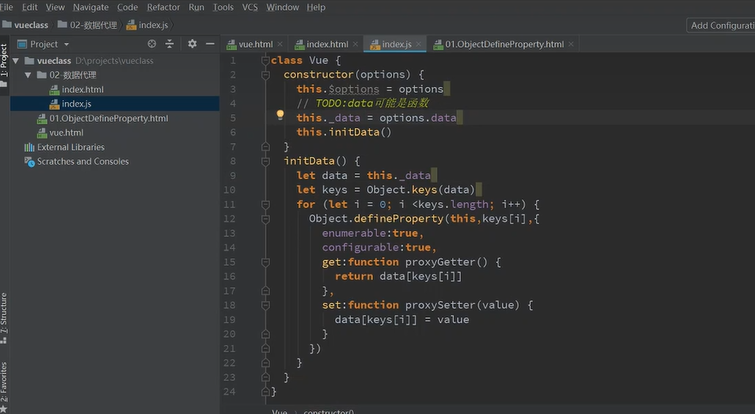
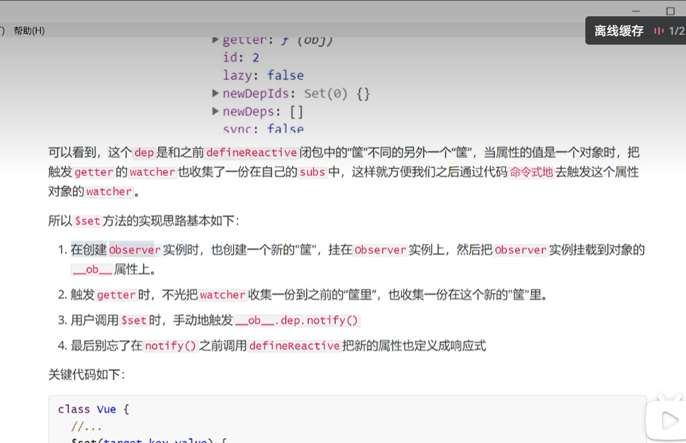
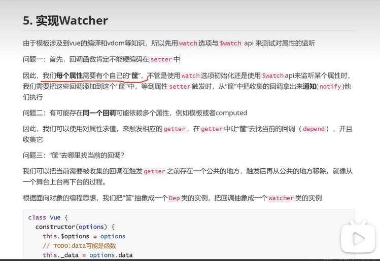
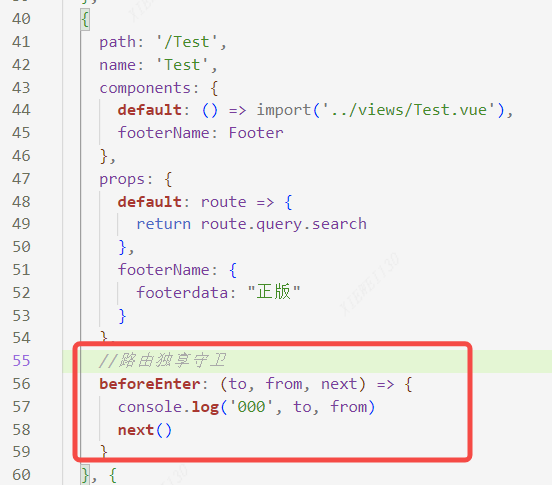
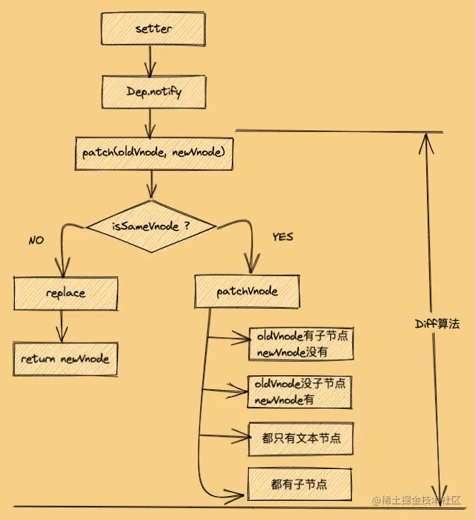
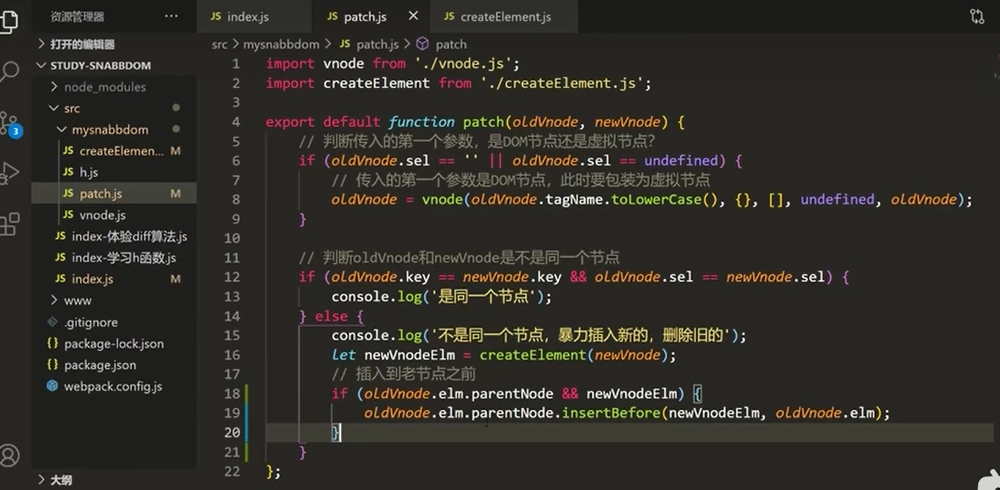
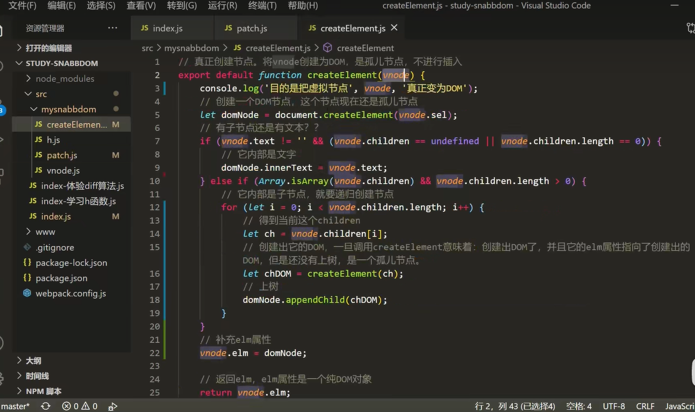
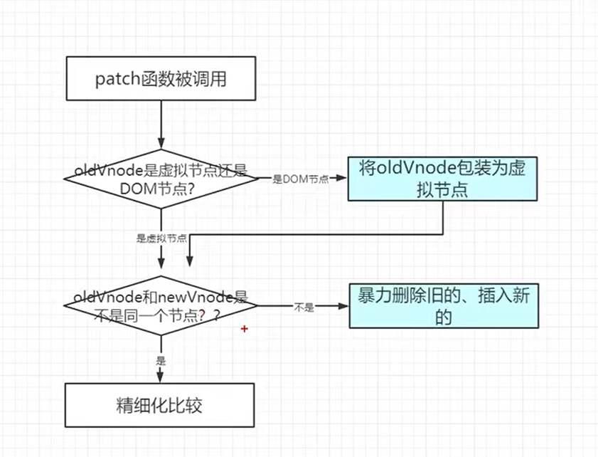
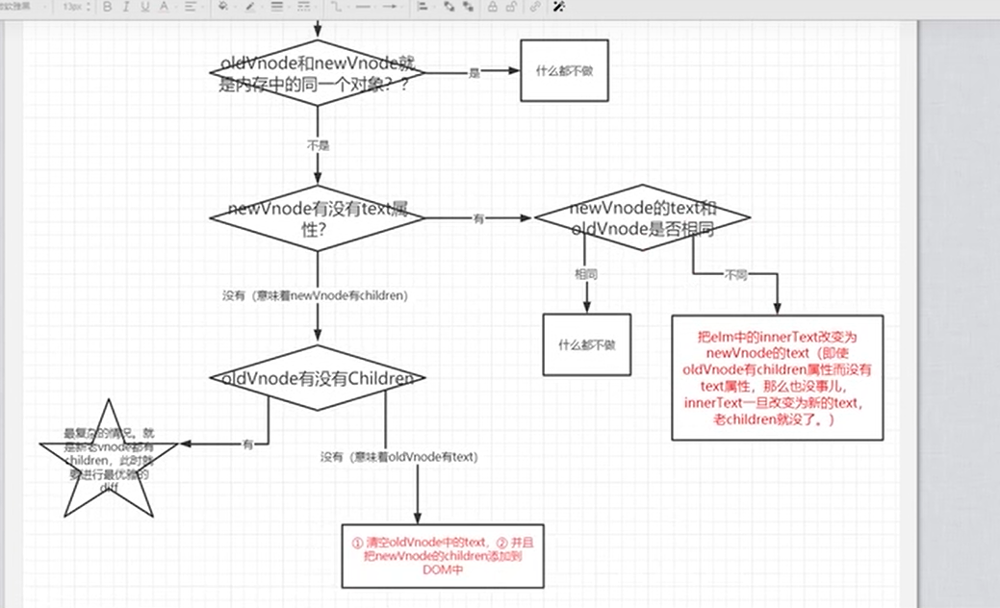
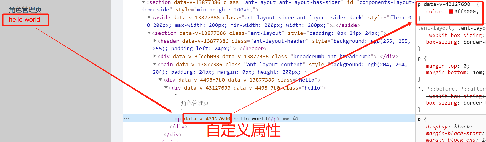

## Vue


- 1.Vue响应式原理？(必问)
[答案](https://juejin.cn/post/6844904084374290446#heading-1)
[如何实现一个类vue的双向绑定——Vue2.0 | MVVM | 数据劫持+发布订阅](https://blog.csdn.net/swallowblank/article/details/107542882)
[Vue双向数据绑定原理(面试必问)](https://blog.csdn.net/Android062005/article/details/127198506)
一、实现数据代理
  把data的所有的属性都代理到了new出来的vue实例上，这样就使得对vue实例属性的修改就是对data的修改。具体的就是通过defineProperty代理 Vue对象作为obj参数，把data里面的属性作为prop参数 然后在get中返回data[key] set中设置data[key]=value(修改的值)
  
二 数据劫持
  劫持data的属性，能够监听到data属性的get set
  
  到现在，无论是对vue实例还是对data 的属性值进行获取或者修改，我们都能监听到
三 数据递归劫持
```javascript
class Vue {
    constructor(options) {
        this.$options = options;
        this._data = options.data;
        this.initData()//数据代理
    }

    initData() {
        let data = this._data;
        for (let key in data){//数据代理
            //  把data的所有的属性都代理到了new出来的vue实例上，
            //  具体的就是通过defineProperty代理 Vue对象作为obj参数，把data里面的属性作为prop参数
            //  然后在get中返回data[key] set中设置data[key]=value(修改的值)
            Object.defineProperty(this,key,{
                enumerable:true,
                configurable:true,
                get:function (){
                    console.log(`${key}取值代理`)
                    return data[key]
                },
                set:function (value){
                    console.log(`${key}改值 代理`)
                    data[key] = value
                }
            })
        }
        observe(data)
    }
}

function observe(data){//观测data	美[əbˈzɜːrv] 观察
    //data是基本数据类型就返回
    let type = Object.prototype.toString.call(data)
    if (type !== '[object Object]' && type !== '[object Array]') return;
    new Observer(data)//这个时候并没有递归调用自己 观测对象

}
function defineReactive(obj,key,value){//劫持 工具函数
    //obj:定义的对象  key 定义的属性  value 原来的值
    observe(obj[key])
    Object.defineProperty(obj,key,{
        enumerable:true,
        configurable:true,
        get:function (){
            console.log(`${key}取值`)
            return value
        },
        set:function (val){
            if (val === value) return
            console.log(`${key}改值`)
            value = val
        }
    })
}
class Observer{//观测类
    constructor(data) {
        this.walk(data)
    }
    walk(data){//遍历
        for (let key in data){
            defineReactive(data,key,data[key])//劫持
        }
    }

}
    
```

  
  


- 2.Vue组件通信？（必问）
1、路由传参  
    (1)	路由配置传参  path:'/页面b/:name/:age/:sex', 在path里面用 /:参数名  传参  用this.$route.params取参
    (2)	Params传参 this.$router.push({ name:'componentsB', params:{ exa:'我是传到组件B的参数' } })   在this.$router.push的时候加params字段名 值就是传得参 也是用$route.params取参
    (3)	query传参  this.$router.push({ name:'componentsB',// path:'/componentsB' query:{ que:'我是通过query传到组件B的参数' } })  用$route.query取参
    params传参和query传参区别类似于post和get方法。params传参地址栏不会显示参数，而query传参会将参数显示在地址栏中
    params传参刷新页面参数会丢失，另外两种不会
2、父子组件传参
    (1)	父向子传的时候，在父组件里面的子组件标签上注册传参的名，变量的话用v-bind也就是冒号：，在子组件里面用props接收参数
    export default{ 
        props:['message1','message2','message3'], 	created(){ console.log(this.message3) }
     }
    (2)子向父传的时候，子组件用this.$emit(event,[参数值])，触发父组件页面上子组件标签绑定的event，获得参数  
    子组件： this.$emit('emitToParent',’哈哈哈’)   父组件：<children @emitToParent='parentSayLove'></children> 
    js里   methods:{ 
                parentSayLove(data){ this.loveWho = data } 
             },
3、兄弟组件传参 自定义事件
    (1)	在first.vue和second.vue中分别引入bus.js。 	import Bus from '../bus.js'
    (2)	模拟情景：first.vue向second.vue传值。在first.vue通过在事件中添加Bus.$emit( event, 参数 )进行传值，在second.vue中通过Bus.$on(event,function(data){ data就是$emit中的参数 })进行监听
  
[VUE2 VUE3 父子、隔代、兄弟组件的传值方式](https://blog.csdn.net/alokka/article/details/87104189)
一 父子通信：
    1 父向子传递数据是通过 props，子向父是通过 $emit
    2 通过父链 / 子链也可以通信（$parent / $children(VUE2)、 $refs(VUE3)）
        this.$children[0].childMethod() // $children获取的是子组件的数组 通过索引找到对应的子组件的实例
        console.log(this.$children[0].msg)
        $refs 也可以访问组件实例  this.$refs.child.do()调用子组件事件  this.$refs.child.msg获取子组件值
    3 provide / inject （跨级 依赖注入） API 
        1. 跨级 Vue2.2.0 新增 API,这对选项需要一起使用，以允许一个祖先组件向其所有子孙后代注入一个依赖，不论组件层次有多深，并在其上下游关系成立的时间里始终生效。
        一言而蔽之：祖先组件中通过 provider 来提供变量，然后在子孙组件中通过 inject 来注入变量。
        传递响应式数据  provide(){
                        return{
                            info:computed(()=>this.name)
                        }
                    }
        传递静态数据 provide:{info:'aaa'}
    4 $attrs / $listeners(Vue3合到了attrs中  依赖于v-bind='$attrs')   attributes( 属性 美[əˈtrɪbjuːts])($attrs)中是没有被props $emits定义的属性或方法
二 兄弟通信：
    自定义事件： VUE2  eventBus  VUE3 第三方库： mitt 、tiny-emitter、 event-emitter  在组件销毁的时候要 event.off('事件名','函数名')
    Vuex
三 跨级通信：
    自定义事件： VUE2  eventBus  VUE3 第三方库： mitt 、tiny-emitter、 event-emitter  在组件销毁的时候要 event.off()
    provide (提供 [[prəˈvaɪd]) / inject API
    $attrs / $listeners(Vue3合到了attrs中  依赖于v-bind='$attrs')   attributes( 属性 美[əˈtrɪbjuːts])($attrs)中是没有被props $emits定义的属性或方法
    Vuex
>[答案](https://juejin.cn/post/6844904084374290446#heading-21)

- 3.Vue生命周期？（必问） 
一、beforeCreate  实例创建前   使用 setup() 创建一个空白的vue实例 data method尚未初始化，不可使用
  created       实例创建完成 使用 setup() 实例创建完成 ，完成响应式绑定   data method都已经初始化完成，可调用 。 尚未开始渲染模板
  beforeMount   挂载前  onBeforeMount 编译模板，调用render生成vdom  还没有渲染DOM
  mounted       挂载完成  onMounted   完成DOM渲染 组件创建完成 开始由创建阶段进入运行阶段
  beforeUpdate  更新前  onBeforeUpdate data发生变化之后，准备更新DOM
  updated       更新完成 onUpdated   DOM更新完成 此时不能修改data，可能会导致死循环
  beforeDestory 销毁前  onBeforeUnmount
  destoryed     销毁完成 onUnmounted
  keep alive组件 ：onActivated 缓存组件被激活 ，onDeactivated 缓存组件被隐藏
  
  [答案](https://juejin.cn/post/6844904084374290446#heading-5)
二、Vue的nextTick实现原理以及应用场景？
Vue的nextTick 在Vue中dom更新并不是在数据变化之后立马发生的，而是按照一定的策略进行DOM的更新，而在此过程中，dom更新之后会立马执行nextTick的回调函数。 
  就是你放在$nextTick 当中的操作不会立即执行，而是等数据更新、DOM更新完成之后再执行
 原理 就是$nextTick将回调函数放到微任务或者宏任务当中以延迟它的执行
应用场景，在created阶段，如果需要操作渲染后的视图，就需要使用nextTick方法。
三、vue什么时候操作dom比较合适
  mounted跟uptated都不能保证子组件全部挂载完成
  使用$nextTick操作dom
四、ajax放在created跟mounted都可以 相比ajax请求的时间1s，created到mounted的时间特别小10ms

-$set原理 [ $set原理](https://juejin.cn/post/7076138220970311688) [](https://juejin.cn/post/7015214879330172964)
一、this.$set( target, key, value ) 方法的作用： 响应式对象中添加一个属性，并确保这个新属性同样是响应式的，且触发视图更新。
它必须用于向响应式对象上添加新属性，对象不能是 Vue 实例，或者 Vue 实例的根数据对象
二 原理
首先 set 方法会对参数中的 target 进行类型判断
1 如果是 undefined 、null 、基本数据类型，直接报错。
2 如果为数组，取当前数组长度与 key 这两者的最大值作为数组的新长度，然后使用数组的 splice 方法将传入的索引 key 对应的 val 值添加进数组。
    target 在 observe 的时候，原型链被修改了， splice 方法也已经被重写了，触发之后会再次遍历数组，进行数据劫持，
    也就是说当使用 splice 方法向数组内添加元素时，该元素会自动被变成响应式的
3 如果为对象，会先判断 key 值是否存在于对象中，如果在，则直接替换 value。如果不在，就判断 target 是不是响应式对象（其实就是判断它是否有 __ob__ 属性），
    接着判断如果它是不是Vue实例，或者是Vue实例的根数据对象，如果是则抛出警告并退出程序。如果 target 不是响应式对象，就直接给 target 的 key 赋值，
    如果 target 是响应式对象，就调用 defineReactive 将新属性的值添加到 target 上，并进行依赖收集，更新视图
三、实现 思路


- 15.Vue父子组件执行过程中生命周期？
  创建阶段：父组件执行了前三个生命周期：beforeCreate=>created=>beforeMounted，
  然后等子组件执行完四个生命周期:beforeCreate=>created=>beforeMount=>mounted,父组件再执行了mounted
  如果父组件传给子组件的数据是异步获取的，比如在父组件created中通过接口获取数据，接口很长时间才返回，那么在子组件的created、beforeMounted、mounted都拿不到数据
  解决方案：在子组件中watch要传的数据
  [父子组件的生命周期执行流程是怎么样的呢？](https://juejin.cn/post/7024151086436974623)
  [vue父子组件传值不能实时更新](https://blog.csdn.net/catascdd/article/details/129065973)
  更新阶段： 先执行父组件的beforeUpdate（） 再执行子组件的beforeUpdate（） 再执行子组件的 updated（）再执行父组件的 updated（）
  销毁阶段：先执行父组件的beforeDestroy（） 再执行子组件的beforeDestroy（） 再执行子组件的 destroyed（） 再执行父组件的 destroyed（）


- 7.如何写一个组件和设计一个组件？ [](https://blog.csdn.net/u011332271/article/details/105169882)
一 、
如果全局引入，那么所有的组件需要要注册到Vue component 上，并导出。
Vue component用来注册一个组件。
按需加载，单个导出组件即可。 
  二、vue3 用<script setup>语法糖的情况  父组件信息用defineProps接收 子组件信息用defineEmits传递
```javascript
      defineProps({
          modelValue: {
              type: String,
              default: ""
          },
      })

    let emit = defineEmits(["update:modelValue", "onChange"]);
    emit("onChange", val);
```
vue2 父组件信息用props接收 子组件信息用$emit传递

setup（props, context）{
// props.data
// context.attrs    context.slots    context.emit
}
props指组件传递来的参数，并且ts可以推论出props的类型.props也就是 vue2 中组件中的 props
context 有三个属性 attrs slots emit 分别对应vue2中的attrs属性、slots插槽、$emit发送事件


[Vue3关于响应式数据类型(ref、reactive、toRef、以及toRefs)](https://blog.csdn.net/qq_41400354/article/details/124121777?utm_medium=distribute.pc_relevant.none-task-blog-2~default~baidujs_baidulandingword~default-0-124121777-blog-120720925.pc_relevant_3mothn_strategy_and_data_recovery&spm=1001.2101.3001.4242.1&utm_relevant_index=3)

-自定义组件实现数据双向绑定 使用v-model [vue2和vue3中的v-model使用](https://blog.csdn.net/qq_28378665/article/details/128784126)
一、v-model原理：是v-bind（:） 跟v-on（@）的语法糖
二、vu2:
    父组件 ：<ChildComponent v-model="pageTitle" /> 在data里面定义数据 pageTitle:'页面标题’
    子组件：在props:['value'],就是用value来接收父组件的pageTitle,用$emit('value','新页面标题') 传递给父组件
        如果想要更改 prop属性或事件名称，则需要在 ChildTpl 组件中添加 model 选项:
        model: {
        prop: "customParams", // 将默认value属性改为customParams
        event: "change", // 将默认input事件改为change }
},
三、vue3：v-model 相当于在prop添加了modelValue属性 并接收，抛出 update:modelValue 事件：
   1、绑定一个
    父组件：<ChildTpl v-model="count" />
    子组件：
    let emits = defineEmits(["update:modelValue"]);
    emits("update:modelValue", props.modelValue + 1);
   2、绑定多个
    父组件： <ChildTpl v-model:num="count" <ChildTpl v-model:city="cityName" /> />
    子组件：
    let emits = defineEmits(["update:num","update:city"]);
    emits("update:num", newNum);
    emits("update:city", newCity);
总结：vue2子组件是用vlue接收父组件信息，用$emit的input事件传值给父组件
    vue3子组件是用modelValue接收父组件信息，用$emit的 updata:modelValue传值给父组件


- <script setup> 语法糖 父组件访问子组件数据
[Vue3父组件访问子组件数据 defineExpose用法](https://blog.csdn.net/qq_29585681/article/details/126485407)

- 4.Vue2和Vue3的区别？(必问) [](https://zhuanlan.zhihu.com/p/410951679)
一 、响应式原理
  vue2 的响应式原理是利⽤ES5 的⼀个 API ，Object.defineProperty()对数据进⾏劫持 结合 发布订阅模式的⽅式来实现的。
  Vue3.x是借助 Proxy 实现的，通过Proxy 对象创建一个对象的代理，并且 Proxy 的监听是深层次的，监听整个对象，而不是某个属性
  这⾥是引相⽐于vue2版本，使⽤proxy的优势如下
  1.defineProperty 无法监听对象或数组新增、删除的元素。
      Vue2 方案：针对常用数组原型方法push、pop、shift、unshift、splice、sort、reverse进行了hack处理；
      提供Vue.set监听对象/数组新增属性。对象的新增/删除响应，还可以new个新对象，新增则合并新属性和旧对象；
      删除则将删除属性后的对象深拷贝给新对象
  2.可以监听数组，不⽤再去单独的对数组做特异性操作,通过Proxy可以直接拦截所有对象类型数据的操作，完美⽀持对数组的监听。
二、数据和方法的定义
  Vue2使⽤的是选项类型API（Options API），Vue3使⽤的是合成型API（Composition API）
  Vue2：
  data() { return {}; }, methods:{ }
  复制代码
  Vue3：
  数据和⽅法都定义在setup中，并统⼀进⾏return{}
三、生命周期 
四、组件根节点的不同  vue3在组件中支持多个根节点. vue2只能一个根节点
    原因：在vue2中只所以这么做是因为vdom是一颗单根树形结构，patch方法在遍历的时候从根节点开始遍历，它要求只有一个根节点，
        组件也会转换为一个vdom,自然满足这个要求
    vue3中值所以可以有多个节点，是因为引入了Fragment的概念，这是一个抽象的节点，如果发现组件有多个根，就创建一个Fragment节点，
        把多个根节点作为它的children,将来path的时候，如果发现是一个Fragement节点，则直接遍历children创建或更新。
五、diff算法
    vue2中的虚拟dom是全量的对比（每个节点不论写死的还是动态的都会一层一层比较，这就浪费了大部分事件在对比静态节点上）
    vue3新增了静态标记（patchflag）与上次虚拟节点对比时，只对比带有patch flag的节点（动态数据所在的节点）；
    可通过flag信息得知当前节点要对比的具体内容。
六、静态提升
  vue2无论元素是否参与更新，每次都会重新创建然后再渲染。
   vue3对于不参与更新的元素，会做静态提升，只会被创建一次，在渲染时直接复用即可。
  

-[详解defineProperty和Proxy](https://www.jianshu.com/p/0e2984d13ab4) [ defineProperty 与 proxy](https://juejin.cn/post/6844903710410162183)
ES5 提供了 Object.defineProperty 方法，该方法可以在一个对象上定义一个新属性，或者修改一个对象的现有属性，并返回这个对象。
语法:Object.defineProperty(obj, prop, descriptor)
参数 :  obj: 要在其上定义属性的对象。 prop: 要定义或修改的属性的名称。 descriptor: 将被定义或修改的属性的描述符。
    函数的第三个参数 descriptor 所表示的属性描述符有两种形式：数据描述符和存取描述符。
    两者均具有以下两种键值：
        enumerable 当且仅当该属性的 enumerable 为 true 时，该属性才能够出现在对象的枚举属性中。默认为 false。
        configurable 当且仅当该属性的 configurable 为 true 时，该属性描述符才能够被改变，也能够被删除。默认为 false。
    数据描述符同时具有以下可选键值：
        value 该属性对应的值。可以是任何有效的 JavaScript 值（数值，对象，函数等）。默认为 undefined。
        writable 当且仅当该属性的 writable 为 true 时，该属性才能被赋值运算符改变。默认为 false。
    存取描述符同时具有以下可选键值：
        get 当访问prop属性时，get方法会执行，函数的返回值会作为prop属性的值返回。默认为 undefined。
        set 当修改prop属性值时，set方法会执行，接受一个参数（就是属性的新值）默认为 undefined。


- 5.Vue和React的区别？(必问) [](https://juejin.cn/post/7144648542472044558#heading-0)
一、组件化 react和vue中组件化的相同点：
  react和vue都推崇组件化，通过将页面拆分成一个一个小的可复用单元来提高代码的复用率和开发效率。
  在开发时react和vue有相同的套路，比如都有父子组件传参，都有数据状态管理，都有前端路由等。
  react和vue组件化的差异：
  React推荐的做法是JSX + inline style, 也就是把 HTML 和 CSS 全都写进 JavaScript 中,即 all in js;
  Vue 推荐的做法是 template 的单文件组件格式(简单易懂，从传统前端转过来易于理解),即 html,css,JS 写在同一个文件(vue也支持JSX写法)
二、diff算法
  Vue2的核心Diff算法采用了双端比较的算法，同时从新旧children的两端开始进行比较，借助key值找到可复用的节点，
  再进行相关操作。相比React的Diff算法，同样情况下可以减少移动节点次数，减少不必要的性能损耗，更加的优雅。
  

- 6.Vue项目如何做性能优化？(必问)
    1 v-if v-show的正确使用，如果dom计算量很大就用v-show，一般的用v-if就行
    2 v-for使用key
  3 使用计算属性computed缓存  计算量比较大的结果把他缓存起来 比如未读消息数
  4 keep-alive缓存组件 比如频繁切换的tabs，不能乱用，因为缓存太多会占用内存，且不好debug
  5 异步组件 [defineAsyncComponent](https://blog.csdn.net/weixin_44733660/article/details/128639280)
  ES 模块动态导入也会返回一个 Promise，所以多数情况下我们会将它和 defineAsyncComponent 搭配使用 
  6 路由懒加载 vue-lazyload  
  7 服务端渲染ssr  
    
  

>[答案](https://juejin.cn/post/6844904084374290446#heading-23)

- 7.Vue的nextTick实现原理以及应用场景？(必问)

>[答案](https://juejin.cn/post/6844904084374290446#heading-4)

- 8.Vue中watch和computed的区别？(大概率) 以及改变数据computed变化情况？
computed是计算属性，用于计算现有数据并且产生新的数据  computed有缓存
watch用于监听现有数据
>[答案](https://juejin.cn/post/6844904084374290446#heading-7)

- 实现watcher 
watcher是异步执行 并且对于监听属性的多次变化，只执行一次回调函数

- 9.说下Vue的keepalive？(大概率)

>[答案](https://juejin.cn/post/6844904084374290446#heading-15)

- 7.你是如何理解MVVM与MVP以及MVC这些模式的？(大概率)

>[答案](https://juejin.cn/post/6844904084374290446#heading-0)

- 8.vue-router的实现原理？（大概率）

- 9.Vuex的实现原理？（大概率） [](https://www.jb51.net/article/261550.htm)
介绍vuex
官方解释: Vuex 是一个专为 Vue.js 应用程序开发的状态管理模式。它采用集中式存储管理应用的所有组件的状态，并以相应的规则保证状态以一种可预测的方式发生变化
大白话：对数据(data)统一的管理,如果涉及到了数据的处理，来，到vuex里面进出吧！就像是超市对商品的统一管理一样
  Vuex状态管理跟使用传统全局变量的不同之处：

Vuex的状态存储是响应式的： 就是当你的组件使用到了这个 Vuex 的状态，一旦它改变了，所有关联的组件都会自动更新相对应的数据，这样开发者省事很多。
不能直接修改Vuex的状态： 如果是个全局对象变量，要修改很容易，但是在 Vuex 中不能这样做，想修改就得使用 Vuex 提供的唯一途径： 
显示地提交（commint）mutations来实现修改。这样做的好处就是方便我们跟踪每一个状态的变化，在开发过程中调试的时候，非常实用。
通过commit 提交 mutation 的方式来修改 state 时，vue的调试工具能够记录每一次 state 的变化，这样方便调试
。但是如果是直接修改state，则没有这个记录，那样做会使状态不受我们管控。如果是多个模块需要引用一个state的，
然后每个人可能由不同的人开发，如果直接修改值，可能会造成数据的混乱，Mutation 也记录不到，到时候调试会有麻烦。
但是通过 mutation 修改 state 这样设计，就有个统一的地方进行逻辑运算去修改。如果逻辑有变动，修改一个地方就可以了
```javascript
import Vue from 'vue'; //首先引入vue
import Vuex from 'vuex'; //引入vuex
Vue.use(Vuex)
export default new Vuex.Store({
    state: { 
        // state 类似 data
        //这里面写入数据
        isLogin:localStorage.getItem("isLogin")?localStorage.getItem("isLogin"):false,//判断是否登录
    },
    getters:{ 
        // getters 类似 computed 
        // 在这里面写个方法
    },
    mutations:{ // 突变 美[mjuˈteɪʃənz]  
        // mutations 类似methods
        // 写方法对数据做出更改(同步操作)
        //判断是否登录
        setLogin(state,payload){
            state.isLogin=payload
            localStorage.setItem("isLogin",state.isLogin)
        },
        //退出登录
        logout(state){
            console.log("[退出登录]",state)
            state.isLogin=false
            localStorage.clear();//清除本地缓存
        }

    },
    actions:{
        // actions 类似methods
        // 写方法对数据做出更改(异步操作)
        getLogin(context,payload){
            context.commit("setLogin",payload)
        }
    }
})
//在页面中使用或者修改vuex中的值
// mapState用于将state中的数据映射到组件的计算属性中，而mapGetters用于将getter中的计算属性映射到组件的计算属性中，
import { mapState, mapActions,mapMutations } from "vuex"
export default {
    name:"index",
    data() {
        return {

        }
    },
    computed:{
        ...mapState({
            isLogin:state=>state.isLogin,
            isLoginhhh:'isLogin'//上面的简写 
        }),//等同于==>...mapState(['isLogin']);映射 this.isLogin 为 this.$store.state.isLogin
        ...mapGetters(//使用跟mapState类似   mapGetters是Vuex提供的将store中的getter映射到组件计算属性中的辅助函数
            ['isLogin']
        ),
    },
    mounted(){
        this.$store.state.isLogin;//等同于==》this.isLogin
        this.$store.dispatch("getLogin",true);
        //等同于==》this.getLogin(true)；dispatch触发actions里的方法，Action 提交的是 mutation，而不是直接变更状态，
        // Action 可以包含任意异步操作
        this.$store.commit("logout");
        //等同于==》this.logout()；commit触发mutations里的方法，
        // 更改 Vuex 的 store 中的状态的唯一方法是提交 mutation
    },
    methods:{
        ...mapMutations(["logout"]),// 将 `this.logout()` 映射为 `this.$store.commit('logout')`
        ...mapActions(["getLogin"]),// 将 `this.getLogin()` 映射为 `this.$store.dispatch('getLogin')`
    }
}
```
如果你想要直接使用一些数据，但是在computed中没有给出来怎么办？ 可以写成这样 {{ $store.state.goods.totalPrice }}

- mutation action 的区别  为什么区分
 一、 mutations 必须同步代码
  actions 可包含异步代码
 二、 为了能用 devtools 追踪状态变化，方便调试
  主要的原因是当我们使用 devtools 时，devtools 可以帮助我们捕捉 mutation 的快照
  但是如果是异步操作，那么 devtools 将不能很好的追踪这个操作什么时候会被完成


-vuex持久化 
一 封装好localstorage存取数据的公共方法setItem getItem ，
在state中定义数据的时候调用getItem   state: { language: getItem(LANGUAGE) || 'zh', }, 
在mutations里面调用对数据的本地存储   mutations: {[SET_LANGUAGE](state, payload) {
                                        state.language = payload
                                        setItem(LANGUAGE, payload)
                                        },
                                    },
二 用vuex-persistedstate  [](https://blog.csdn.net/xm1037782843/article/details/128071142)
persisted 美[pərˈsɪstɪd]持续存在;


- 10.路由守卫？
  路由守卫分为三种：全局路由守卫、独享路由守卫以及组件内路由守卫
一、全局路由守卫分为全局前置守卫 beforeEach  ，全局后置守卫：afterEach
  //全局前置守卫
  router.beforeEach((to,from,next) =>{
  //第一个参数to，包含的内容是切换后的路由对象，也就是跳转后的路由对象
  //第二个参数from，包含的内容的是切换前的路由对象，也就是跳转前的路由对象
  //第三个参数next()，是否往下执行，执行的话，如果不写的话路由就不会跳转，操作将会终止
  })
二、独享路由守卫  单个路由拦截处理  
  beforeEnter(to,from,next){
  //第一个参数to，包含的内容是切换后的路由对象，也就是跳转后的路由对象
  //第二个参数from，包含的内容的是切换前的路由对象，也就是跳转前的路由对象
  //第三个参数next()，是否往下执行，执行的话，如果不写的话路由就不会跳转，操作将会终止
  }
三、组件内守卫
  当使用路由规则进入该组件或离开该组件时，就会触发组件内守卫的调用，而组件内守卫的作用于范围也仅限于该组件
  beforeRouteEnter (to, from, next) {} //进入守卫：通过路由规则，进入该组件时被调用
  beforeRouteLeave (to, from, next) {}//离开守卫：通过路由规则，离开该组件时被调用


- 11.diff算法？ [](https://juejin.cn/post/6994959998283907102#heading-2)
一、diff算法就是对比新旧虚拟dom的算法，对比出是哪个虚拟节点更改了，找出这个虚拟节点，并只更新这个虚拟节点所对应的真实节点，
  而不用更新其他数据没发生改变的节点，实现精准地更新真实DOM，进而提高效率
二、对比流程 
  当数据改变时，会触发setter，并且通过Dep.notify去通知所有订阅者Watcher，
  订阅者们就会调用patch方法，给真实DOM打补丁，更新相应的视图
三、patch方法  
  这个方法作用就是，通过sameVnode方法对比当前同层的虚拟节点是否为同一种类型的标签(同一类型的标准，下面会讲)：
    是：继续执行patchVnode方法进行精细化比较
    否：没必要比对了，暴力删除旧的，插入新的虚拟节点，创建节点时，所有子节点需要递归创建出来（creatElement ） 
四、sameVnode方法  判断是否为同一类型节点（key值、标签名是否一样，是否都为注释节点、是否都定义了data、当标签为input时，type必须是否相同）
五、patchVnode方法
  主要做了5件事情
      找到对应的真实DOM，称为el
      判断newVnode和oldVnode是否指向同一个对象，如果是，那么直接return
      如果他们都有文本节点并且不相等，那么将el的文本节点设置为newVnode的文本节点。
      如果oldVnode有子节点而newVnode没有，则删除el的子节点
      如果oldVnode没有子节点而newVnode有，则将newVnode的子节点真实化之后添加到el
      如果两者都有子节点，则执行updateChildren函数比较子节点，这一步很重要
六、updateChildren方法
  通过双端比较的方法，对比新旧虚拟dom的子节点集合，

一、h函数生成虚拟节点vnode，嵌套使用h函数就生成虚拟dom树
二、 1 diff算法是最小量更新，key很重要，key是节点的唯一标识，表示更改前后是同一个dom节点
   2  同一个虚拟节点才会进行精细化比较（同一个虚拟节点就是选择器相同，key相同），否则就是暴力拆除旧的，插入新的
    3 只进行同层比较，不会进行跨层比较
三、patch函数   
  
深度比较，同层优先。
先比较同级，再比较子节点。如果都有子节点的话，会递归比较。
  一、diff算法很早就有而且应用广泛，例如github中pull代码的时候 。如果要严格diff两棵树，时间复杂度是O(n^3),不可用
  二、优化（O（n））：1只比较同一层级，不跨级比较 2 tag不同直接删除重建，不再比较内部的细节 3子节点通过key区分（key的重要性）
  三、 vue2 vue3 react 的diff算法区别
  react：仅右移 
  vue2：双端比较 
  vue3：在双端比较的基础上加上了查找最长递增子序列 
  四、vue react 循环时为什么必须使用key
  1 vdom diff算法会根据key判断元素是否要删除，匹配了key，就只移动元素-性能较好，未匹配key，则删除重建-性能较差
  
-Fiber React 团队在 React16 之后就改写了整个架构，将原来数组结构的虚拟DOM，改成叫 Fiber 的一种数据结构，
基于这种 Fiber 的数据结构可以实现由原来不可中断的更新过程变成异步的可中断的更新

- 12.详细说说Vue双向绑定原理？

- 17.当v-if和v-for同时使用时，v-for比v-if有更高的优先级。如果想避免这种情况可以在外层放一个template元素上做判断，这样就会先判断后循环。也可以将判断先放到计算属性里面判断，然后再把返回的值给到v-for进行遍历，这两种方法都可以。

- 18.Vue中的data为什么是函数，如果Vue中的data是对象的话，那么他的对象属性如果是引用类型的话，那么在复用组件的时候，创建多个实例，这些实例用的都是同一个构造函数，就会影响到所有实例，为了保证组件间不同的实例之间的独立性，data必须是一个函数。


- 20.双向绑定具体过程？


-自定义指令 [](https://blog.csdn.net/ct5211314/article/details/125425317)
一。什么是自定义指令
    除了核心功能默认内置的指令 (v-model 和 v-show)，Vue 也允许注册自定义指令。
    注意，在 Vue2.0 中，代码复用和抽象的主要形式是组件。然而，有的情况下，你仍然需要对普通 DOM 元素进行底层操作，这时候就会用到自定义指令。
二、使用 比如定义input自动聚焦的指令v-focus
//设置自定义指令
import Vue from 'vue'
Vue.directive('focus', {
// 当被绑定的元素插入到 DOM 中时……
inserted: function (el) {
// 聚焦元素
el.focus()
}
})
//在main.js中引入
import '@/utlis/focus'
//在组件中使用
<input type="text" name="" id="" v-focus>


- 虚拟dom？
虚拟dom： 用js对象模拟DOM节点数据 
  一、框架价值
    1 组件化 2 数据驱动视图 （1数据变化 2 生成新vnode 然后diff算法旧vnode 3 更新dom
  3 vDom并不快，js直接操作DOM才是最快的，但是‘数据驱动视图’不能对全部DOM进行重建，vDom是最合适的方案
  4 Svelte框架就不用vdom， 是构建 Web 应用程序的一种新方法。Svelte 是一个编译器,它将声明性组件转换成高效的 JavaScript 代码,并像做外科手术一样细粒度地更新 DOM
  
- 路由 vue-router三种模式
    1.hash local 用的 location.hash 获取#后面的内容
    2 webHistory  用的h5的history.pushState()：往浏览器历史添加url，能回退到上次历史  history.replaceState()：替换当前url，不能回退到上次页面  和 window.onpopState
    3 MemoryHistory （vuerouter4之前叫abstract history） 不能有浏览器的前进后退
  

-history模式下刷新页面404问题 [](https://www.cnblogs.com/Lencamo/p/16860823.html)
原理：
① 导航栏的跳转
导航栏间的跳转是不会向服务端发送请求的。
hash 模式：会匹配路由规则，进而进行组件切换
history 模式：会利用 h5 的 history API 进行导航切换
② 回车刷新
前端打包后的 dist 包中，只有 index.html。所以，history 模式下发送的请求地址，服务端是找不到的。
hash 模式：只将 hash 前面的部分当作地址
history 模式：会将地址栏中的地址全部看作请求地址
方案
① 开发环境（前端）
在vue.config.js中设置 historyApiFallback: true
② 部署环境   
在vue.config.js中 publicPath:	process.env.NODE_ENV === 'production' ? '/': '/', 
[vue之解析vue.config.js中的配置项之publicPath](https://www.jianshu.com/p/c79bb6cd6bce)
配置nginx :location / {
    root   /usr/share/nginx/html;
    index  index.html index.htm;
    //配置url🎈重写语句（先返回404，然后返回index.html）
    try_files $uri $uri/ /index.html;
}
- vue遇到的坑
一 内存泄漏
  产生原因：全局变量、全局事件、全局定时器、自定义事件 没有销毁
二 vue2响应式的缺陷
  data属性新增用Vue.set() 删除用vue.delete() 
三  详情页回到列表页，滚动到原来位置 
  方案：keep-alive与vue-router beforeRouteEnter(to, from, next) beforeRouteLeave(to, from, next)配合使用  [1](https://juejin.cn/post/6844904127076499469)

-监听vue组件报错
一、window.onerror = function(msg,source,line,column,error){}  
1 全局监听js错误 2 是js级别的，识别不了vue组件信息 3捕捉vue监听不到的错误 4 不能监听 try ...catch捕获的错误
window.addEventListener('error',event => { event是一个错误事件对象})
二、errorCaptured生命周期  （captured 捕获  美[ˈkæptʃərd]）
1监听所有下级组件的错误   2 返回false会阻止向上传播 
三、errorHandler配置  Handler（ 搬运工; 操作者; 组织者; 顾问 美[ˈhændlər]）
1 vue全局错误监听 ，所有组件报错都汇总到这里 2 如果errorCaptured返回false ，就不会传播到这里
四 异步错误只有window.onerror能监听到
五 三种监听方式结合使用 errorCaptured监听重点组件 errorHandler window.onerror候补监听 

- H5很慢 该如何排查问题
一 前端性能指标   paint（	美[peɪnt] 把…描绘成）
  First Paint（FP）第一次渲染
  First Contentful Paint (FCP) 第一次有内容渲染  content（内容 美[ˈkɑːntent , kənˈtent]） 
  First Meaningful Paint （FMP） 第一次有意义的渲染（不好定义 业界已弃用 企业内可以自己约定）
  DOMContentLoaded(DCL)  当初始的 HTML 文档被完全加载和解析完成之后 
  Largest Contentfull Paint (LCP)   最大内容的渲染
  Load（L） load 是在 HTML 所有相关资源被加载完成后触发。
二 chrome devTools
  performance可查看上述性能指标，并有网页快照
  netWork 可以查看资源的加载时间 
三 也可以用第三方性能评测工具  LightHouse   
四 如果是网页加载慢
  1.优化服务器硬件配置 使用cdn 2路由懒加载 大组件异步加载 ---减少主包的体积 3 优化http缓存策略 
五 如果是网页渲染慢
  1 优化服务端接口 2 继续分析，优化前端组件内部逻辑 3 服务端渲染 
六 持续跟进持续优化  
  

- scoped原理 
  scope的时候，会给元素节点新增自定义属性：data-xx，然后在css中通过属性选择器的方式给元素添加样式，这就是scope的原理。
  
- proxy解决跨域的原理
  浏览器是禁止跨域的，但是服务端不禁止，在本地运行npm run dev等命令时实际上是用node运行了一个服务器，
  因此proxyTable实际上是将请求发给自己的服务器，再由服务器转发给后台服务器