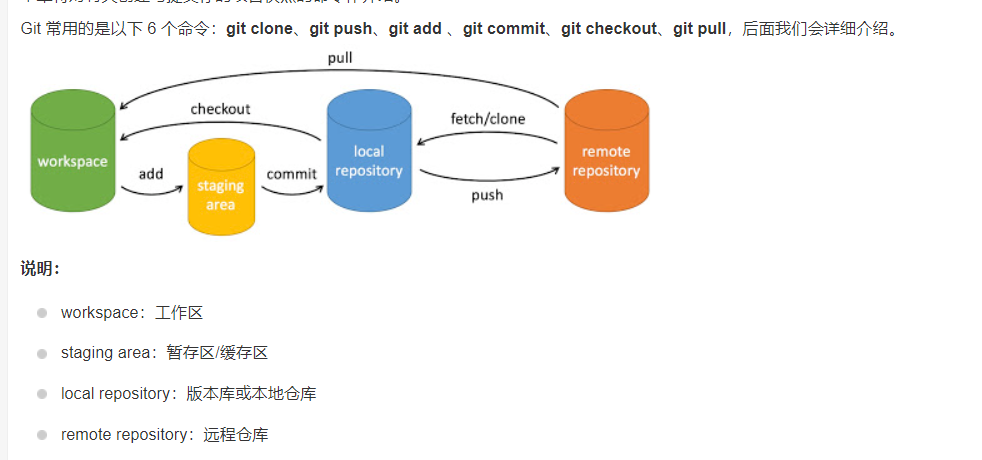

git clone	拷贝一份远程仓库，也就是下载一个项目。
git init - 初始化仓库。
git add . - 添加文件到暂存区。
git commit - 将暂存区内容添加到仓库中。
git pull	下载远程代码并合并
git push	上传远程代码并合并

git branch 列出分支基本命令：
git branch testing  创建新分支 testing
git checkout testing 切换分支
git merge testing   在main分支下合并testing分支到main分支
git branch -d testing 删除分支

git log - 查看历史提交记录。 退出log： q

git tag -a v1.0    "创建一个带注解的标签"

- 1.git rebase。
git rebase：改变基底
  当在feature分支上执行git rebase master时，git会从master和featuer的共同祖先B开始提取feature分支上的修改，
  也就是C和D两个提交，先提取到。然后将feature分支指向master分支的最新提交上，也就是M。
  最后把提取的C和D接到M后面，注意这里的接法，官方没说清楚，实际是会依次拿M和C、D内容分别比较，
  处理冲突后生成新的C’和D’。一定注意，这里新C’、D’和之前的C、D已经不一样了，是我们处理冲突后的新内容，
  feature指针自然最后也是指向D’
用来优化合并提交记录。

- 2.怎么解决代码冲突。 1 

>可以用过git status查看做了哪些修改，然后手动解决冲突，再进行提交。
> 
