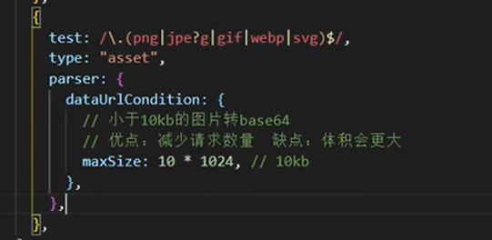
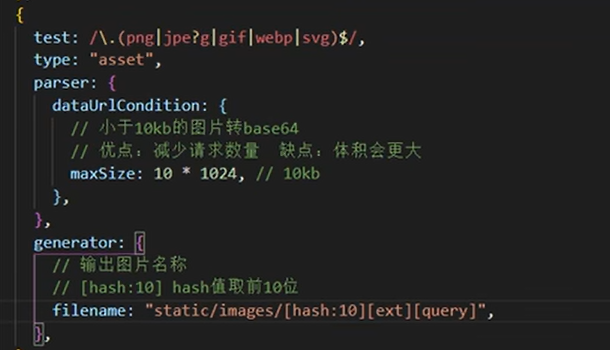
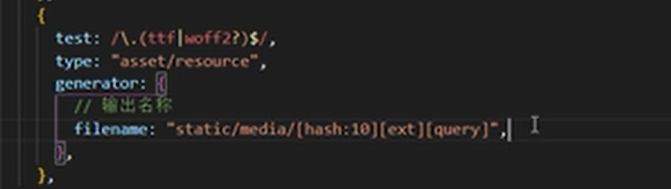
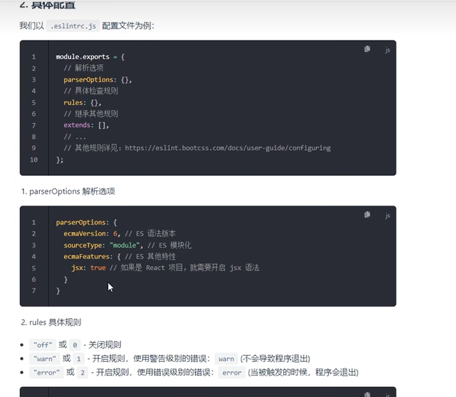
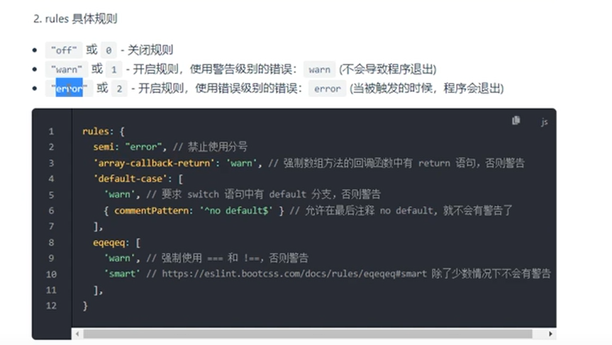

## webpack
发布时间：w5：
- 5大核心概念
1 entry（入口）提示webpack从哪个文件开始打包
2 output（输出）打包完的文件输出到哪
3 loader（加载器）webpack只能处理js json 等 其他资源需要借助loader才能解析
4 plugin （插件）拓展webpack的功能
5 mode（模式）主要有两种模式 开发模式：development 生产模式：production
开发模式：开发代码时使用的模式 主要做两件事：1 编译代码，使浏览器能识别运行 2 代码质量检查
- 处理样式资源
处理.css文件 在main.js中引入css文件 安装css-loader 在webpack.config.js中module rules下配置

-处理图片资源 优化 给小于10kb的图片转成base64能减少http请求数 在
webpack5中直接配置 type:asset 在parser下dataUrlCondition里面maxSize  

-修改文件输出目录   在generator中修改  n.	发电机; 发生器; 电力公司
hash:10  ：哈希值只取前10位
ext： 文件后缀

-自动清空上次打包内容
W5中output下clean：true  原理：在每次打包前将打包目录清空，再进行打包

-处理字体、图标资源


-处理其他资源 加在字体（woff）后面就可以

-处理js代码
一、检查代码格式：eslint 根目录下.eslintrc.js文件中配置
定义 ：检查js jsx 代码语法的工具
使用eslint关键是配置eslint文件  

```javascript
//.eslintrc.js
module.exports = {
  root: true,
  env: {
    node: true,
  },
  globals: {
    defineProps: 'readonly',
    defineEmits: 'readonly',
    defineExpose: 'readonly',
    withDefaults: 'readonly',
  },
  extends: [//继承现有的规则
    'plugin:vue/vue3-essential',//vue3 cli官方规则
    'eslint:recommended',//eslint官方规则
    '@vue/typescript/recommended',
    '@vue/prettier',
    '@typescript-eslint',
  ],
  parserOptions: {//解析选项 parser 美[ˈpɑrsər]  解析器; 分析器; 
    ecmaVersion: 2020,//es语法版本
  },
  rules: {//具体规则 off/0 关闭     warn/1 开启规则 警告级别 触发程序不会退出    error/2 开启规则 错误级别 触发程序能退出
    'no-console': process.env.NODE_ENV === 'production' ? 'warn' : 'off',
    'no-debugger': process.env.NODE_ENV === 'production' ? 'warn' : 'off',
    '@typescript-eslint/explicit-module-boundary-types': 'off',
    '@typescript-eslint/no-explicit-any': 'off',
    '@typescript-eslint/no-var-requires': 'off',
  },
}

```
二、js兼容性：babel
定义：js编译器 把高级的语法比如es6 vue 转换为向下兼容的语法 便于在浏览器中运行
位置：项目根目录下的 babel.config.js/json
具体配置：
1 presets预设：就是一组babel插件 拓展babel功能   vt.	预调; 预置; 给…预定时间; 预先决定; 事先安排;
preset-env是智能预设 能把es6转成es5  preset-typescript 编译ts的预设
2 使用：
exclude:排除哪些文件

-处理html文件 使用插件  html-webpack-plugin
为了保留原来的html结构 自动引入打包生成的资源 要加template:path.resolve(__dirname,'public/index.html')  模板 以public/index.html文件为模板创建新的html文件

-搭建开发服务器 自动化
1 下载包 npm i webpack-server -D  开发服务器不会输出资源，是在内存中编译打包的
2 配置
```javascript
devServer: {
    host: 'localhost',//服务器域名
    open: true,//自动打开浏览器
    historyApiFallback: true,
    // port: 8080,
    proxy: {
      '/change': {
        target: 'http://172.22.50.216:8888',
        // target: 'http://172.16.50.185:8888',
        changeOrigin: true,
        pathRewrite: {
          '^/change': '',
        },
      },
    },
  },
```
-生产模式 路径
一、优化代码运行性能 代码打包速度
开发模式不用输出 所以path：undefined
在package.json中直接配置运行指令
```javascript
"scripts": {
    "serve": "vue-cli-service serve --mode dev",
    "build": "vue-cli-service build",
    "lint": "vue-cli-service lint"
  },
```
二、css处理 npm install --save-dev mini-css-extract-plugin  
提取css成单独的文件 并且把style.loader替换成MiniCssExtractPlugin.loader
三、样式兼容性处理
postcss-loader 放在css-loader和less-loader中间
四 css压缩 $ npm install css-minimizer-webpack-plugin --save-dev


-生产环境移除console  
```javascript
if(process.env.NODE_ENV === 'production') {
plugins.push("transform-remove-console")
}
```

-高级配置
-提升打包构建速度 
一、HotModuleReplacementPlugin（HMR/热模块替换）：在开发中我们修改了一个模块的代码，就只这个模块重新打包编译，这样就提升了打包速度
vue-loader其实已经集成了 只在开发模式下配置
二 oneof 每个文件只能被module加载器中rules中其中一个loader处理
三 include包含（只处理一个文件） exclude排除一些文件比如node_modules  只针对js的babel eslint
四 cache  缓存 eslint和 babel的缓存
每次打包时js文件都要通过eslint检查和babel编译，速度慢，可以缓存之前的结果，这样第二次打包就快了
在babel/eslint配置项options中 加cacheDirectory:true//开启缓存 cacheCompression：false //关闭缓存文件的压缩   美[kəmˈprɛʃən]压缩
五、thread-loader  多进程打包  美[θred] n.	(棉、毛、丝等的)线; 线索; 脉络; 思绪; 思路;
多进程同时干js的babel eslint terse（webpack内置的用来开发环境下压缩js代码）
```javascript
const os = require('os')//引入nodejs的核心模块os 
const threads = os.cpu().length //获取cpu核数
//在options加works:threads
```


- Vite 主要有两大主要优势:
一、利用浏览器内置 ES Module 的支持(script 标签加上属性 type="module" 即可)，
  浏览器直接向 dev server 逐个请求各个模块，而不需要提前把所有文件打包。
二、借助 esbuild 超快的编译速度把第三方库进行预构建，一方面将零散的文件打到一起，减少网络请求，
  另一方面全面转换为 ESM 模块语法，以适配浏览器内置的 ESM 支持。
  [初识Vite](https://www.jianshu.com/p/4c07316b6dd9)  

>[webpack参考学习资料](https://juejin.cn/post/6844904094281236487#heading-0)

- 1.Tree-Shaking？

>作用：用来删除掉没有用的代码。

>tree-shaking消除原理利用的是ES6的模块特性。

>ES6模块依赖关系是确定的，和运行时的状态无关，可以进行可靠的静态分析，这是tree-shaking的基础。

- 2.模块化机制？

>什么是模块？

>将代码分别封装成一个个的JS文件，然后通过对外暴露接口的方式进行数据共享，那么这样的单独的JS文件就是模块。

- 3.uglify？

>uglify原理：1.将代码转换为抽象语法树(AST) 2.将AST进行优化，生成一个更小的AST 3.将新生成的AST再转化为code。

>uglify压缩遵循一些uglify的压缩规则。

- 4.babel原理？

>babel核心处理流程：1.将源代码解析成AST 2.转换AST为需要的样子 3.打印AST为源码

>将ES6的代码转换为ES6以下版本可以运行的代码。

- 5.webpack工作流程？

>loader：能转换各类资源，并处理成对应模块的加载器。loader间可以串行使用。

>chunk：按需加载分块，可以装载不同的module。

>plugin：webpack插件

>1.初始化阶段：启动构建，读取与合并配置参数，加载plugin，实例化Complier。

>2.编译阶段：从Entry出发，针对每个Module串行调用对应的Loader去翻译文件的内容，再找到该Module依赖的Module，递归的进行编译处理。

>3.输出阶段：将编译后的Module组合成Chunk，将Chunk转换成文件，输出到文件系统中。

- 6.webpack plugin插件机制？

- 7.webpack中的loader机制？

- 8.webpack打包优化？

- 9.webpack如何配置？在项目中怎么配置？图片文件需要怎么配置？

- 10.webpack打包原理？

- 11.webpack热更新原理？

总结：面试相关必问知识点？

>1.webpack打包原理？

>首先将代码转成AST，其中首先使用parser将字符串代码转成AST，然后使用traverse收集依赖，然后使用transformFromAst将ES6转成ES5

>2.webpack配置相关？

>3.webpack性能优化相关？

>4.loader相关？

>5.plugin相关？

>6.babel相关？

>7.tree-shaking相关？

>带着相关问题再过一遍webpack4官方文档。带着相关问题然后再去学一下手写webpack。
> 


-[Webpack优化手段](https://blog.csdn.net/m0_68997646/article/details/129116360?spm=1001.2014.3001.5502)


