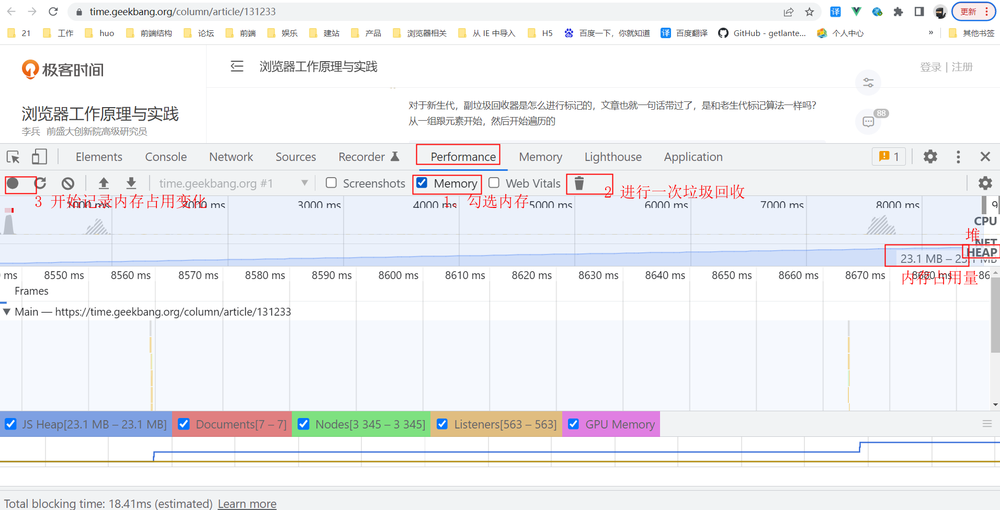

- 垃圾回收
  定义：回收那些函数已经执行完成了，再也用不到的对象和数据
  内存泄漏：非预期的垃圾回收不了
  算法：
  1） 引用计数（早期浏览器） 对对象的引用次数做计数（看引用了几次）  
  缺陷：循环引用问题  const obj1 = {}; const obj2 = {};obj1.a = obj2 ;obj2.a = obj1 这样就导致不知道该给obj1 obj2计算多少次引用了
  2） 标记清除
  V8引擎回收机制。
  V8引擎底层是用C++写的。
  参考文章，[V8引擎详细的垃圾回收](https://time.geekbang.org/column/article/131233)
  数据类型
  基本数据类型
    栈
      ESP指针标识（）
  引用数据类型
    堆  
      代际假说
        新生代区域
          副垃圾回收器
            对象区域， 空闲区域  在对象区域中对活动对象进行标记，然后将这些活动对象复制到空闲区域，然后将空闲区域和对象区域反转，然后进行垃圾回收
        老生代区域
          主垃圾回收器
          标记-清除  标记-整理
        晋升机制
        JS是单线程 拆分成小任务

栈和堆
栈垃圾回收
当函数执行结束，JS引擎通过向下移动ESP指针（记录调用栈当前执行状态的指针），来销毁该函数保存在栈中的执行上下文（变量环境、词法环境、this、outer）。
堆垃圾回收
一、代际假说
1、大部分对象存活时间很短
2、不被销毁的对象，会活的更久
二、分类
V8 中会把堆分为新生代和老生代两个区域，新生代中存放的是生存时间短的对象，老生代中存放的生存时间久的对象。
三、新生代
算法：Scavenge 算法
原理：
1、把新生代空间对半划分为两个区域，一半是对象区域，一半是空闲区域。
2、新加入的对象都会存放到对象区域，当对象区域快被写满时，就需要执行一次垃圾清理操作。
3、先对对象区域中的垃圾做标记，标记完成之后，把这些存活的对象复制到空闲区域中
4、完成复制后，对象区域与空闲区域进行角色翻转，也就是原来的对象区域变成空闲区域，原来的空闲区域变成了对象区域。
对象晋升策略：
经过两次垃圾回收依然还存活的对象，会被移动到老生区中。
四、老生代
算法：标记 - 清除（Mark-Sweep）算法
原理：
1、标记：标记阶段就是从一组根元素开始，递归遍历这组根元素，在这个遍历过程中，能到达的元素称为活动对象，没有到达的元素就可以判断为垃圾数据。
2、清除：将垃圾数据进行清除。
碎片：
对一块内存多次执行标记 - 清除算法后，会产生大量不连续的内存碎片。而碎片过多会导致大对象无法分配到足够的连续内存。
算法：标记 - 整理（Mark-Compact）算法
原理：
1、标记：和标记 - 清除的标记过程一样，从一组根元素开始，递归遍历这组根元素，在这个遍历过程中，能到达的元素标记为活动对象。
2、整理：让所有存活的对象都向内存的一端移动
3、清除：清理掉端边界以外的内存
优化算法：增量标记（Incremental Marking）算法
原理：
1、为了降低老生代的垃圾回收而造成的卡顿
2、V8把一个完整的垃圾回收任务拆分为很多小的任务
1、让垃圾回收标记和 JavaScript 应用逻辑交替进行

首先说到垃圾回收，就要说一下JS存储数据的方式，JS中的数据类型其实是分为两类的，
一类是原始数据类型，另一类就是引用类型，然后JS中的原始类型是存在栈空间中的，
而引用类型是存在堆空间中的，栈空间中存了一个引用地址，然后通过这个引用地址去使用引用类型。
然后对于栈空间中的垃圾数据，回收的方法是通过一个ESP指针去移动标识哪些内容是否有用，没用的就直接抹掉。
而堆空间中的垃圾回收要比栈空间中的垃圾回收更为复杂，说到堆空间里的垃圾回收，我们先要说一下代际假说，
这个假说有两个特点，一个特点是有些对象生存时间很短，在分配内存没多久就变得不可访问了，
第二个特点是有些对象会活的很久。在这个假说的基础上，V8进行了垃圾回收的实现。
首先V8引擎将堆空间分为新生代区域和老生代区域，然后新生代区域主要存储生存时间短的对象，而老生代区域存储的是生存时间长的对象。
然后垃圾回收也通过2个垃圾回收器进行回收，一个副垃圾回收器负责新生代区域的垃圾回收，一个主垃圾回收器负责老生代区域的垃圾回收。
新生代区域的垃圾回收，主要是将新生代区域拆分成两个区域，一个对象区域，一个空闲区域，
在对象区域中对活动对象进行标记，然后将这些活动对象复制到空闲区域，然后将空闲区域和对象区域反转，然后进行垃圾回收。
老生代区域的垃圾回收是通过主垃圾回收器进行的，因为老生代区域里的对象比较大，所以不能像新生代区域那样采用scavenge算法，
因为复制活动对象是需要时间的，因为老生代区域里的对象比较大，复制时间会比较长，所以老生代区域采用标记-清除的方法进行垃圾回收，
对不活动对象进行标记，然后标记完成之后将不活动对象全部清理掉。但是这种方法会导致内存空间里存在内存碎片，
所以还有一种清理方法就是标记-整理的清理方法，基本上跟上一种方法差不多，不过清理的时候，会将活动对象全部放到一端，清除端之外的内存，这样就不存在内存碎片了。
然后这里面还有一个机制就是晋升机制，当一个对象在新生代里经过2次垃圾回收还存在的话就会被自动晋升放到老生代区域中。
最后就是在执行垃圾回收的过程中，因为JS是单线程运行的，所以进行垃圾回收的时候需要停下js脚本的运行工作，这样如果js垃圾回收时间较长的话，
那么JS脚本如果正在执行动画，那就会卡顿， 所以V8对将一个垃圾回收过程拆成了很多小的任务，和js脚本穿插执行，这样就不会有卡顿的感觉了，JS的垃圾回收机制基本是这样。

闭包的数据不会被回收

-内存泄漏如何监测，场景有哪些
一、
二、场景 （vue）
  1 被全局变量、函数引用，组件销毁时未清除
  2 被全局事件、定时器引用，组件销毁时未清除 
  3 被自定义事件引用，组件销毁时未清除  比如组件传参时用的自定义事件就得清楚：event.off('事件名',函数)
  
