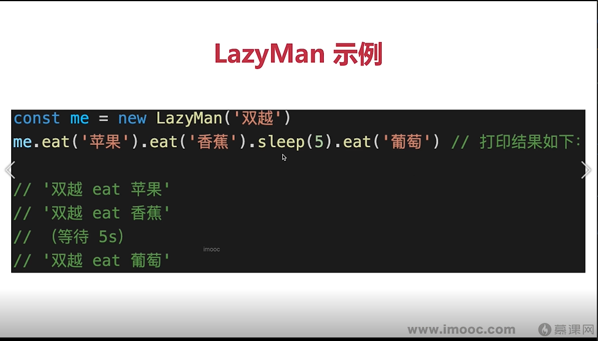
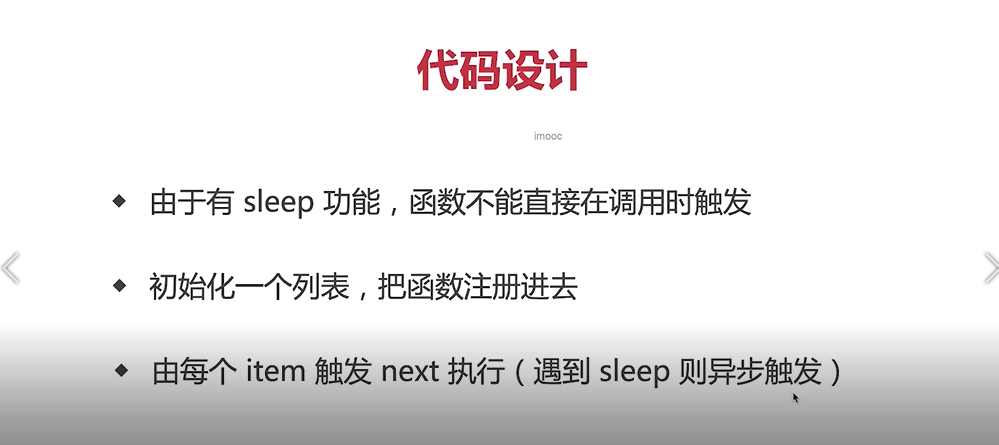
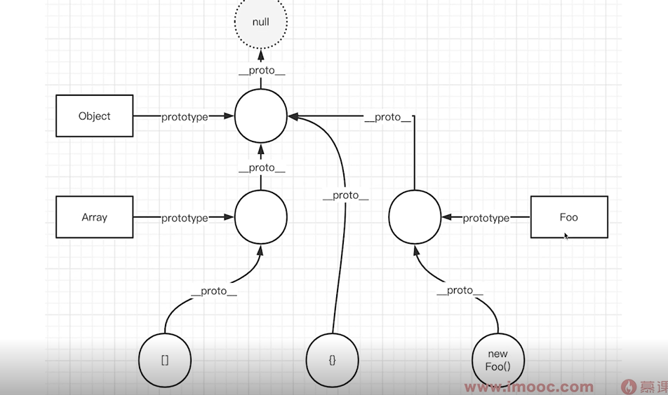

- 实现数组扁平化 
```javascript
 //数组扁平化 只扁平化一级 多维数组转为一维数组
//使用push  循环数组，如果item为数组则循环item并把n push到res中 ，如果不为数组则把item push到res中
function flatten(arr){
    const res  = []
    arr.forEach(item =>{
        if (Array.isArray(item)){
            item.forEach(n =>{res.push(n)})
        }else{
            res.push(item)
        }
    })
    return res
}
const arr1 = [1,2,[3,[4,5]],6]
// console.log('flatten',flatten(arr1))

//使用concat
function flatten1(arr){
    let res = [];
    arr.forEach(item => {
        res = res.concat(item)
    })
    return res;
}

console.log('flatten1',flatten1(arr1))

//单元测试 jest
// describe('',function (){
//     it('空数组', function () {
//         const res = flatten([])
//         expect(res).toEqual([])
//     });
// })


//数组深度扁平化 彻底拍平 多维数组转为一维数组
//使用push
function flattenDeep(arr){
    const res  = []
    arr.forEach(item =>{
        if (Array.isArray(item)){
            const flattenItem = flattenDeep(item)
            flattenItem.forEach(n =>{
                res.push(n)
            })
        }else{
            res.push(item)
        }
    })

    return res
}
const arr2 = [1,2,[3,[4,5]],6]
console.log("flattenDeep",flattenDeep(arr2))
//数组深度扁平化 彻底拍平 多维数组转为一维数组
//使用concat
function flattenDeep1(arr){
    let res  = []
    arr.forEach(item =>{
        if (Array.isArray(item)){
            const flattenItem =  flattenDeep1(item)
            res = res.concat(flattenItem)
        }else{
            res = res.concat(item)
        }
    })

    return res
}
const arr3 = [1,2,[3,[4,5]],6]
console.log("flattenDeep1",flattenDeep1(arr3))

//用flat
const arr4 = [1,2,[3,[4,5]],6]
console.log('flat',arr4.flat(Infinity),arr4)
// flat() 方法会按照一个可指定的深度递归遍历数组，并将所有元素与遍历到的子数组中的元素合并为一个新数组返回。
//flat  arr.flat([depth])  depth 是可以传递数组的展开深度（默认不填、数值是 1），即展开一层数组。
// 那么如果多层的该怎么处理呢？参数也可以传进 Infinity，代表不论多少层都要展开。

//用reduce 
const arr5 = [1,2,[3,[4,5]],6]
function reduceFlatten(arr){
    return arr.reduce((t,v) => {
        return  t.concat(Array.isArray(v)?reduceFlatten(v):v)
    },[])
}
console.log('reduceFlatten',reduceFlatten(arr5),arr5)
```

-获取详细的数据类型
```javascript
 //获取详细的数据类型
    function getType(x){
        const originType = Object.prototype.toString.call(x)
        const sliceIndex = originType.indexOf(' ')
        const type = originType.slice(sliceIndex+1 , -1)
        return type.toLowerCase()
    }
console.log('getType',getType([]))
```
-new
一过程：
1创建一个空对象obj，继承构造函数的原型 2  执行构造函数（将obj作为this） 3 返回obj
 ```javascript
    //泛型  myNew<T> 定义什么类型就要返回什么类型
    function myNew(constrc,...arg) {
        let obj = Object.create(constrc.prototype)//创建空对象并把空对象的__proto__指向构造函数的原型对象
        let res = constrc.apply(obj,arg)// 改变constrc中this的指向并执行
        console.log('res instanceof Object',res,res instanceof Object,obj)
        //如果构造函数返回的是对象，则使用构造函数执行的结果。否则，返回新创建的对象
        return  res instanceof Object ?res:obj
    }

    function Foo(name,age){
        this.name =  name
        this.age = age
        // const num  = {}
        // return num
    }
    let f = myNew(Foo,'xiaoming',18)
    // let f = new Foo('xiaoming',18)
    console.log("myNew",f)
```

-遍历dom树
```javascript
 //深度优先遍历dom树
    //访问节点
    function visitNode(n){
        if (n instanceof Comment ){
            //注释
            console.log('Comment',n.textContent)
        }
        if (n instanceof Text ){
            //注释
            if (n.textContent?.trim() !== ''){
                console.log('Text',n.textContent?.trim())
            }
        }
        if (n instanceof HTMLElement ){
            //注释
            console.log('HTMLElement', `<${n.tagName.toLowerCase()}>`)
        }
    }
    //深度优先遍历 用递归
    function depthFirstTraverse(root){
        visitNode(root)
        const childNodes = root.childNodes
        //.childNodes获取的是元素的所有子node 包括元素 注释comment  文本text
        //.children只获取元素
        if (childNodes.length){
            childNodes.forEach(child => {
                depthFirstTraverse(child)
            })
        }
    }
    const box = document.getElementById('box')
    // depthFirstTraverse(box)

    //深度优先遍历 用栈
    function depthFirstTraverse1(root){
        //定义一个栈 根节点压栈
        //while循环条件栈的长度大于零 出栈 如果出栈的节点等于null就break  访问出栈节点
        //如果出栈节点有子节点 就把子节点顺序反过来压栈
        const stack = []
        stack.push(root)
        while (stack.length > 0){
            const curNode = stack.pop()
            if (curNode == null) break
            visitNode(curNode)
            const childNodes = curNode.childNodes
            if (childNodes.length){
                Array.from(childNodes).reverse().forEach(child =>{
                    stack.push(child)
                })
            }
        }

    }
    depthFirstTraverse1(box)

    //广度优先 用队列
    function breadthFirstTraverse(root){
        //1 用数组来定义队列  根节点入队
        //2 while循环条件 队列长度大于0 就出队一个并且访问 如果出队的节点有子节点，就把子节点全部入队
        const queue = []
        queue.unshift(root)
        while (queue.length > 0){
            let curNode = queue.pop()
            if (curNode == null) break
            visitNode(curNode)
            const childNodes = curNode.childNodes
            if (childNodes.length){
                childNodes.forEach(child => queue.unshift(child))
            }
        }
    }
    // breadthFirstTraverse(box)
```


-lazyMan实现sleep机制   
promise实现延时函数
```javascript

    //promise实现延时函数
    function sleep(delay){
        return new  Promise((resolve => {
            setTimeout(resolve,delay)
        }))
    }
    sleep(2000).then(() => {
        console.log("两秒执行")
    })
    //promise 带延时功能的链式调用
    function human(name){
        return new Human(name)
    }
    function Human(name){
        this.name = name
        this.sayHello()
        this.queue = Promise.resolve()
    }
    Human.prototype.sayHello = function(){
        console.log(`I am ${this.name}`)
    }
    Human.prototype.eat = function(){
        console.log('this.queue1',this.queue)
        this.queue = this.queue.then(()=>{
            return new Promise((resolve)=>{
                console.log('Eat')
                resolve()
            })
        })
        console.log('this.queue2',this.queue)
        return this
    }
    Human.prototype.sleep = function(time){
        this.queue = this.queue.then(()=>{
            return new Promise((resolve)=>{
                setTimeout(()=>{
                    console.log(`Sleep ${time}s`)
                    resolve()
                },time*1000)
            })
        })
        return this
    }
    Human.prototype.go = function(){
        this.queue = this.queue.then(()=>{
            return new Promise((resolve)=>{
                console.log('Go')
                resolve()
            })
        })
        return this
    }
    Human.prototype.rest = function(time){
        this.queue = this.queue.then(()=>{
            return new Promise((resolve)=>{
                setTimeout(()=>{
                    console.log(`Rest ${time}s`);
                    resolve()
                },time*1000)
            })
        })
        return this
    }

    human('Jack').eat().sleep(5).go().rest(10);
```
-函数柯里化
```javascript
 //函数柯里化 分析：1 curry输入/返回的是函数fn 2 执行fn，中间状态返回函数，如add(1)或者add(1)(2)
//3 最后返回执行结果 如add(1)(2)(3)
function add(x,y,z){
    return x + y
}
function curry(fn){
    //获取fn参数长度 用来判断入参是否够了  定义入参数组用来装入参
    //定义计算函数calc 把每次的入参加到入参数组中 判断入参不够就返回calc 够了就返回计算结果
    const fnArgsLength = fn.length
    let args = []
    function calc(...newArgs){
        args = [...args,...newArgs]
        if (args.length <fnArgsLength){
            return calc
        }else{
            return  fn.apply(this,args)
        }
    }
    return calc
}
const curryAdd = curry(add)
console.log(curryAdd(10)(20))
```

- 手写instanceof

```javascript
// f instanceof F  判断构造函数F的原型对象是否在被监测对象f的原型链上
    function myInstanceof(left,right){
        if (left === null) return false //处理被检测对象是 null undefined的情况
        const type = typeof left;
        if (type !== 'object' && type !== 'function') return  false //处理left是基本数据类型
        let tempLeft = left //temp 临时 防止修改left
        while(tempLeft){
            if (tempLeft.__proto__ === right.prototype ) return true //如果被检测对象的隐式原型指向构造函数的原型对象 就成立
            tempLeft = tempLeft.__proto__  //不成立就顺着原型链往上
        }
        return  false
    }

    console.log('myInstanceof',myInstanceof({},Array))
```

-手写bind
```javascript
//应用：返回一个新函数 但是不执行 绑定this和部分参数  如果是箭头函数，不能改变this只能改变参数
//返回一个函数 函数里面返回原本函数apply的结果
Function.prototype.myBind = function (context,...bindArgs){//context意思就是上下文，this
    //context 是bind传入的this  bindArgs是bind传入的参数
    const self = this //原始函数
    return function (...args){
        const newArgs = bindArgs.concat(args)//拼接参数
        return self.apply(context,newArgs)
    }
}
function fnBind(x,y,z){
    console.log(this,x,y,z)
}
const fn1 = fnBind.myBind({x:100},10)
fn1(20,30,40)


```

