-1.什么是复杂度 1 定义：程序执行时需要的cpu计算量（时间复杂度 -cpu）和内存空间（空间复杂度 -内存） ,-（和代码是否简洁无关） 复杂度是数量级（相差不大的数量范围），不是具体数字 一般针对具体的算法,而非一个完整的系统
2 [时间复杂度图](.算法_images/fdab399b.png)
O(1)一次就够 O（n）和输入的数据量一样（一个for循环） O(n^2)输入的数据量的平方(两个for循环)   O(logn)数据量的对数（以2为底的数据量（n）的对数）二分 O（n*logn) 数据量*数据量的对数
（for循环里面包二分） 3 O(1):有限的、可数的空间 O(n)和输入量相同的空间 -2 数组旋转 1）pop unshift 2）concat -3 单元测试

```javascript
//describe 	美[dɪˈskraɪb]  描述; 形容;  expect 美[ɪkˈspekt] v.	预料; 预期; 预计; 等待; 期待; 盼望; 要求; 指望; 猜想;
// equal 	美[ˈiːkwəl] (在大小、数量、价值、程度、能力等方面)相等的, 同样的; 

describe('测试名字描述', () => {
    it('测试情况1',() => {
    const arr = [1, 2, 3, 4]
    const k = 2
    const res = rotate2(arr, k)
    expect(res).toEqual([3, 4, 1, 2])
});
})
describe('测试名字',()=>{
    it('qingkuang', function () {
        expect(res).toEqual()
    });
})
```

-数组旋转
```javascript
 //旋转数组 pop unshift  时间复杂度 O(n^2) 空间复杂度O（1）
function rotate1(arr, k) {
    const length = arr.length
    if (!k || length === 0) return arr
    const step = Math.abs(k % length)//取余 取绝对值
    for (let i = 0; i < step; i++) {
        let lastValue = arr.pop()
        arr.unshift(lastValue) //数组是一个有序数组 unshift操作非常慢 时间复杂度是O(n)  ，数组是连续的内存空间
    }
    return arr
}

// slice concat    时间复杂度 O(1) 空间复杂度O（n）
function rotate2(arr, k) {
    const length = arr.length
    if (!k || length === 0) return arr
    const step = Math.abs(k % length)
    const part1 = arr.slice(-step)//O(1)
    const part2 = arr.slice(0, length - step)
    const part3 = part1.concat(part2)
    return part3
}

//功能测试
let array1 = [1, 2, 3]
console.log("11", rotate1(array1, 2))
//性能测试
let arrTest = []
for (let i = 0; i < 10 * 10000; i++) {
    arrTest.push(i)
}
let arrTest2 = []
for (let i = 0; i < 10 * 10000; i++) {
    arrTest2.push(i)
}
console.time('rotate1')
rotate1(arrTest, 9 * 10000)  //980.5830078125 ms
console.timeEnd('rotate1')

console.time('rotate2')
rotate2(arrTest2, 9 * 10000) //0.51220703125 ms
console.timeEnd('rotate2')


```


- 判断字符串是否括号匹配  如 {a(b)c}匹配 {a(b}c)就不匹配
  一 栈 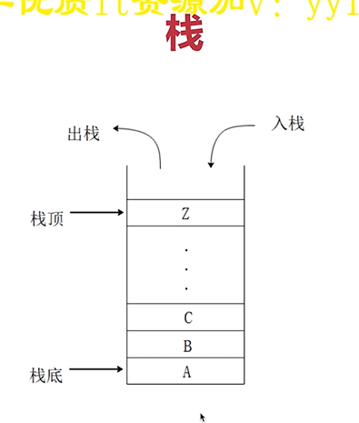
  1 先进后出的数据结构 2 API: push pop length  3 相关的：队列 ，堆
  二 栈跟数组没有关系
  栈 ：逻辑结构。理论模型，不管如何实现，不受编程语言限制
  数组：物理结构。真正的功能实现，受限于编程语言
  三 思路
  遇到左括号就压栈 遇到右括号就判断栈顶，匹配就出栈,不匹配就直接说明字符串不是括号匹配  最后判断length是否为0
  
```javascript
//字符串括号匹配  栈
    function match(left,right){//判断两个括号是否相等
        if (left === '(' && right === ')'){ return true}
        if (left === '{' && right === '}'){ return true}
        if (left === '[' && right === ']'){ return true}
        return  false
    }
    function matchBracket(str){//时间复杂度O(n)  空间复杂度O（n）
        const length = str.length
        if (length === 0) return false
        let stack = [] // 定义栈
        const leftSymbols  = '({['//定义左括号情况集合
        const rightSymbols  = ')}]'//定义右括号情况集合
        for (let i = 0;i<length;i++){
            let s = str[i]
            if (leftSymbols.includes(s)){//如果是左括号
                stack.push(s)//压栈
            }else if (rightSymbols.includes(s)){//如果是右括号
                let top = stack[stack.length - 1]
                if (match(top,s)){//判断s是否跟栈顶匹配 匹配就出栈 不匹配就说明整个字符串不满足
                    stack.pop()
                }else{
                    return  false
                }
            }
        }
        if (stack.length === 0){
            return true
        }else{
            return false
        }
    }
    const matchStr = 'a(b{c[d]]e}f)'
    console.log('括号匹配matchBracket',matchBracket(matchStr))
```

- 两个栈实现一个队列 (queue 美[kjuː])
一 队列 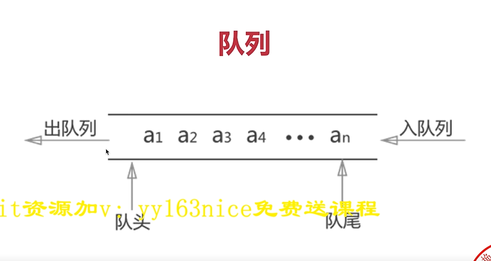
  1.先进先出 2 API : add delete length
二 逻辑结构 VS 物理结构
  1 队列是逻辑结构，抽象模型 2简单的队列可以用数组、链表实现 3 复杂的队列服务需要单独设计 （比如消息队列）
```javascript
    //两个栈实现一个队列
    function MyQueue() {
        this.stack1 = [] //private 私有属性
        this.stack2 = []
    }
    MyQueue.prototype.add = function (n){
        this.stack1.push(n)
    }
    MyQueue.prototype.delete = function (){
        let res;
        const stack1 = this.stack1
        const stack2 = this.stack2
        //先把栈1的所有元素转到栈2中
        while(stack1.length){
            const n = stack1.pop()
            if (n !== null) stack2.push(n)
        }
        //取栈2的栈顶 为res的值
        res = stack2.pop()
        //把栈2的元素倒腾回栈1
        while (stack2.length){
            const n = stack2.pop()
            if (n !== null) stack1.push(n)
        }
        return res || null
    }
    MyQueue.prototype.length = function (n){
        return  this.stack1.length
    }
    const q = new MyQueue()
    q.add(1)
    q.add(2)
    q.add(3)
    q.delete()
    console.log('q',q)
    console.log('q.length',q.length())
```

-定义一个js函数 反转单向链表  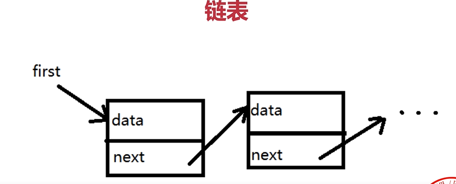
一 链表
  1 是一种物理结构，是零散存储的结构、类似于数组 2 数组需要一段连续的内存空间，查询快O(1)增删慢(在最后增删快，在中间增删慢)O(n) 
而链表是零散存储的 查询慢O(n)增删快O(1) 
  3 链表节点的数据结构{value ， next？，prev？ }
二 链表VS数组
  都是有序结构 （对象、 Set是无序结构   ）
三 应用： React Fiber使用了链表 在渲染组件的时候可以停下来做别的高优任务，高优任务做完后再接着做


- 二分查找
```javascript
function halfSearch(arr, num) {
    // 1 定义start和end 用来查目标数组段 2 定义中间index middleIndex 3 取中间值middleVal = arr[middleIndex] 
    // 4 while 循环条件中start<end 体中判断middleVale比num小就使end=middleInde+1 ，middleVal比num大就使start = middleIndex-1 ，middleVal等于num就return middleIndex
    let start = 0;
    let end = arr.length - 1;
    while (start < end) {
        let middleIndex = Math.floor((start + end) / 2)
        let middleVal = arr[middleIndex]
        if (middleVal < num) {
            end = middleIndex + 1
        } else if (middleIndex > num) {
            start = middleIndex - 1
        } else if (middleVal == num) {
            return middleIndex
        }
    }
    return -1
}
```

- 找数组中和为n的两个数 双指针 时间复杂度O(n)  优化嵌套循环就用双指针

```javascript
  function findTwoNum(arr, count) {
    //定义start end 作为要找的两个数的下标
    //while循环条件是start<end 循环体中定义两数之和sum = arr[start] + arr[end]
    // 如果sum<count则start往右移动一位即start++  如果sum >count end往左移动一位即end--
    // 如果sum == count return[arr[start],arr[end]]
    let start = 0, end = arr.length - 1;
    while (start < end) {
        console.log('while')
        let sum = arr[start] + arr[end]
        if (sum < count) {
            start++
        } else if (sum > count) {
            end--
        } else {
            return [arr[start], arr[end]]
        }
    }
    return -1
}

const arrSum = [1, 3, 4, 5, 8, 9]
console.log(findTwoNum(arrSum, 11))
```

- 求二叉树的第k小值
```javascript
 // 求二叉搜索树的第k小值
    const bst = {
        value: 5,
        left: {
            value: 3,
            left: {
                value: 2,
                left: null,
                right: null
            },
            right: {
                value: 4,
                left: null,
                right: null,
            }
        },
        right: {
            value: 7,
            left: {
                value: 6,
                left: null,
                right: null
            },
            right: {
                value: 8,
                left: null,
                right: null
            }
        }
    }
    let sortArr = []
    //二叉树中序遍历
    function inOrderTraverse(node){
        if (node == null) return
        inOrderTraverse(node.left)
        sortArr.push(node.value)
        inOrderTraverse(node.right)
    }
    // inOrderTraverse(bst)
    function getKthNum(arr,k){
        inOrderTraverse(arr)
        console.log('sortArr',sortArr)
        return sortArr[k-1]
    }

    console.log("getKthNum",getKthNum(bst,2))
```

> 二叉树：每个节点最多只能有两个子节点 树节点的数据结构{value left？ right？}
> 二叉树的遍历：1 前序遍历：root - >left - >right 中序遍历：left -> root - >right 后序遍历：left -> right ->root
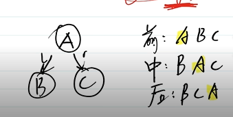
> 二叉搜索树BST： 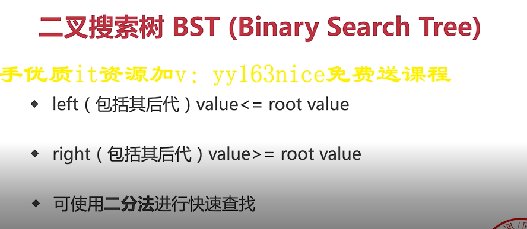 目的：为了性能 二分思想 数组查找快增删慢 链表查找慢增删快 二叉搜索树查找增删都快所以性能好
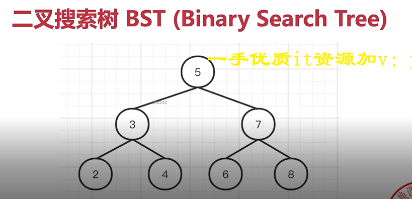
> 平衡二叉搜索树BBST：BST如果不平衡就成了链表,所以要尽量平衡BBST。 增删查时间复杂度都是O(logn)，即树的高度
> 红黑树：1 一种自平衡二叉树 2 分为 红/黑 两种颜色，通过颜色转换来维持树的平衡 3 相对于普通平衡二叉树，它维持平衡的效率更高 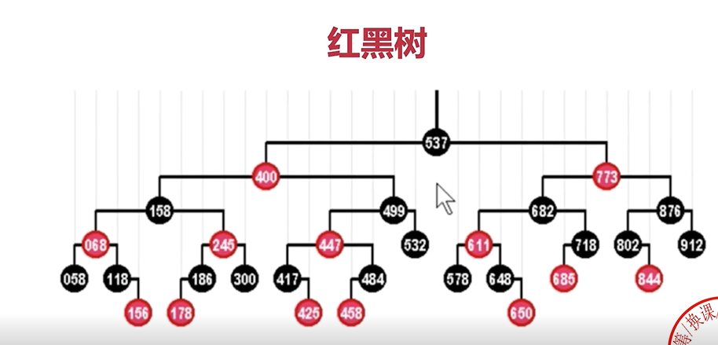
> B树：物理上是多叉树 ，但是逻辑上是二叉树 一般用于高效I/O，关系型数据库常用B树来组织数据 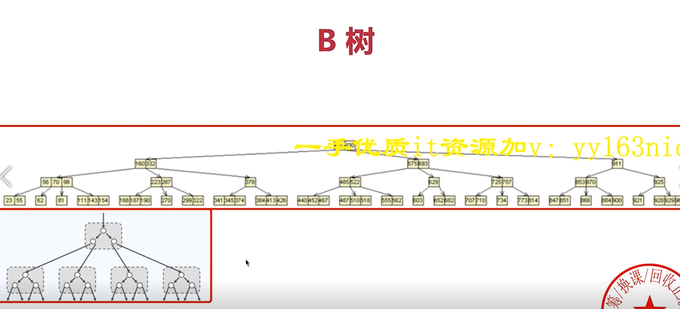

> 堆（heap）栈（stack 先进后出）模型 ： js代码执行时，值类型变量存储在栈，引用类型变量存储在堆 ! [堆栈模型](.算法_images/ccdf85d4.png)
堆：是一个完全二叉树 。逻辑结构是一颗二叉树 物理结构是一个数组（适合连续存储+节省空间） 。 特点：最大堆：父节点 >= 子节点 ；最小堆：父节点 <= 子节点  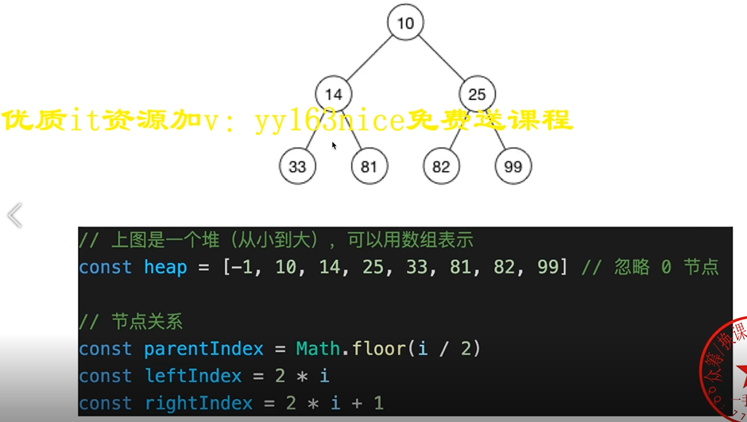
完全二叉树：左右两边都填满是满二叉树。左边填满，右边不填满是完全二叉树  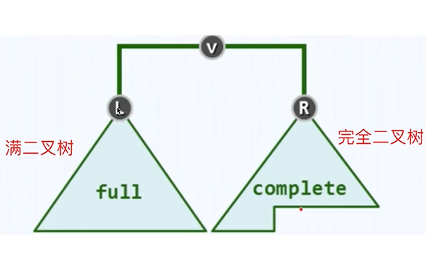
> 堆 vs BST 查询比BST慢 增删比BST快，维持平衡更快 时间复杂度都是O(logn)
> 堆的使用场景：1 特别适合堆栈模型 2堆的数据都是在栈中引用的，不需要从root遍历 3 堆恰巧是数组形式，根据栈的地址，可用O(1)找到目标

- 斐波那契数列 递归 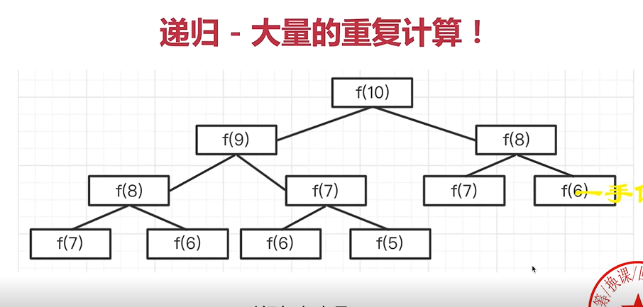

```javascript
 //fibonacci数列 递归
function fibonacci(n) { //时间复杂度 O(2^n) 重复计算了
    //如果n == 0,return 0 如果n == 1，return 1
    //return fibonacci(n-1) + fibonacci(n-2)
    if (n <= 0) return 0
    if (n === 1) return 1
    return fibonacci(n - 1) + fibonacci(n - 2)
}

console.log('fibonacci', fibonacci(9))
```

//循环 记录中间结果 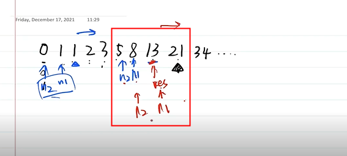

```javascript
 //fibonacci数列 循环 记录中间值
function fibonacci1(n) {//
    // 如果n == 0,return 0 如果n == 1，return 1
    //定义 n的前一位数 n1 = 1，n的前两位数 n2 = 0 ，n1 n2的和res=0
    //for循环中 res = n1 + n2   n2 = n1   n1=res
    if (n === 0) return 0
    if (n === 1) return 1
    let n1 = 1, n2 = 0, res = 0;
    for (let i = 2; i <= n; i++) {//从2开始
        res = n1 + n2;
        //记录中间结果
        n2 = n1
        n1 = res
    }
    return res
}

console.log("fibonacci1", fibonacci1(2))

```

动态规划：1 把一个大问题拆解成多个小问题，逐级向下拆解 2 用递归的思路去分析问题，再改为循环来实现 算法三大思维：贪心 、二分、动态规划

- 将数组中的所有0移动到末尾
```javascript
// 将数组中的所有0移动到末尾  双指针
    function moveZero(arr){
        //定义length  = arr.length
        //定义j = -1 用来指向0  定义i用来指向j后的第一个非0
        //for循环体 循环到arr[i]=0时就j=i  如果arr[i] == 0 { 如果j < 0 就j = i }
        //循环到arr[i] !==0 并且j > = 0时,arr[i]跟arr[j]的值进行交换 交换完成后j向前走一步j++
        let length = arr.length
        if (length == 0) return arr
        let i,j = -1;
        for (let i = 0;i<length;i++){
            console.log('222',i,j, arr)
            if (arr[i] == 0 && j < 0 ){
                j = i
            }
            if (arr[i] !== 0 && j >= 0 ){
                //交换
                const n = arr[i]
                arr[i] = arr[j]
                arr[j] = n
                //交换完成后j向前走一步j++
                j++
            }
            console.log(i,j, arr)
        }
    }

    let zeroArr = [0,0,3,0,0,4]
    console.log("moveZero",moveZero(zeroArr))
```

- 获取字符串中连续最多的字符以及次数
```javascript
 //获取字符串中连续最多的字符以及次数 双指针
    //定义指针i ,j 。j不动i继续移动
    //如果str[i] == str[j] ,i继续移动
    //直到str[i] !== str[j],记录处理，继续第一步
    function findContinuousChart(str){
        let res = {char:'',length:0}
        const length = str.length
        if (length === 0) return res
        let tempLength = 0;
        let i,j=0;
        for (i = 0;i<length;i++){
            if (str[i] === str[j]){
                tempLength++
            }
            if (str[i] !== str[j] || i === length -1){
                if (tempLength > res.length){
                    res.char = str[j]
                    res.length = tempLength
                }
                tempLength = 0
                if (i < length -1 ){
                    j = i;
                    i--
                }
            }

        }
        return  res
    }
    let findContinuousStr = 'aabbbccccdd'
    console.log('findContinuousChart',findContinuousChart(findContinuousStr))
```

- 快速排序  时间复杂度O(n*logn)
```javascript
 function quickSort(arr) {
        //定义一个中间index midIndex 定义中间值midVal  定义左数组left=[] 右数组right = []
        //for循环中 如果arr[i]<midVal那么left.push(arr[i]) 如果arr[i]>midVal那么right.push(arr[i])
        //return quickSort(left).concat([midValue],quickSort(right))
        const length = arr.length;
        if (length === 0) return arr;
        const midIndex = Math.floor(length / 2);
        const midValue = arr[midIndex];
        let left = [],right = [];
        for(let i = 0;i < length;i++) {
            if (i !== midIndex) {
                const n = arr[i];
                if (n < midValue) {
                    left.push(n);
                } else {
                    right.push(n)
                }
            }
        }
        return quickSort(left).concat([midValue],quickSort(right))
    }
    let quickArr = [2,3,5,1,4]
    console.log('quickSort',quickSort(quickArr))
```
-    查询1-max的对称数  [1,2,3,...,100,101]  Palindrome[ˈpælɪndroʊm]
```javascript
  function findPalindromeNumbers(max){// 时间复杂度O（n） 但是操作数组性能比操作字符串的性能差
        //数字转化为字符串，再转化为数组，再颠倒顺序，再转为字符串
        let arr = []
        for (let i = 1;i <= max; i++){
            const s = i.toString();
            // console.log("s",s,i,s.split('').reverse().join(''))
            if ( s === s.split('').reverse().join('')){
                arr.push(i)
            }
        }
        return arr
    }
    console.log("findPalindromeNumbers",findPalindromeNumbers(30))

    function findPalindromeNumbers1(max){//字符串前后比较
        // 定义 首尾index，首尾value是否相等的flag=true 。 while条件startIndex<endIndex， {}中：判断首尾value是否相等，相等则startIndex++ endIndex-- ，不相等则flag=false break
        //如果flag为true arr.push(i)
        let arr = []
        for (let i = 1;i <= max; i++){
            const s = i.toString();
            let startIndex = 0,endIndex =s.length - 1, flag = true;
            while (startIndex < endIndex){
                if (s[startIndex] !== s[endIndex]){
                    flag = false
                    break
                }else{
                    startIndex++
                    endIndex--
                }
            }
            if (flag){ arr.push(i)}
        }
        return arr
    }
    console.log("findPalindromeNumbers1",findPalindromeNumbers1(30))
```

-切换字母大小写 如输入12aBc34   输出12AbC34  慎用正则表达式  常见字符的ASCII码 数字48-57  大写字母65-90 小写字母97-112 
```javascript
function switchLetterCase(str){//正则表达式  2ms
        //定义length 判断大小写的正则表达式 /[a-z]/ /[A-Z]/  新的字符串res
        //for循环如果str[i]是小写就用 string.toUpperCase()转为大写， 大写就用string.toLowerCase()转为小写
        const length = str.length;
        if (length === 0) {return str}
        const req1 = /[a-z]/ ;
        const req2 = /[A-Z]/;
        let res = '';
        for (let i = 0;i < length; i++){
            const val = str[i]
            if (req1.test(val)){
                res += val.toUpperCase()
            }else if (req2.test(val)){
                res += val.toLowerCase()
            }else{
                res += val
            }
        }
        return res
    }
    const strSwitch = '12aBc34'
    console.log('switchLetterCase',switchLetterCase(strSwitch))

    function switchLetterCase2(str) {//ASCII码  4ms
        const length = str.length;
        if (length === 0) {return str}
        let res = ''
        for(let i = 0; i< length ; i++){
            const val = str[i]
            const ascVal = val.charCodeAt(0)
            if (ascVal >=65 && ascVal <= 90){//大写
                res += val.toLowerCase()
            }else if (ascVal >= 97 && ascVal <= 112){
                res += val.toUpperCase()
            }else{
                res += val
            }
        }
        return res

    }
    const strSwitch2 = '12aBc34'
    console.log('switchLetterCase2',switchLetterCase2(strSwitch2))

```

- 写一个方法找出字符串中最多的字母？
直接遍历字符串的方法有哪几种：3种  for循环。  for...of...  for...in... 用展开语法也可以展开字符串
```javascript
        function searchStr(str) {
            const obj = {};
            // 1.统计字符串中每个字母出现的次数
            for (const val of str) {
                if (obj[val]) {
                    obj[val]++;
                } else {
                    obj[val] = 1;
                }
            }
            // 2.找出出现次数最多的那个字母
            let maxLetter = '', number = 0;
            for (const key in obj) {
                if (obj[key] > number) {
                    number = obj[key];
                    maxLetter = key;
                }
            }
            console.log('出现次数最多的字母：' + maxLetter + ',出现的次数：' + number);
            return maxLetter;
        }
        console.log(searchStr('asdaa111111'));
```


- 1.题目： 在一个二维数组中，每一行都按照从左到右递增的顺序排序，每一列都按照从上到下递增的顺序排序。请完成一个函数，输入这样的 一个二维数组和一个整数，判断数组中是否含有该整数。
  

