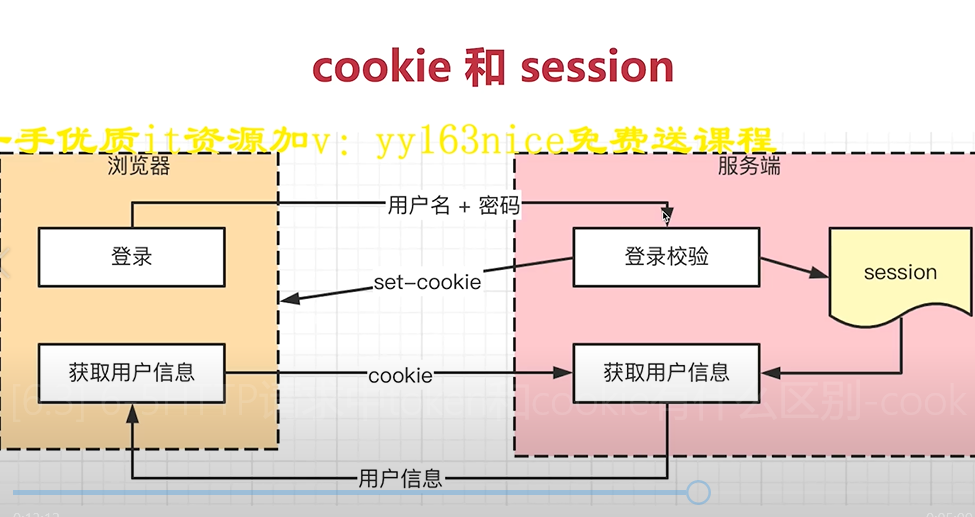
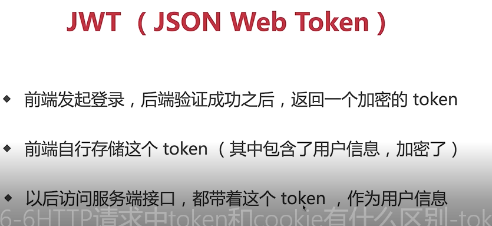
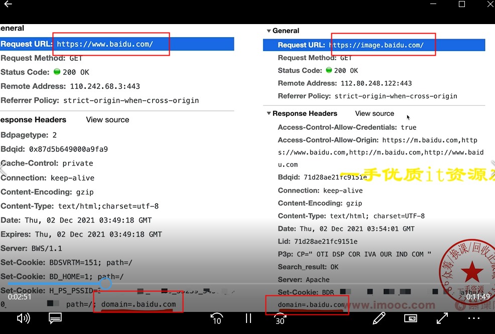
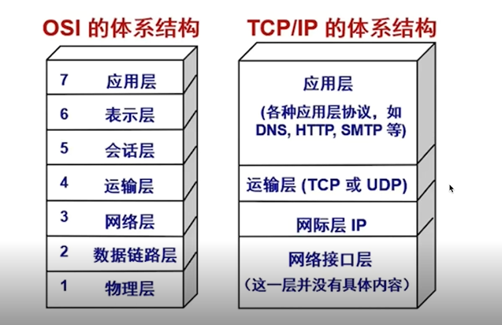
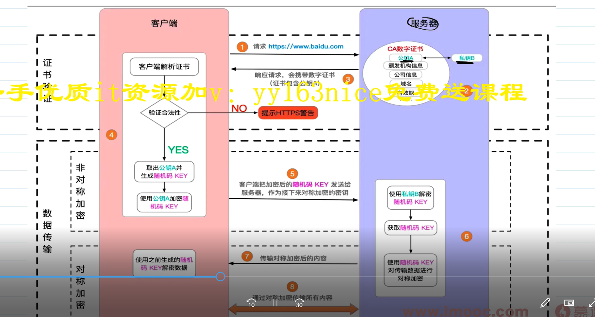

- tcp的3次握手和4次挥手？

>首先3次握手是客户端和服务端建立连接的过程，而4次挥手是客户端和服务端断开连接的过程。tcp/ip协议是一个传输层的安全可靠的协议。

>3次握手过程，1.首先客户端向服务端发起申请连接请求，就相当于告诉服务端，我要跟你连接。2.然后服务端响应这个连接并且给客户端发送一个请求告诉客户端可以进行连接。
3.客户端收到这个请求，然后发送一个请求给服务端告诉服务端我知道了，我们可以建立连接。

>4次挥手过程。1.首先客户端发送一个请求给服务端，告诉服务端，我要跟你断开连接。2.然后服务端收到这个请求并响应告诉客户端我收到了你的申请断开的请求，但是我还没准备好，等我准备好了我通知你。
 3.等服务端准备好了，服务端再发送一个请求给客户端，告诉客户端我准备好了，我们可以断开连接了。4.客户端收到这个请求，然后会再发送一个请求给服务端，告诉服务端我收到了你准备好了的信息，我们可以断开连接了。

>4次挥手的过程，第2次和第3次能不能合并为一次，这个是不能的，因为tcp连接是安全的，所以在通信的过程中需要保证每一步都正确完成了，如果将第2步和第3步合到一起的话，那么在客户端发出断开连接的时候，服务端还有请求在发给客户端，这种情况也是需要处理的，所以服务端需要先准备。就是把一些待发送的请求给它取消掉。

建立网络连接是TCP协议  传输内容是http协议

- http请求中token和 cookie区别
一、cookie
  1.每次请求都要携带cookie，用来帮助识别身份
  2服务端也可以向客户端set cookie，大小4kb  3 默认有跨域限制：不跨域共享、传递（客户端服务端都设置withCredentials就能传递）
  4 浏览器开始禁止第三方js写入cookie，为了保护隐私，有属性可以设置禁止与否 
 二、cookie和session 
  1 cookie用于登录验证，存储用户标识（userId） 2 session在服务端存储用户详细信息，和cookie信息（userId）一一对应
  3 cookie和 session是最常见的登录验证解决方案
  三、token VS cookie
  1.cookie是http规范，只要不跨域就自动传递 。token是自定义传递
  2 cookie会默认被浏览器存储，而token需要自己存储
  3 token默认没有跨域限制，用于JWT
  四、JWT（JSON WEB Token）
  传递token,里面是用户的所有信息
  
  五、session和 JWT 哪个好
  session缺点：1占用服务端内存，硬件成本高 2 多进程多服务器时，不好同步，需要用第三方缓存，如redis  3默认跨域限制
  JWT优点：1不占用服务端内存，因为信息是放在客户端的 2 没有跨域限制
  缺点：1 用户信息存在客户端，不能快速封禁用户（session直接删除用户信息就能快速封禁，token只能设置黑名单）
  2 如果服务端密钥泄漏，那么用户的信息都丢失了
  所以 有严格保密要求 快速封禁用session   如果没有严格要求，推荐JWT，适合初创网站
  六如何实现sso单点登录  
  1基于cookie(同父域) ：cookie默认不共享，设置cookie domain为主域名，即可贡献cookie  www.baidu.com baidu.com是主域名 
  2 CAS（跨域）：A/B两个网站同时使用第三方sso网站的登录
  
- HTTP协议和UDP协议的区别  
  一。网络协议
   http协议在应用层  tcp udp协议在传输层 
  tcp协议：有连接（3次握手），有断开（四次挥手），传输稳定
  udp协议：无连接 无断开 不稳定传输但是效率高 适合视频会议语音通话
  
- http1.0  1.1 2.0 区别
http1.0： 1 最基础的http协议 2 只支持最基本get post请求 
  http1.1 ：1 增加一些缓存策略 比如cache-control E-tag等 2 支持长连接：一次tcp连接发送多个http请求 3 支持断点续传（大文件），状态码206
    4 支持新的方法 put delete等
  http2.0 ：1 可压缩header，减少体积  2 多路复用：一次tcp连接中可以多个http并行请求 3 服务端推送（现在基本都用websocket）

- 什么是https中间人攻击？如何预防？考点：https的加密过程
    一、http
    1.明文传输 2 https加密传输是http + TLS/SSL
    二、https加密
    对称加密：用同一个密钥来加密解密
    非对称加密：公钥用来加密，私钥用来解秘
    https加密过程：是用的非对称加密和对称加密相结合的方式，先用非对称加密：服务端把公钥传给客户端，客户端生成随机码Key并用公钥加密，
  客户端把加密后的随机码发给服务端，服务端用私钥解密出随机码并用这个随机码作为对称加密的密钥来对数据进行加密后再传输给客户端，客户端拿到数据用随机码
  key解密收到的数据，就拿到了加密前的数据
  三 、中间人攻击
    把服务端给客户端的公钥劫持替换成黑客的公钥，再劫持客户端发给服务端的加密后的随机码，再用私钥解密出
  随机码
    解决：用阿里云等正规官方提供的证书传给客户端，浏览器自动验证证书合法性，不合法会给出提示。（不正规的不行）
  
