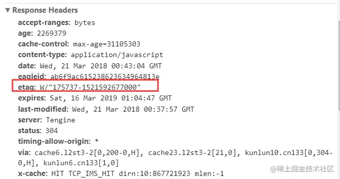
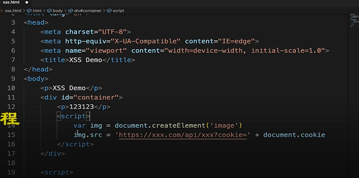
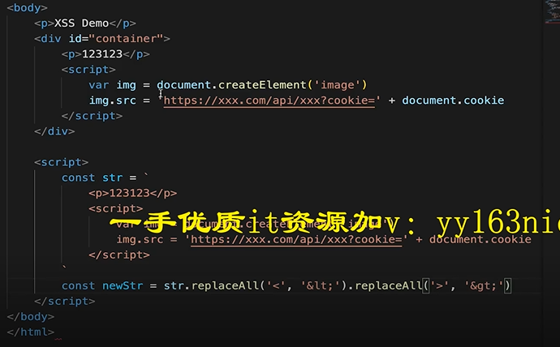
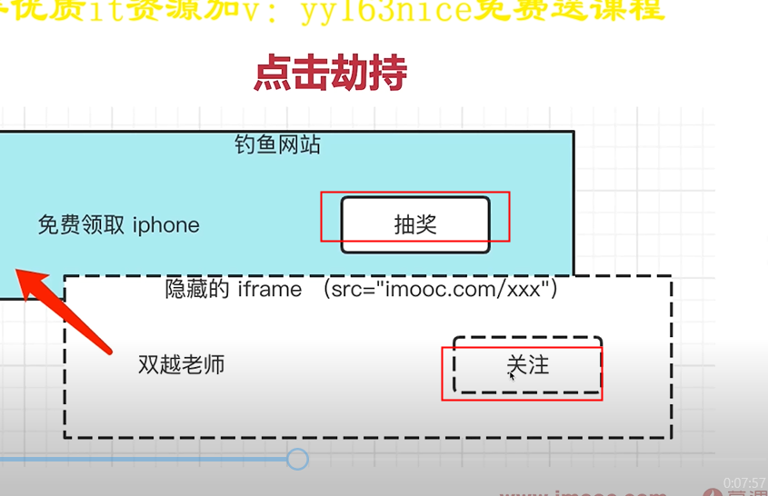
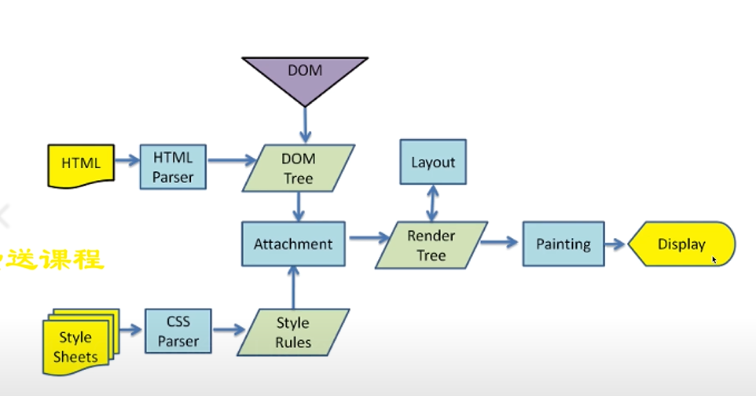
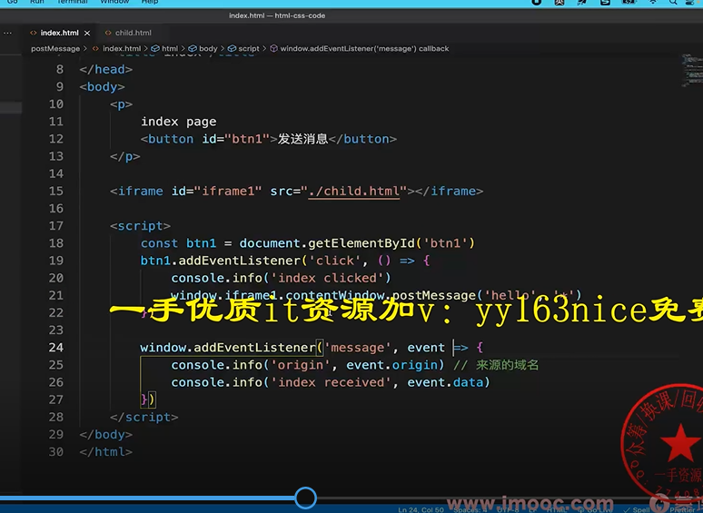
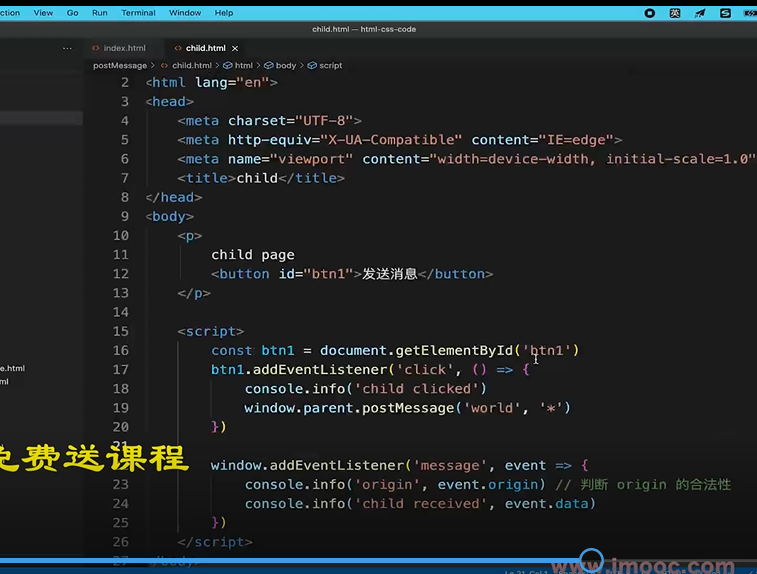

- tcp的3次握手和4次挥手？

>首先3次握手是客户端和服务端建立连接的过程，而4次挥手是客户端和服务端断开连接的过程。tcp/ip协议是一个传输层的安全可靠的协议。

>3次握手过程，1.首先客户端向服务端发起申请连接请求，就相当于告诉服务端，我要跟你连接。2.然后服务端响应这个连接并且给客户端发送一个请求告诉客户端可以进行连接。
3.客户端收到这个请求，然后发送一个请求给服务端告诉服务端我知道了，我们可以建立连接。

>4次挥手过程。1.首先客户端发送一个请求给服务端，告诉服务端，我要跟你断开连接。2.然后服务端收到这个请求并响应告诉客户端我收到了你的申请断开的请求，但是我还没准备好，等我准备好了我通知你。
 3.等服务端准备好了，服务端再发送一个请求给客户端，告诉客户端我准备好了，我们可以断开连接了。4.客户端收到这个请求，然后会再发送一个请求给服务端，告诉服务端我收到了你准备好了的信息，我们可以断开连接了。

>4次挥手的过程，第2次和第3次能不能合并为一次，这个是不能的，因为tcp连接是安全的，所以在通信的过程中需要保证每一步都正确完成了，如果将第2步和第3步合到一起的话，那么在客户端发出断开连接的时候，服务端还有请求在发给客户端，这种情况也是需要处理的，所以服务端需要先准备。就是把一些待发送的请求给它取消掉。

建立网络连接是TCP协议  传输内容是http协议

- http请求中token和 cookie区别
一、cookie
  1.http是无状态的，每次请求都要携带cookie，用来帮助识别身份
  2服务端也可以向客户端set cookie，大小4kb  3 默认有跨域限制：不跨域共享、传递（客户端服务端都设置withCredentials就能传递）
  4 浏览器开始禁止第三方js（比如自己写的测评手机的网站引入了京东广告的js挣点钱,jd广告js就把登陆人的信息写入domain为jd.com的cookie，
    等再登录京东商城，京东就能到拿到这条里面浏览手机信息的cookie，就知道要买手机）写入cookie，
  为了保护隐私，sameSite：strict严格就是禁止/low松散/none没有 属性可以设置禁止的程度 
 二、cookie和session 
  1 cookie用于登录验证，存储用户标识（userId） 2 session在服务端存储用户详细信息，和cookie信息（userId）一一对应
  3 cookie和 session是最常见的登录验证解决方案
  三、token VS cookie
  1.cookie是http规范，只要不跨域就自动传递 。token是自定义传递
  2 cookie会默认被浏览器存储，而token需要自己存储
  3 token默认没有跨域限制，用于JWT
  四、JWT（JSON WEB Token）
  传递token,里面是用户的所有信息
  
  五、session和 JWT 哪个好
      session缺点：1占用服务端内存，硬件成本高 2 多进程多服务器时，不好同步，需要用第三方缓存，如redis  3默认跨域限制
      JWT优点：1不占用服务端内存，因为信息是放在客户端的 2 没有跨域限制
      缺点：1 用户信息存在客户端，不能快速封禁用户（session直接删除用户信息就能快速封禁，token只能设置黑名单）
        2 如果服务端密钥泄漏，那么用户的信息都丢失了
        所以 有严格保密要求 快速封禁用session   如果没有严格要求，推荐JWT，适合初创网站
  六如何实现sso单点登录  [](https://juejin.cn/post/6844903509272297480#comment)
  1基于cookie(同父域) ：cookie默认不共享，设置cookie domain为主域名，即可共享cookie  www.baidu.com baidu.com是主域名 
  2 CAS方案（跨域）：A/B两个网站同时使用第三方sso网站的登录
  
- HTTP协议和UDP协议的区别  
  一。网络协议
   http协议在应用层  tcp udp协议在传输层 
  tcp协议：有连接（3次握手），有断开（四次挥手），传输稳定
  udp协议：无连接 无断开 不稳定传输但是效率高 适合视频会议语音通话
  
- http1.0  1.1 2.0 区别
http1.0： 1 最基础的http协议 2 只支持最基本get post请求 
  http1.1 ：1 增加一些缓存策略 比如cache-control E-tag等 2 支持长连接：一次tcp连接发送多个http请求 3 支持断点续传（大文件），状态码206
    4 支持新的方法 put delete等
  http2.0 ：1 可压缩header，减少体积  2 多路复用：一次tcp连接中可以多个http并行请求 3 服务端推送（现在基本都用websocket）

- 浏览器缓存和http缓存？强缓存和协商缓存请求头的区别？
  浏览器缓存：比如,localStorage,sessionStorage,cookie等等
  http缓存：强缓存 协商缓存
一、强缓存 不会向服务器发送请求，直接从缓存中读取资源，强缓存可以通过设置两种 HTTP Header 实现：
    1.Expires 缓存过期时间，用来指定资源到期的时间，是服务器端具体的时间点
        Expires 是 HTTP/1 的产物，受限于本地时间，如果修改了本地时间，可能会造成缓存失效  已废弃
    2.Cache-control实现的强缓存（代替Expires的强缓存实现方法）
        HTTP/1.1 的产物，比如当设置Cache-Control:max-age=300，单位是s，代表5分钟内再次请求就会从缓存中读取
二、协商缓存 ：
    浏览器携带缓存标识向服务器发起请求，由服务器根据缓存标识决定是否使用缓存的过程 
  触发条件:Cache-Control 的值为 no-cache （协商缓存）
    如果缓存还能就用，就返回304，浏览器继续用缓存的资源
    如果缓存不能用了，就返回200和新的资源给浏览器
    如何设置协商缓存：
    1. Last-Modified / If-Modified-Since    美[ˈmɑːdɪfaɪd] 调整 修改;   美[sɪns]  自…以后
           Last-Modified是服务器响应请求时，返回该资源文件在服务器最后被修改的时间。
           If-Modified-Since则是客户端再次发起该请求时，携带上次请求返回的Last-Modified值，
           通过此字段值告诉服务器该资源上次请求返回的最后被修改时间。服务器收到该请求，发现请求头含有If-Modified-Since字段，
           则会根据If-Modified-Since的字段值与该资源在服务器的最后被修改时间做对比，
           若服务器的资源最后被修改时间大于If-Modified-Since的字段值，则重新返回资源，状态码为200；
           否则则返回304，代表资源无更新，可继续使用缓存文件。
    2.Etag / If-None-Match   
       Etag是服务器响应请求时，返回当前资源文件的一个唯一标识(由服务器生成)。
       If-None-Match是客户端再次发起该请求时，携带上次请求返回的唯一标识Etag值，
       通过此字段值告诉服务器该资源上次请求返回的唯一标识值。服务器收到该请求后，发现该请求头中含有If-None-Match，
       则会根据If-None-Match的字段值与该资源在服务器的Etag值做对比，一致则返回304，代表资源无更新，继续使用缓存文件；
       不一致则重新返回资源文件，状态码为200
三、缓存方案 
   目前的项目大多使用这种缓存方案的：
    HTML: 协商缓存；
    css、js、图片：强缓存，文件名带上hash。
四、 刷新对于强缓存和协商缓存的影响
    1 当ctrl+f5强制刷新网页时，直接从服务器加载，跳过强缓存和协商缓存。
    2 当f5刷新网页时，跳过强缓存，但是会检查协商缓存。
    3 浏览器地址栏中写入URL，回车 浏览器发现缓存中有这个文件了，不用继续请求了，直接去缓存拿。（最快）


- 什么是https中间人攻击？如何预防？考点：https的加密过程
    一、http
    1.明文传输 2 https加密传输是http + TLS/SSL
    二、https加密
    对称加密：用同一个密钥来加密解密
    非对称加密：公钥用来加密，私钥用来解秘
    https加密过程：是用的非对称加密和对称加密相结合的方式，先用非对称加密：服务端把公钥传给客户端，客户端生成随机码Key并用公钥加密，
  客户端把加密后的随机码发给服务端，服务端用私钥解密出随机码并用这个随机码作为对称加密的密钥来对数据进行加密后再传输给客户端，客户端拿到数据用随机码
  key解密收到的数据，就拿到了加密前的数据
  三 、中间人攻击
    把服务端给客户端的公钥劫持替换成黑客的公钥，再劫持客户端发给服务端的加密后的随机码，再用私钥解密出
  随机码
    解决：用阿里云等正规官方提供的证书传给客户端，浏览器自动验证证书合法性，不合法会给出提示。（不正规的不行）

-前端攻击？预防？
一 XSS 
跨站脚本攻击
手段：黑客将js代码插入到网页内容中，渲染时执行js代码
预防：特殊字符替换     
vue {{}}默认是屏蔽xss攻击的 但是v-html不屏蔽
react {{}}默认屏蔽xss攻击 但是 dangerouslySetInnerHTML
二、CSRF
跨站请求伪造
手段：黑客诱导用户去访问另一个网站的接口，伪造请求 （转发邮件到黑客邮箱）
过程：用户登录a网站，有了cookie ，黑客诱导用户打开b网站页面，页面自动发起a网站的请求接口，a网站发现请求中cookie
认为是用户自己操作的
预防：1 严格的跨域请求限制，如判断referrer（请求来源） 2 cookie设置sameSite 禁止第三方使用cookie 3.关键接口加短信验证码
三 点击劫持 
   手段 
    预防：1 判断顶层视口的域名是不是和本页面的域名一致，如果不一致就让恶意网页自动跳转到我方的网页。
```javascript
    if (top.location.hostname !== self.location.hostname) {
        alert("您正在访问不安全的页面，即将跳转到安全页面！");
        top.location.href = self.location.href;
    }
```    
2 在head中设置meta属性 <meta http-equiv="X-Frame-Options" content="SAMEORIGIN">
3 服务器中设置拦截
四、DDos
分布式拒绝服务
手段：分布式的、大规模的流量访问，是服务器瘫痪
预防：软件层不好做，需要硬件预防（如阿里云WAF）
五、SQL注入
手段：黑客提交SQL语句破坏数据库
预防：处理内容 替换字符

-websocket和http有什么区别
一、websocket
过程：1先发起一个http请求 2成功后再升级到websocket协议，再通讯
区别：1 websocket协议名是ws:// 可双端发起请求  2 websocket没有跨域限制 3 通过send 和onmessage通讯（http通过req和res）
 聊天室的实现：服务端定义websocket的list集合，当收到a客户端发送的消息之后，循环list，把a的消息send到b、c客户端

- 输入url到页面渲染 
一网络请求
  1 DNS查询（得到IP），建立TCP链接（三次握手） 
  2 浏览器发起HTTP请求
  3 收到请求响应，得到HTML源代码
二解析：字符串 =》 结构化数据
  1 html构建DOM树 2 css构建 CSSOM树 3 两者结合形成render tree(渲染树)
    优化解析：1 css放在head中，不要异步加载css 2 js放在body最下面或者合理使用defer async 3 提前定义width height
三 渲染 ：render tree绘制到页面
  1计算DOM的尺寸、定位最后绘制到页面
  2遇到js可能会执行（参考defer async）
  3异步css 图片加载 可能会触发重新渲染 

- 重绘和回流(重排)？
一、
重绘：元素外观改变，比如颜色背景色 元素的尺寸、位置不变，
回流(重排):重新计算尺寸和布局，可能会影响其他元素的位置。
重排一定会导致重绘，重绘不一定会导致重排。
  区别：重排比重绘影响大，消耗大  
二、哪些操作会导致重绘操作？哪些操作会导致回流（重排）操作？
1.会导致重绘的操作，color，background，visibility等这些属性的改变会导致重绘。
2.导致重排的操作，添加/删除可见的dom元素，改变元素位置，改变浏览器窗口尺寸等等，display，padding，margin，postion等等。
3 重排优化：1.集中修改样式，或者直接切换css class。2.修改之前使用display：none脱离文档流 
  3使用BFC特性，不影响其他元素位置 4 使用createDocumentFragment 批量操作DOM
  3.优化动画，使用css3不要用js 因为css3能触发GPU渲染

- 网页多标签tab通信
1 websocket 跨域通信
2 localStorage 同域的多页面通信 (localstorage 跨域不共享)
3 sharedWorker 调试不方便 不兼容ie11（同域）
  webWorker是为弥补js单线程所提出的，它可以为js提供多线程环境，sharedWorker是webWorker中的一种。
    shareWorker特点：
    1、同域数据共享，跨域数据无法共享
    2、使用port发送和接收数据
    3、如果是同一个url且是同一个js，那么只会创建一个sharedWorker，多个页面共享这个sharedWorker

- 网页和iframe的通信
  使用postMessage  注意跨域的限制和判断 
  发送信息：postMessage('信息','*') *代表域名  
  接收信息 window.addEventListener('message',event =>{event.origin是来源 event.data是接收到的数据 })
   
  
  