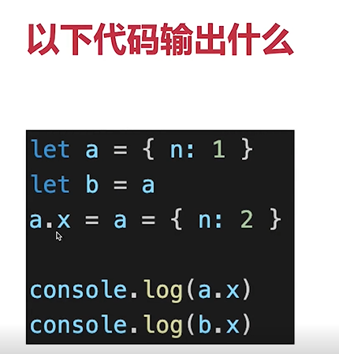
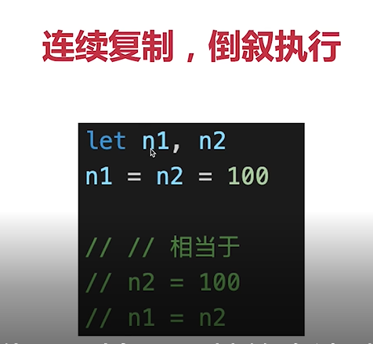
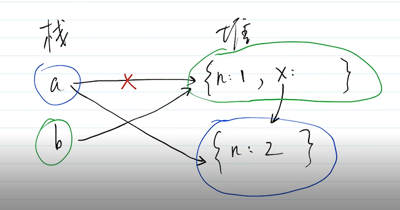
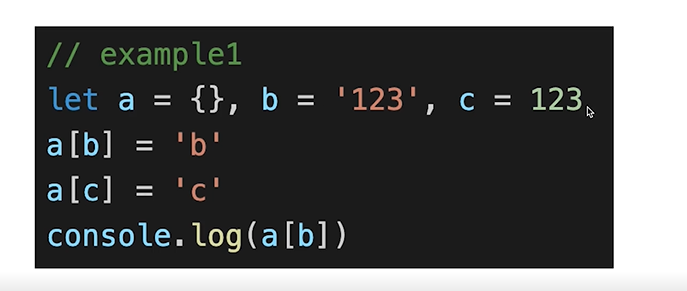
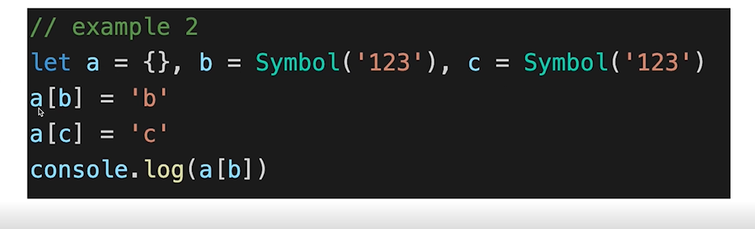
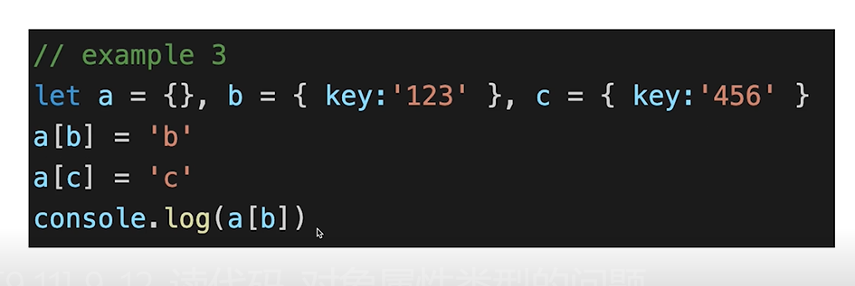

-执行 ['1','2','3'].map(parseInt)   拆到最小颗粒度分析
一、parseInt(str,radix)
1 解析字符串，返回十进制整数 2 第一个参数str，即要解析的字符串  3 radix 进制 基数 范围2-26 
4 如果radix不传  当str以‘0x’开头，就按照16进制处理 其他的都按10进制处理 。
    当str以‘0’开头 就按照8进制处理（但是es5取消了） 所以这个参数要传
```javascript
const nums = ['1','2','3']
nums.map((item,index) =>{
    // item '1' index 0   //1
    //item '2' index 1    //NAN
    // item '3' index 2  // NAN
    return parseInt(item,index)
})
```
二 拓展 eslint会建议parseInt写第二个参数

- 函数修改形参 能否影响实参
不会影响（如果是修改对象的属性值会影响）
  扩展eslint建议函数参数不能修改 当做常量
  
- 数组转树
```javascript
 //数组转树
    const arr = [
        { id: '02', name: '小亮', pid: '01', job: '产品leader' },
        { id: '01', name: '张大大', pid: '', job: '项目经理' },
        { id: '100', name: '赵大大', pid: '', job: '项目经理' },
        { id: '03', name: '小美', pid: '01', job: 'UIleader' },
        { id: '04', name: '老马', pid: '01', job: '技术leader' },
        { id: '05', name: '老王', pid: '01', job: '测试leader' },
        { id: '06', name: '老李', pid: '01', job: '运维leader' },
        { id: '07', name: '小丽', pid: '02', job: '产品经理' },
        { id: '08', name: '大光', pid: '02', job: '产品经理' },
        { id: '09', name: '小高', pid: '03', job: 'UI设计师' },
        { id: '10', name: '小刘', pid: '04', job: '前端工程师' },
        { id: '11', name: '小华', pid: '04', job: '后端工程师' },
        { id: '12', name: '小李', pid: '04', job: '后端工程师' },
        { id: '13', name: '小赵', pid: '05', job: '测试工程师' },
        { id: '14', name: '小强', pid: '05', job: '测试工程师' },
        { id: '15', name: '小涛', pid: '06', job: '运维工程师' }]

    //利用map
    function arrToTree(data) {
        // 创建一个空数组
        let result = []
        if (!Array.isArray(data)) {
            // 首先判断传进来的这个参数是不是一个数组
            return result
            // 如果不是直接结束
        }
        // 创建一个空对象
        let map = {};
        data.forEach(item => {
            // 然后再次遍历数组中的每一项，让每一项的ID值作为map对象的键
            map[item.id] = item;
        });
        data.forEach(item => {
            // 找到item的上一级
            let parent = map[item.pid];
            if (parent) {

                // 判断当前parent有没有children属性有的话就把item加进去，没有就先初始化再加进去
                parent.children ? parent.children.push(item) : (parent.children = []).push(item)

            } else {
                // 如果他没有父亲就把他加入到我们首次声明的数组里
                result.push(item);
            }
        });
        return result;
    }
    console.info('arrToTree',arrToTree(arr))
``` 

-看代码的时候模拟js执行代码

- promise失眠题
一、then交替执行
  
二、then中返回promise实例的时候，相当于多出一个promise实例 也会遵循交替执行
    出现慢两拍的情况

-对象和属性的连续赋值 
a.x 优先级比赋值的优先级高



-对象属性类型 



一 对象的属性key只能是字符串或者symbol ，如果是别的类型会调用toString()方法转成字符串，
比如{}会转成'[object Object]' []会转成'[object Array]'


  