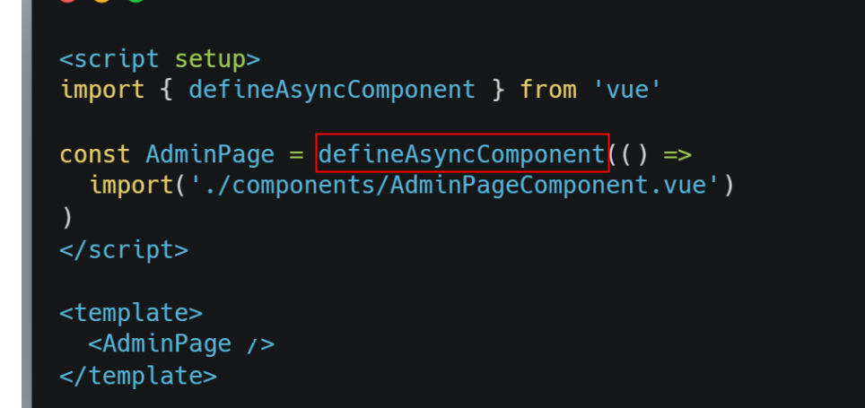

## 项目

- indexDB 
  通俗地讲，IndexedDB 就是浏览器提供的本地数据库，它可以被网页脚本创建和操作。
  IndexedDB 允许储存大量数据，提供查找接口，还能建立索引。这些都是 LocalStorage 所不具备的。
  就数据库类型而言，IndexedDB 不属于关系型数据库（不支持 SQL 查询语句），更接近 NoSQL 数据库。
  [indexDB](https://blog.csdn.net/qq_38974163/article/details/127846737?spm=1001.2101.3001.6650.1&utm_medium=distribute.pc_relevant.none-task-blog-2%7Edefault%7EYuanLiJiHua%7EPosition-1-127846737-blog-111954045.pc_relevant_3mothn_strategy_recovery&depth_1-utm_source=distribute.pc_relevant.none-task-blog-2%7Edefault%7EYuanLiJiHua%7EPosition-1-127846737-blog-111954045.pc_relevant_3mothn_strategy_recovery&utm_relevant_index=2)
  
  localForage : 一个简单的 Polyfill，提供了简单的客户端数据存储的值语法。它在后台使用 IndexedDB，
  并在不支持 IndexedDB 的浏览器中回退到 WebSQL 或 localStorage。
  
[https://www.jianshu.com/p/a2c8acc046af](https://www.jianshu.com/p/a2c8acc046af)
 
- 当我们封装一个搜索组件的时候，会存在一个问题就是请求数据跟不上用户输入的速度，怎么去解决这个问题？
使用防抖

- [whistle 美 wɪsl](https://cloud.tencent.com/developer/article/2033773)
  Proxy SwitchyOmegaSwitchyOmega 浏览器插件
  
- webpack5模块联邦 
  模块联邦本身是一个Webpack 插件 ModuleFederationPlugin，插件有几个重要参数：  	Federation美[ˌfedəˈreɪʃn]联邦
  name 必须，唯一 ID，作为输出的模块名，使用的时通过 name/{name}/name/{expose} 的方式使用；。
  filename: 入口文件名称，用于对外提供模块时候的入口文件名  
  remotes 可以将其他项目的 name 映射到当前项目中，远程其他共享模块的加载地址。 remote:美[rɪˈmoʊt] n.	远程;
  exposes 表示导出的模块，只有在此申明的模块才可以作为远程依赖被使用。 美[ɪkˈspoʊzɪz] 暴露
  shared 是非常重要的参数，制定了这个参数，可以让远程加载的模块对应依赖改为使用本地项目。 美[ʃerd] v.	共有; 合用;
```javascript
//模块提供者
new webpack.container.ModuleFederationPlugin({
    name: 'remote',//唯一 ID 作为输出的模块名，
    filename: 'remoteEntry.js',//filename: 入口文件名称，用于对外提供模块时候的入口文件名
    exposes: {// 表示导出的模块，只有在此申明的模块才可以作为远程依赖被使用。
      './navMenu.vue': './src/components/NavMenu.vue',
      './table.vue': './src/components/Table/common/CommonTable.vue',
    },
    shared: { //shared 是非常重要的参数，制定了这个参数，可以让远程加载的模块对应依赖改为使用本地项目。
      vue: {
        singleton: true,// singleton 美[ˈsɪŋɡltən]
      },
      vuex: {
        singleton: true,
      },
    },
})
//模块使用者 change项目
new webpack.container.ModuleFederationPlugin({
  name: 'change',
  filename: 'remoteEntry.js',
  remotes: {//  remotes 可以将其他项目的 name 映射到当前项目中，远程其他共享模块的加载地址。 remote:美[rɪˈmoʊt] n.	远程;
    remote: 'remote@http://vue.meta42.indc.vnet.com/remoteEntry.js',//romote是提供者的name
  },
  // exposes: {
  //   './navMenu.vue': './src/components/NavMenu.vue',
  // },
  shared: {
    vue: {
      singleton: true,
    },
  },
})
//使用 ： remote是提供者的name 使用者remotes中 remote: 'remote@http://vue.meta42.indc.vnet.com/remoteEntry.js'也要用同样的名字
const NavMenu = defineAsyncComponent(() => import('remote/navMenu.vue'))
```
-异步组件 [defineAsyncComponent](https://blog.csdn.net/weixin_44733660/article/details/128639280)
ES 模块动态导入也会返回一个 Promise，所以多数情况下我们会将它和 defineAsyncComponent 搭配使用 


- 1.15+功能模块分别是哪些？

>1.图层类：盲区分析，显示孪生体，孪生体变色，逻辑线，激活操作集，温场图，温度云图，显示配饰，组态图

>2.业务类：智慧园区，智慧电梯，智慧停车，智慧安防，智慧空调，智慧照明，智慧消防，智慧用电

- 2.通过拆分task的方式优化打包时间

- 3.10+业务组件包含哪些？

>纵向柱状图，横向柱状图，饼图，折线图，象形柱图，散点图，雷达图，列表，进度图，多环图，玫瑰图，定制的图表，例如基本信息，视频组件等等。

- 4.你们的组件库支持按需引入组件吗？

>支持，按需引入的话就是将组件单独导出。

- 5.优化模块配置功能，如何优化的？

>设置一些常用的默认值，填写的改成下拉框选择形式。

- 6.是否对图表进行过优化？

>懒加载，将数据分批加载，然后不需要的数据可以在中间层进行处理一次。

>缓存数据。

- 7.websocket？

>为什么更换方案？

>断线重连。

- 8.清楚的知道自己的项目。

>需要有一块自己完全能讲清楚的。

