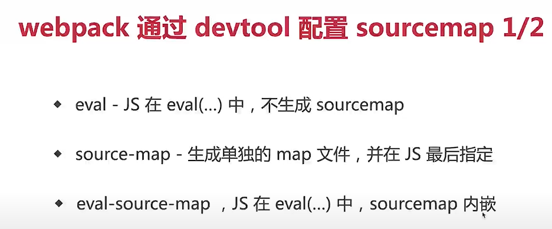
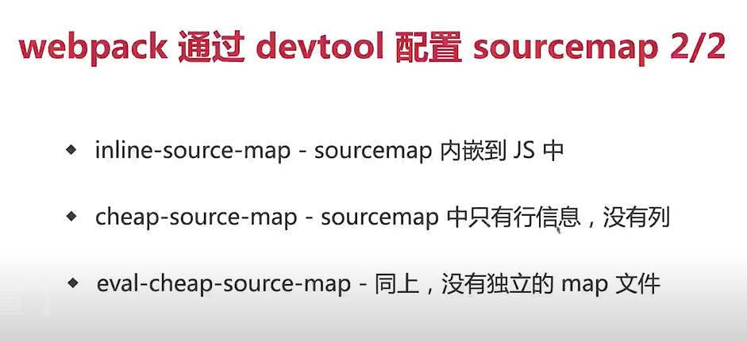
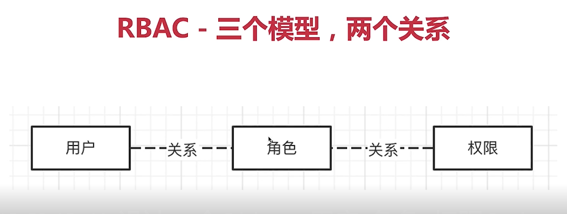

-项目设计
1 识别需求 转化为功能 2 功能模块设计 3 数据模型设计
4 要看整体设计 不纠结细节 

-开发一个前端统计sdk 如何设计
一、前端统计的范围
1 访问量PV（页面访问量） 2自定义事件 比如点分享按钮的人数 确认升级vip弹框点确定的人数点取消的人数
3 性能 错误  
发送用img的src发送
```javascript
 class MyStatistic {
        constructor(productId){
            this.productId = productId//项目id
            this.initPerformance()
            this.initError()

        }
        //发送统计数据
        send(url,params = {}){
            params.productId = this.productId
            const paramsArr = []
            for (let key in params){
                const val = params[key]
                paramsArr.push(`${key}=${val}`)
            }
            const newUrl = `${url}?${paramsArr.join('&')}`//url?a=10&b=20
            //用img发送 1 可跨域 2 兼容性极好 比ajax fetch好
            const img = document.createElement('img')
            img.src = newUrl //get
        }
        //初始化性能统计
        initPerformance(){
            const url = 'yyy'
            this.send('url',performance.timing)
            //performance.timing 性能信息

        }
        //错误监控
        initError(){
            window.addEventListener('error',event =>{
                const {error,lineno,colno} = event
                this.error(error)
            })
            //promise未catch住的报错
            window.addEventListener('unhandledrejection',event =>{
                this.error(new Error(event.reason))
            })
        }
        pv(){
            //特殊的event
            this.send('pv')
        }
        //自定义事件
        event(key,val){
            const url = 'xxx'//自定义事件统计接口url
            this.send(url,{key,val})

        }
        error(err){
            //send
            this.url = 'zzz'
            const {message,stack} = err
            this.send(url,{message,stack})
    
        }
    }
```
- sourcemap  
1 作用：线上压缩混淆后js代码跟源码的位置对应

配置 通过devtool:'source-map'配置
开发环境不用  线上用source-map

-SPA（单页面应用） MPA（多页面应用）如何选择
SPA：用于大型系统 复杂的webH5
MPA： 每个页面功能比较少，以展示为主 比如分享页 

-设计用户权限角色 系统
RBAC-基于角色的访问控制：

-前端项目如何做技术选型
 范围 ：前端框架 语言（js ts） 其他（构建工具）
一 技术没有好坏 看是否合适自己
二 1 社区是否成熟  2 公司是否已有经验积累 3 团队成员的学习成本
三 全面考虑各种成本 ：1学习成本 2 管理成本  3 运维成本


